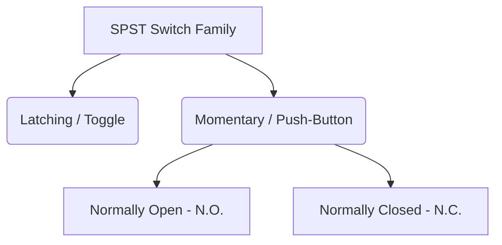

人間が電気を制御するために使用するすべてのインターフェースの中心には、機械式スイッチがあります。このコンポーネントの最も単純で最も普及しているのは、**SPST** (単極単投スイッチ) です。

高電圧電源ブレーカーを設計している場合でも、単に Arduino ブレッドボード上に押しボタンをマッピングしている場合でも、SPST シンボルは論理的な開始点となります。

## 1. SPST の実際の意味

エンジニアは、**極** と **投球** という 2 つの変数を使用してスイッチを分類します。

* **極 (P):** スイッチが同時に制御できる独立した電気回路の数。 
* **Throw (T):** 各極が持つ閉状態 (ON 位置) の数。

したがって、SPST は *単極* (1 つの回路を制御) および *単投* (閉じた導通位置が 1 つだけある) です。

```mermaid
flowchart LR
    A[Human Input] --> B((SPST Mechanism))
    B -- Open / Default --> C[Infinite Resistance / OFF]
    B -- Closed / Actuated --> D[Zero Resistance / ON]
    
    style B fill:#0f172a,stroke:#f59e0b
```

## 2. SPST の回路図シンボルの読み取り

SPST スイッチの標準 IEEE シンボルは非常に直観的であり、文字通りその機能に似ています。

|視覚要素 |現実世界における意味 |
| :--- | :--- |
| **2 つの白丸** |ワイヤが終端する固定電気接触パッド。 |
| **斜めの破線** | 「オープン」のデフォルト状態を示すために、2 番目のパッドから物理的に切り離された機械的導電アーム。 |
| **指定子 (`S` または `SW`)** |標準の参照タグ。例:「SW1」。 |

> **通常状態の仮定:** 特に指定がない限り、機械式スイッチは **非作動の休止状態**で描かれています。標準の SPST ライト スイッチの場合、これは回路図でオフとして示されていることを意味します。

## 3. SPST のバリエーション: プッシュボタン

トグルスイッチは置いた場所に留まります（ラッチング）。押しボタンは、指が上にある間だけ (瞬間的に) 作動します。 SPST の指定は両方に適用されますが、人間の対話モードを区別するために記号がわずかに変更されます。

|スイッチの種類 |回路図の変更 |実際の例 |
| :--- | :--- | :--- |
| **プッシュボタン (N.O.)** |角度のついたアームの代わりに、平らなブリッジが 2 つの接触パッドの「上」に浮かんでいます。押し下げるとギャップが埋まります。 |キーボードのキー、コンピュータの電源ボタン、ドアホンのボタン。 |
| **プッシュボタン (ノースカロライナ州)** |フラットブリッジはパッドの下にあるか、パッドに触れているか、デフォルトで回路をオンに保ちます。押し下げると接続が切断されます。 |重機の緊急停止 (E-Stop) ボタン。 |

## 4. ハードウェア実装に関する警告

SPST スイッチをデジタル論理回路 (Raspberry Pi GPIO ピンなど) に組み込む場合、単純な回路図設計では悲惨なほど予測不可能なソフトウェア動作が発生します。

### 「フローティングピン」問題

SPST スイッチの一方の側を 5V に接続し、もう一方の側をマイクロコントローラーのピンに直接接続すると、スイッチが開いたときに何が起こりますか?ピンの読み取り値は 0V ではありません。ピンは切断されて「フローティング」になっており、周囲の電磁気を拾うアンテナのように機能します。

**修正: プルダウン抵抗**

デジタル ピンとグランドの間には、必ず抵抗 (通常 10kΩ) を接続してください。

1. **スイッチをオフにします:** ピンは抵抗を通じて確実に 0V を読み取ります。
2. **スイッチをオンにします:** 5V 電源が抵抗に電力を供給し、安全な HIGH 状態をトリガーします。

**[回路図エディタ](/editor/)** を使用して、SPST のバリエーションを設計に安全に組み込みます。左側の「Switches」ライブラリを展開して、N.O. を見つけます。そしてNC実装！