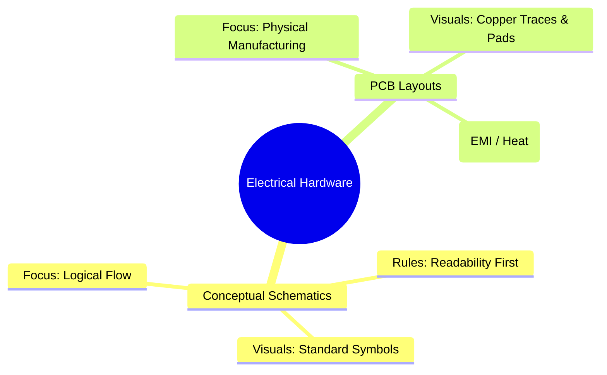
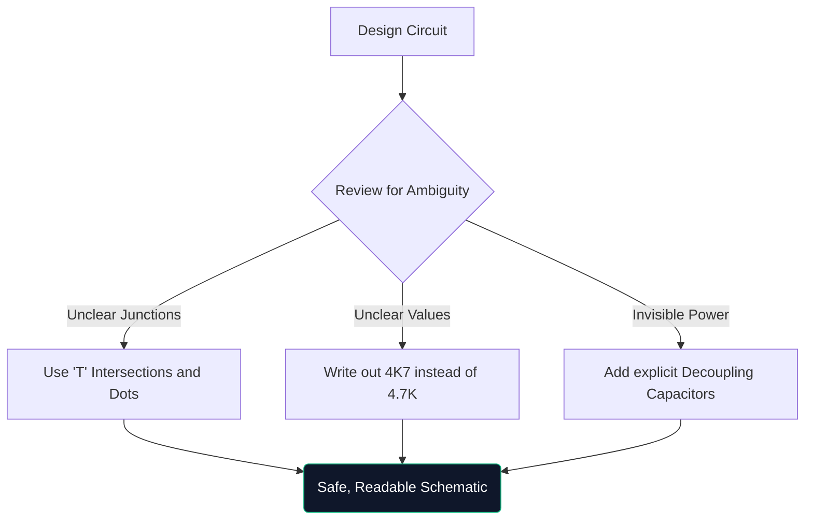

回路図に関する決定版のマスタークラスへようこそ。週末にArduinoのプロトタイプを一緒にハッキングしている場合でも、電気工学を勉強している場合でも、回路図アーキテクチャを理解することは交渉の余地がありません。

このガイドは基本を超えて、最新の図がどのように構築、検証、作成されるかを評価します。

## 理論回路図と PCB レイアウト

非常によく混乱する点は、回路図とプリント基板 (PCB) レイアウトの違いです。それらは、同じ電気的真実のまったく異なる表現です。

|特性 |概略図 | PCB レイアウト |
| :--- | :--- | :--- |
| **目的** |回路が論理的に *どのように動作するのかを理解するには |銅が物理的に*どこに*行くかを指示するには |
| **コンポーネントの表現** |抽象的なシンボル (三角形、ジグザグ) |物理 1:1 フットプリント パッド (SOIC-8、0805 など) |
| **接続** |完璧な幾何学的なライン | 写真45 度の角度の銅配線 |
| **環境** |きれいな白い背景紙 |多層リテラル 3D 空間 |

## 高度な回路図の構造

回路のコンポーネントが 100 個を超えると、視覚的なパラダイムが変化します。単純にすべてを引き出したワイヤーで接続することはできません。

1. **タイトル ブロック**: プロ仕様の回路図には、常に右下隅に会社名、記録エンジニア、リビジョン番号、および日付を示すブロックが表示されます。
2. **ネット ラベルとポート**: ワイヤはサブシステムに接続しません。名前付きラベルはそうします。 2 本のワイヤに「CLK_OUT」というラベルが付いている場合、たとえそれらが別のページにあるとしても、それらは電気的に接続されています。
3. **階層ブロック**: 大規模な設計 (コンピューターのマザーボードなど) では階層が使用されます。 「Memory Interface」というラベルが付いた 1 つの長方形のブロックの中に、完全に別個の回路図ページが含まれています。

## 「守りの絵」のルール

防御的な運転と同様に、防御的な描画は、あなたが明示的に指導しない限り、回路図を読んでいる人がそれを誤解すると仮定することを意味します。

> **なぜ `4K7` と書くのですか?** 印刷またはコピーした回路図では、小さな小数点 (`.`) がアーティファクトにより簡単に消えてしまいます。 「4.7K」と書くと、誰かがそれを「47K」と読んでしまう危険性があり、コンポーネントが壊れてしまう可能性があります。 「4K7」と書き込むと、乗数が小数点として機能し、実質的に誤読がなくなります。

## デジタル CAD ツールへの移行

方眼紙に描くことはブレインストーミングには最適ですが、生産にはほとんど役に立ちません。設計を [Circuit Diagram Maker](/editor/) などのツールに移行すると、いくつかのスーパーパワーが得られます。

* **ネットリスト**: デジタル ツールは接続を数学的に証明します。
* **再利用性**: 以前のプロジェクトから複雑な安定化電源をコピー＆ペーストすることで、時間を節約できます。
* **ベクター品質**: SVG としてエクスポートすると、どれだけズームインしても完全に鮮明な線が保証されます。

理論から現実への飛躍は、明確に引かれた線から始まります。今日から旅を始めましょう！