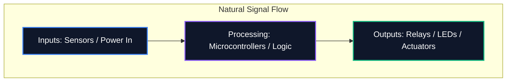

포럼에서 다이어그램을 공유하거나 전문 PCB 제작을 위해 제출하는 경우 회로도의 가독성은 논리적 정확성만큼 중요합니다. 지저분한 회로도는 라우팅 오류, 구성요소 오해, 시간 낭비로 이어집니다.

이 가이드에서는 전문 전자 엔지니어가 깨끗하고 유지 관리가 가능하며 읽기 쉬운 회로 다이어그램을 만드는 데 사용하는 핵심 모범 사례를 간략하게 설명합니다.

## 1. 회로도의 흐름: 왼쪽에서 오른쪽으로, 위에서 아래로

회로도는 기술 문서이므로 다른 문서와 마찬가지로 자연스럽게 읽어야 합니다. 전자 설계에서 표준 관례는 입력이 왼쪽에서 흐르고 출력이 오른쪽으로 나가는 것을 나타냅니다.

마찬가지로, 더 높은 전압은 회로도 상단에 명시적으로 배치하고, 더 낮은 전압 또는 접지는 맨 아래에 배치해야 합니다.



## 2. 전원 및 접지 기호

모든 단일 접지 핀을 함께 연결하는 길고 구불구불한 전선을 그리지 마십시오. 읽을 수 없는 거미줄을 만듭니다. 대신 구성 요소에 로컬 전원 및 접지 기호를 사용하십시오.

| 나쁜 습관 | 모범 사례 | 왜 중요한가 |
| :--- | :--- | :--- |
| 단일 연속 와이어로 모든 접지 연결 | 각 구성 요소에서 로컬 'GND' 기호 활용 | 시각적 혼란을 줄입니다. 복잡한 추적 없이 반환 경로를 명시적으로 정의 |
| 신호 트레이스를 가로지르는 VCC 라인 배치 | 위쪽을 가리키는 로컬 `VCC` / `+5V` 기호 사용 | 신호선이 전력공급과 시각적으로 혼동되는 것을 방지 |
| 동일한 기호로 서로 다른 근거 표시 | 아날로그 접지(AGND)와 디지털 접지(DGND) 구별하기 | 혼합 신호 설계에서 접지 루프 및 잡음 전파를 방지하는 데 중요 |

## 3. 교차점과 교차점

회로도 설계에서 가장 위험한 실수 중 하나는 와이어가 교차하는 위치가 모호하다는 것입니다.

```mermaid
graph TD
    A[Is it a connection?]
    A --> B{Is there a junction dot?}
    B -- Yes --> C[Wires are electrically connected (Node)]
    B -- No --> D[Wires are crossing without connecting]
    
    style A fill:#1e293b,stroke:#f59e0b
    style C fill:#1e293b,stroke:#10b981
    style D fill:#1e293b,stroke:#ef4444
```

> **전문가 팁:** "4방향" 접합('+' 모양의 십자가)을 사용하지 마십시오. 4개의 와이어가 만나야 하는 경우 2개의 3방향 'T' 접합으로 오프셋하십시오. 이는 모호성을 완전히 제거합니다. 인쇄하거나 크기를 조정할 때 접합점이 사라지더라도 'T' 모양은 여전히 ​​연결을 의미하지만 십자가 모양은 그렇지 않습니다.

## 4. 논리적 구성 요소 그룹화

64개 이상의 핀이 있는 마이크로컨트롤러가 포함된 대규모 회로도를 다룰 때 모든 와이어를 구성 요소에 물리적으로 연결하려는 노력은 소용이 없습니다. 대신 전문 도구는 **Net Labels**을 활용합니다.

회로의 기능 블록을 시각적 영역으로 그룹화합니다. 예를 들어 전원 공급 장치를 한쪽 모서리에 배치하고 MCU를 중앙에 배치하며 모터 드라이버를 다른 모서리에 배치합니다. 설명적인 Net Label(예: `SPI_MOSI`, `UART_TX`, `MOTOR_PWM`)을 사용하여 순수하게 연결합니다.

## 5. 참조 지정자 및 값

노출된 저항기 기호는 시청자에게 아무 것도 알려주지 않습니다. 모든 구성요소에는 고유한 참조 지정자와 명시적인 값이 있어야 합니다.

| 부품 카테고리 | 표준 접두사 | 예 |
| :--- | :--- | :--- |
| **저항기** | `R` | `R1(10kΩ)` |
| **커패시터** | `C` | 'C4(100nF)' |
| **집적 회로** | `U` 또는 `IC` | 'U2 (LM358)' |
| **다이오드/LED** | `디` | `D1 (1N4148)` |
| **트랜지스터/MOSFET** | `Q` | `Q1(2N2222)` |
| **인덕터** | '엘' ​​| 'L1(4.7μH)' |
| **커넥터/헤더** | `J` 또는 `P` | `J1(전원 잭)` |

이러한 규칙을 준수하면 전 세계 모든 엔지니어가 회로도를 즉시 이해할 수 있습니다. 지금 바로 [회로도 편집기](/editor/)에서 이 규칙을 적용해 보세요.