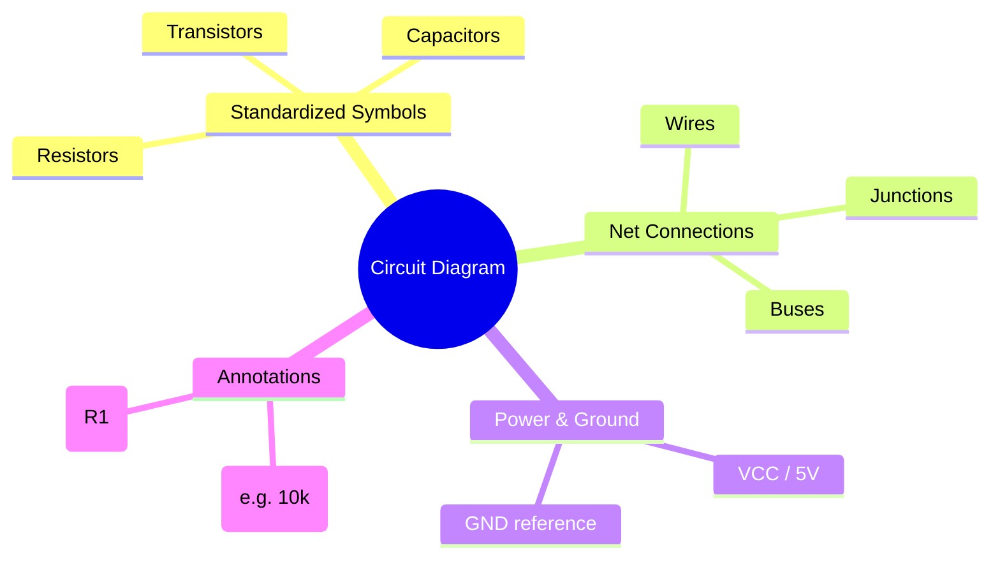
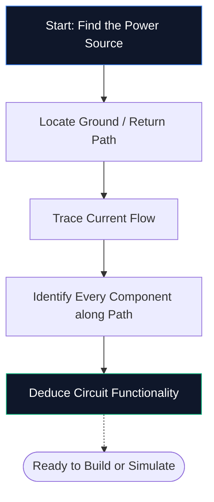

이전에 회로도 편집기를 열어 본 적이 없다면 이것이 필요한 유일한 가이드입니다. 단일 소프트웨어를 설치하지 않고도 회로도가 무엇인지, 기호를 디코딩하는 방법, **Circuit Diagram Maker**에서 첫 번째 회로도를 그리는 방법 등 기본 사항을 살펴보겠습니다.

## 회로도란 정확히 무엇인가요?

회로도는 전기의 지도이다. 지하철 노선도가 터널 규모를 묘사하지 않고 역이 어떻게 연결되는지 보여주는 것처럼, 회로도는 물리적 크기나 보드 배치에 대한 걱정 없이 전자 부품이 어떻게 연결되는지 보여줍니다.

실제 도면 대신 회로도에서는 **표준화된 기호**를 사용합니다. 저항은 지그재그 선으로 나타나고, 커패시터는 두 개의 평행판으로 나타나며, 다이오드는 막대와 만나는 삼각형으로 나타납니다. 이 보편적인 약어는 모든 국가와 언어에서 다이어그램을 깨끗하고 인쇄 가능하며 읽을 수 있는 상태로 유지합니다.

> **추상화가 중요한 이유:** 물리적 저항기는 색상이 있는 띠가 있는 작은 원통이지만 50개 구성 요소로 구성된 회로도에서는 그 세부 사항이 시각적 혼란을 야기합니다. 기호는 그림을 압축하여 *모습*보다는 *사물이 어떻게 연결*되는지에 두뇌가 집중할 수 있도록 합니다.

## 모든 초보자가 꼭 알아야 할 10가지 기호

단일 회로도를 읽거나 그리려면 먼저 핵심 빌딩 블록을 인식해야 합니다. 아래 표를 기억하면 대부분의 취미 회로를 눈으로 보는 즉시 해독할 수 있습니다.

| 기호 모양 | 구성요소 | 주요 기능 | 지정자 |
| :--- | :--- | :--- | :--- |
| **지그재그 라인** | 저항기 | 전류 흐름을 제한 | `R` |
| **두 개의 평행선** | 커패시터 | 충전을 저장하고 소음을 필터링합니다 | `C` |
| **일련의 루프** | 인덕터 | 자기장에 에너지를 저장 | '엘' ​​|
| **삼각형 + 막대** | 다이오드 | 한 방향으로 전류를 허용 | `디` |
| **삼각형 + 막대 + 화살표** | LED | 순방향 바이어스 시 빛 방출 | `D` / `LED` |
| **긴/짧은 평행선** | 배터리 | DC 전압 제공 | `BT` |
| **3개의 누적 라인** | 지상 | 0V의 기준점 | `GND` |
| **삼각형 모양** | 연산 증폭기 | 전압차 증폭 | `U` / `IC` |
| **핀이 있는 직사각형** | 집적 회로 | 복잡한 기능을 수행합니다 | `U` / `IC` |
| **직선** | 전선 | 구성 요소 간 전류 전달 | *(없음)* |

## 회로도를 읽는 5단계 방법

회로도를 읽는 것은 매번 동일한 정신적 과정을 따릅니다. 모든 회로도에서 이 5단계를 연습하면 패턴이 제2의 천성이 될 것입니다.

1. **전원 찾기** — VCC, 5V 또는 3.3V와 같은 배터리 기호나 라벨을 찾으세요. 여기에서 전기 에너지가 회로로 유입됩니다.
2. **접지 찾기** — 3선 접지 기호 또는 GND 라벨을 찾습니다. 모든 회로에는 복귀 경로가 있어야 합니다.
3. **전류 흐름 추적** - 양극 단자의 전선을 따라 각 구성 요소를 통과한 후 다시 접지로 연결됩니다. 기존 전류는 양극에서 음극으로 흐릅니다.
4. **모든 구성요소 식별** — 각 기호를 위의 표와 일치시킨 다음 옆에 있는 라벨을 읽고 정확한 값을 확인하세요(예: 10kΩ은 10,000Ω을 의미함).
5. **목적 이해** — 회로의 기능을 스스로에게 물어보세요. LED와 저항기는 단순한 표시등입니다. 피드백 저항이 있는 연산 증폭기는 신호 증폭기입니다.

## 첫 번째 회로도: LED 회로

모든 전자 초보자는 여기에서 시작합니다. 전류 제한 저항을 통해 전원이 공급되는 LED입니다. [Circuit Diagram Maker 편집기](/editor/)를 열고 따라해 보세요.

**회로 아키텍처 파이프라인:**

**단계별 지침:**

1. 사이드바에서 **배터리** 기호를 캔버스로 드래그합니다.
2. **저항기**를 배터리 오른쪽에 배치합니다.
3. 저항기 오른쪽에 **LED**를 배치합니다.
4. **W**를 눌러 유선 모드를 활성화합니다.
5. 배터리의 양극 단자를 클릭한 다음 저항기의 왼쪽 핀을 클릭하여 와이어를 그립니다.
6. 저항기의 오른쪽 핀을 LED 양극에 연결합니다.
7. LED 음극을 배터리의 음극 단자에 다시 연결합니다.
8. 저항기를 두 번 클릭하고 **330Ω**을 입력합니다.
9. 출판용 품질의 파일을 저장하려면 **내보내기 → SVG**를 클릭합니다.

## 흔히 저지르는 5가지 실수(및 이를 피하는 방법)

| 실수 | 무엇이 잘못됐나요 | 빠른 수정 |
| :--- | :--- | :--- |
| **지상 경로 누락** | 회로가 열린 것으로 나타납니다. 전류가 흐를 수 없습니다 | 항상 복귀 경로를 접지에 연결하십시오 |
| **점 없는 와이어 크로싱** | 교차하는 두 개의 전선은 서로 연결되어 있지 않은 것처럼 보입니다. | 와이어가 실제로 연결되는 곳에만 접합점 추가 |
| **구성요소 값 없음** | 검토자가 디자인을 확인할 수 없습니다 | 모든 저항, 커패시터 및 IC에 라벨을 붙입니다 |
| **지저분한 배선** | 대각선 또는 겹치는 와이어로 인해 가독성이 떨어짐 | 맨해튼 라우팅 사용(수평 및 수직만 해당) |
| **참조 지정자 없음** | 부품 목록 작성이 불가능해짐 | 각 부분에 R1, C1, U1, D1 등의 라벨을 붙입니다 |

## 다음으로 갈 곳

기본 회로도를 그리는 데 익숙해지면 다음 리소스를 탐색하여 레벨을 높이세요.

* **[회로도 기호 설명](/blog/circuit-diagram-symbols-explained/)** — 모든 기호 카테고리에 대한 심층 분석
* **[온라인으로 회로도를 만드는 방법](/blog/how-to-make-circuit-diagram-online/)** — 고급 기술 및 작업 흐름 팁
* **[구성 요소 라이브러리](/comComponents/)** — Circuit Diagram Maker에서 사용할 수 있는 40개 이상의 기호를 모두 찾아보세요.