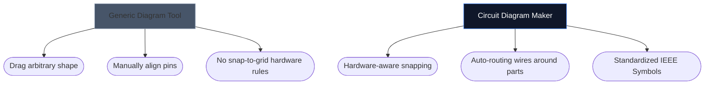

전자 회로도를 그리는 데 적합한 도구를 선택하면 새로운 하드웨어 프로젝트를 얼마나 빨리 반복할 수 있는지가 결정될 수 있습니다. 고급 PCB 설계자에게는 무거운 데스크톱 환경이 필요하지만, 취미생활자, 학생 및 제조업체에는 접근성과 속도라는 완전히 다른 것이 필요한 경우가 많습니다.

아래에서는 우리의 도구가 주요 업계 대안과 어떻게 비교되는지 분석합니다.

## 도구 분류 매트릭스

개별 도구를 살펴보기 전에 프로젝트에 실제로 필요한 소프트웨어 계층이 무엇인지 이해하는 것이 중요합니다. 엔터프라이즈 PCB 소프트웨어를 사용하여 4개 부품 LED 레이아웃을 스케치하는 것은 과잉입니다.

## 1. 회로도 작성기 vs. Fritzing

Fritzing은 브레드보드 프로토타이핑과 회로도 사이의 격차를 해소하는 것으로 유명합니다. 그러나 Fritzing은 설치가 필요하며 수년 동안 유지 관리 업데이트에 어려움을 겪었습니다.

| 기능 | 회로도 작성기 | 프리츠 |
| :--- | :--- | :--- |
| **주요 초점** | 표준 회로도 레이아웃 | 브레드보드 시각화 |
| **설치** | 없음(100% 브라우저 기반) | 데스크탑 설치 필요 |
| **비용** | 100% 무료 | 유료(기부웨어) |
| **학습 곡선** | 매우 낮음 | 보통 |

> **평결:** 브레드보드에 떨어지는 물리 와이어를 특별히 시각화해야 한다면 Fritzing이 더 좋습니다. 표준 범용 전자 회로도가 *즉시* 필요한 경우 Circuit Diagram Maker를 사용하세요.

## 2. 회로도 메이커 vs. KiCad & Altium

KiCad는 전설적인 오픈 소스 PCB 제품군이며 Altium Designer는 엔터프라이즈 산업 표준입니다. 그들은 엄청나게 강력합니다.

| 역량 계층 | 회로도 작성기 | KiCad / 알티움 |
| :--- | :--- | :--- |
| **출력 유형** | SVG/PNG 이미지 | 거버 파일, BOM, Pick&Place |
| **시뮬레이션** | 시각적 / 단순 | 깊은 SPICE 통합 |
| **첫 번째 스키마로의 속도** | < 10초 | 10~30분(설정/구성) |

> **평결:** 심천에 있는 공장으로 구리 층을 보낼 때 KiCad 또는 Altium을 사용하십시오. 물리학 과제, 블로그 게시물 또는 포럼 질문에 회로도를 첨부할 때 Circuit Diagram Maker를 사용하십시오.

## 3. 회로도 메이커 vs. draw.io / Lucidchart

draw.io와 같은 일반 다이어그램 도구는 순서도에 매우 인기가 있습니다. 그러나 전자제품에 대한 의미론적 이해가 부족합니다.

전용 전자 도구를 사용할 때 편집자는 접합 없이는 와이어가 단순히 무작위로 "종단"될 수 없으며 본질적으로 표준 속성(예: 저항에 옴)을 매핑한다는 점을 이해합니다.

## 귀하에게 적합한 도구는 무엇입니까?

가장 좋은 도구는 방해가 되지 않는 도구입니다. 신속한 아이디어 구상, 교육 과제 및 웹 출판을 위해 [회로도 작성기](/editor/)는 속도와 현대적인 미학의 탁월한 조합을 제공합니다.