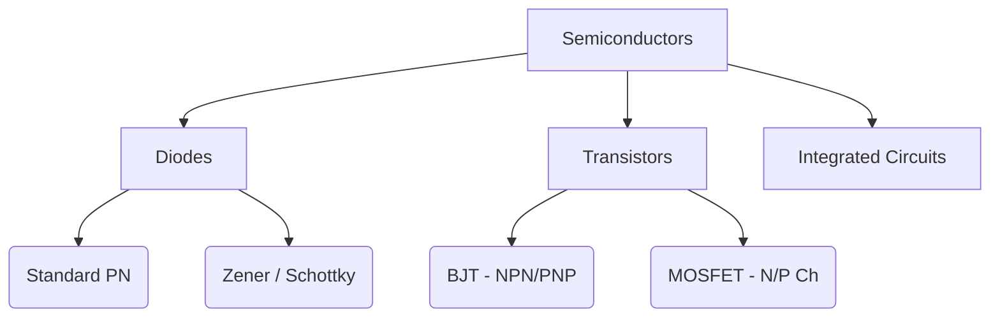

전자 기호는 하드웨어 엔지니어링의 보편적인 언어입니다. 음악 노트가 음높이와 리듬을 지시하는 것처럼 회로 기호는 전기적 기능, 속성 및 연결성을 종이 위에 전달합니다.

이 포괄적인 가이드에서는 모든 회로도에서 접하게 될 가장 중요한 요소의 시각적 형태를 분석합니다.

## 글로벌 표준 차이점: IEEE와 IEC

특정 기호를 살펴보기 전에 회로도가 그려진 위치에 따라 기호가 다르게 보일 수 있다는 점을 인식하는 것이 중요합니다. 두 가지 주요 표준은 **IEEE/ANSI**(대부분 미국)와 **IEC**(유럽 및 국제)입니다.

```mermaid
flowchart LR
    subgraph Regional Standards
    A((Schematic Origin))
    A -- US / Americas --> B[IEEE / ANSI]
    A -- Europe / Int'l --> C[IEC]
    end
    
    B -.-> D(Zigzag Resistors)
    C -.-> E(Rectangle Resistors)
    
    style B fill:#1e293b,stroke:#f59e0b
    style C fill:#1e293b,stroke:#3b82f6
```

Circuit Diagram Maker에서는 IEEE/ANSI 표준을 주로 활용합니다. 기술적으로는 정확하지만 디지털 및 취미 생태계에서 여전히 높은 인기를 누리고 있기 때문입니다.

## 수동 부품

수동 부품은 작동을 위해 외부 전원이 필요하지 않으며 신호를 증폭할 수 없습니다.

| 구성요소 | 표준 기호 모양 | 기능 설명 |
| :--- | :--- | :--- |
| **저항기** | 날카롭고 들쭉날쭉한 지그재그 선으로 정의됩니다. 가변 변형에는 선을 관통하는 화살표가 있습니다. | 전류의 흐름을 제한하기 위해 전력을 열로 방출합니다. |
| **커패시터** | 간격으로 구분된 두 개의 평행선입니다. 극성 변형은 선 중 하나를 곡선으로 만들어 음극 단자를 나타냅니다. | 전기장에 전기 에너지를 일시적으로 저장합니다. |
| **인덕터** | 와이어 코일을 나타내는 일련의 둥근 루프 또는 반원입니다. | 자기장에 에너지를 저장하여 전류 흐름의 변화에 ​​반대합니다. |

## 활성 부품(반도체)

활성 구성 요소에는 전원이 필요하며 전기 흐름을 제어하여 신호를 증폭시키는 경우가 많습니다.

| 구성요소 | 시각적 표시기 | 핵심 사용량 |
| :--- | :--- | :--- |
| **다이오드** | 평평한 선을 가리키는 삼각형입니다. 선은 음극(음극)을 나타냅니다. | 전기용 일방향 밸브입니다. |
| **LED** | 바깥쪽을 가리키는 두 개의 작은 화살표가 있는 표준 다이오드 기호로 빛 방출을 나타냅니다. | 시각적 표시기 및 광전자 공학. |
| **BJT 트랜지스터** | NPN 또는 PNP를 나타내는 화살표가 있는 베이스, 컬렉터 및 이미터의 세 가지 연결 옆에 수직선이 있습니다. | 전류 제어 스위치 및 증폭기. |
| **MOSFET** | 분리된 게이트와 내부 기판 다이오드를 강조하는 분리된 경계선이 특징입니다. | 고전력을 위한 전압 제어 스위칭. |

## 기계 및 출력 장치

이러한 부분은 인간의 입력을 받거나 물리적인 출력을 생성하는 등 물리적 세계와 상호 작용합니다.

| 구성요소 | 도식 속기 | 신청 |
| :--- | :--- | :--- |
| **스위치(SPST)** | 회로를 완성하기 위해 아래로 회전할 수 있는 파선. | 기본 ON/OFF 전원 제어. |
| **릴레이** | 일반적으로 절연된 스위치 접점과 결합된 인덕터(내부 코일)로 표시됩니다. | 저전압 마이크로컨트롤러를 통해 고전압 부하를 전환합니다. |
| **모터** | 'M'을 포함하는 원으로, 종종 지정된 양극 및 음극 터미널이 있습니다. | 전류를 회전 동역학으로 변환합니다. |

> **설계 팁:** 기계식 스위치나 계전기를 사용할 때마다 항상 유도 부하 전체에 *플라이백 다이오드*를 포함시켜 전압 스파이크로부터 반도체 부품을 보호하세요!

이러한 기호를 이해하는 것이 회로 유창성을 향한 첫 번째 단계입니다. [온라인 편집기](/editor/)를 확인하여 이러한 모양을 즉시 드래그 앤 드롭하고 실험해 보세요.