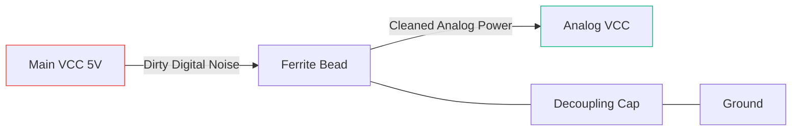

고속 디지털 전자 장치는 많은 전자기 잡음을 생성합니다. 완화하지 않으면 이 고주파 간섭이 민감한 아날로그 라인으로 흘러 들어가거나 외부로 방출되어 장치가 FCC 방출 테스트에 크게 실패하게 됩니다.

이러한 간섭에 대한 주요 무기는 **페라이트 비드**입니다. 회로도 기호와 배치를 이해하면 회로가 깨끗하게 작동하는지 아니면 자체 잡음에 빠져 있는지 알 수 있습니다.

## 1. 페라이트 비드 기호 시각화

페라이트 비드는 본질적으로 손실이 심한 인덕터처럼 작동합니다. 이로 인해 회로도 기호는 표준 인덕터 기호와 밀접하게 관련되어 있지만 특정 역할을 강조하도록 맞춤화되었습니다.

```mermaid
graph LR
    A[Inductor Basis] --> B(Standard Inductor Symbol)
    A --> C(Rectangle Over Wire)
    B -.-> D(Addition of a dashed line or solid bar)
    D --> E[IEEE Ferrite Symbol]
    C --> F[IEC Ferrite Symbol]
    
    style E fill:#0f172a,stroke:#3b82f6
    style F fill:#0f172a,stroke:#10b981
```

| 특성 | IEEE/ANSI 표준 | IEC 표준 | 메모 |
| :--- | :--- | :--- | :--- |
| **모양** | 막대/상자가 있는 일련의 반원 | 단단한 직사각형 블록 | 결과가 기능적으로 동일함 |
| **지정자 접두어** | 'FB' | `FB` 또는 `L` | 파워 인덕터와의 혼동을 방지하기 위해 'FB' 사용을 적극 권장합니다 |
| **측정 단위** | 특정 MHz에서의 옴(Ω) | 특정 MHz에서의 옴(Ω) | Henries(H) |

> **중요한 차이점:** 페라이트 비드를 인덕턴스로 평가하지 마십시오. 페라이트 비드는 특정 주파수**(일반적으로 100MHz)에서의 **임피던스(Ω)로 지정됩니다.

## 2. 핵심 운영 메커니즘

표준 인덕터 대신 페라이트 비드를 사용하는 이유는 무엇입니까?

* **인덕터**는 에너지를 저장하고 이를 회로로 반환합니다. 반응성이 뛰어나고 에너지를 보존합니다.
* **페라이트 비드**는 *손실*이 발생하도록 능동적으로 설계되었습니다. 고주파수에서는 저항처럼 작동하여 원하지 않는 고주파수 잡음을 열로 직접 변환합니다.

| 주파수 범위 | 페라이트 비드 동작 | 서킷 결과 |
| :--- | :--- | :--- |
| **저주파/DC** | 1MHz 미만 | 단순한 전선(~0Ω)처럼 작동합니다. DC 전원은 자유롭게 통과합니다. |
| **공진 주파수** | 반응성이 높은 | 에너지를 잠시 저장합니다. |
| **고빈도** | 50MHz 이상 | 고가 저항기처럼 작동합니다. RF 잡음을 열로 차단하고 발산합니다. |

## 3. 도식적 배치를 위한 모범 사례

FB 기호를 올바르게 활용하려면 전략적 배치가 필요합니다. 회로도에서 페라이트 비드를 무작위로 두드리면 실제로 링잉과 공명이 악화될 수 있습니다.

### 전원 공급 장치 분리(Pi-필터)

'FB' 기호의 가장 일반적인 용도는 깨끗한 아날로그 전원에서 더러운 디지털 전원을 분리하는 것입니다.

위 구성(Pi-Filter의 일부)에서 페라이트 비드는 고주파 과도 전류가 AVCC 라인으로 유입되는 것을 차단하는 반면 커패시터는 나머지 리플을 접지로 분류합니다.

### 데이터 라인 EMI 억제

긴 USB 데이터 케이블이나 HDMI 트레이스를 라우팅할 때 'FB' 기호가 커넥터 근처에 직렬로 배치되는 경우가 많습니다. 이렇게 하면 물리적으로 노출된 긴 와이어가 안테나 역할을 하지 않고 방 전체에 CPU 소음을 방출하지 않게 됩니다.

다음 회로도에 페라이트 비드를 추가하려면 **[회로도 편집기](/editor/)**를 열고 "페라이트"를 검색한 후 임피던스 등급을 지정하세요!