12V 자동차 배터리를 가전제품을 구동할 수 있는 220V 교류로 변환하는 전력 인버터를 구축하는 것은 전자 엔지니어에게는 통과 의례입니다.

납땜 인두를 들어 올리기 전에 기본 회로도를 완벽하게 이해해야 합니다. 고전압 회로는 용서할 수 없으며 잘못 그려진 다이어그램은 MOSFET이 타거나 심각한 감전을 보장합니다. 이 가이드에서는 기본적인 구형파 인버터의 아키텍처를 자세히 설명합니다.

> **안전 경고:** 220V AC 전원은 치명적입니다. 이 기사는 제조 청사진이 아닌 도식적 논리와 이론적 설계에 대한 탐구입니다. 고급 전기 교육 없이는 절대로 고전압 회로를 구축하지 마십시오.

## 세 가지 기둥 아키텍처

최신 인버터가 아무리 복잡하더라도 회로도는 항상 시각적, 논리적으로 세 가지 기능 블록으로 나눌 수 있습니다.

```mermaid
flowchart LR
    DC_SRC[(12V DC Battery)] --> OSC[1. Oscillator Block]
    OSC -- Low Power Square Wave --> AMP[2. Power Switch Block]
    AMP -- High Current 12V Wave --> TX[3. Step-Up Transformer]
    TX -- Magnetic Induction --> AC_OUT((220V AC Output))
    
    style OSC fill:#0f172a,stroke:#3b82f6
    style AMP fill:#0f172a,stroke:#f59e0b
    style TX fill:#0f172a,stroke:#ef4444
```

### 1단계: 발진기(뇌)

배터리의 직류(DC)는 직선으로 흐릅니다. 변압기는 직선으로 올라갈 수 없습니다. 변동하는 자기장이 필요합니다. 따라서 DC를 인공 AC 파동(지역에 따라 일반적으로 50Hz 또는 60Hz)으로 변환해야 합니다.

| 사용된 구성요소 | 도식적 역할 | 선택된 이유 |
| :--- | :--- | :--- |
| **CD4047 IC / 555 타이머** | 불안정한 멀티바이브레이터 | RC 시정수를 계산하여 매우 안정적인 구형파를 출력합니다. |
| **저항기 및 커패시터 네트워크** | 타이밍 교정기 | 값(예: 'R=100kΩ', 'C=0.1μF')은 정확한 50Hz 주파수를 고유하게 나타냅니다. |

### 2단계: 전원 스위치(근육)

로직 칩은 깨끗한 50Hz 파동을 생성하지만 전류 제한이 매우 낮습니다(종종 20mA 미만). 이것을 변압기에 공급하면 전구를 켜기에 충분한 자속이 생성되지 않습니다.

발진기와 변압기 코일 사이에 고전력 트랜지스터를 배치합니다.

1. 발진기의 약한 신호가 대규모 N 채널 MOSFET(예: IRF3205)의 **게이트**에 도달합니다.
2. MOSFET은 전자식 중부하 계전기 역할을 합니다.
3. 12V 배터리의 막대한 전류량을 초당 50회 변압기 코일을 통해 직접 격렬하게 전환합니다.

### 3단계: 승압 변압기

회로도의 이 시점에서 엄청난 양의 12V 전류가 앞뒤로 펄스됩니다. 마지막 단계에서는 이를 변압기의 1차 코일을 통해 라우팅해야 합니다.

| 기능 | 회로도 세부정보 | 실제 영향 |
| :--- | :--- | :--- |
| **1차 코일(왼쪽)** | 중앙 탭 구성(`12V - 0 - 12V`) | 두 개의 교번 MOSFET에서 앞뒤로 푸시풀 스위칭을 허용합니다. |
| **핵심 라인** | 수직으로 그려진 두 개의 실선 | 고효율 자기유도에 필요한 철/페라이트 코어를 나타냅니다. |
| **2차 코일(우)** | 권선비 대폭 증가 | 물리학은 펄스 12V 자속을 치명적이고 휘발성인 220V 파동으로 끌어올립니다. |

## 도면 고려사항

**[회로도 편집기](/editor/)**를 활용하여 이 설계 초안을 작성할 때 레이아웃 모범 사례를 기억하세요.

* 12V 배터리 전류를 전달하는 굵은 선은 저전력 오실레이터 선보다 더 두껍게 그립니다.
* MOSFET 소스 핀을 명시적이고 고유하게 접지합니다. 노이즈 커플링을 방지하기 위해 민감한 발진기 접지 근처로 다시 배선하지 마십시오.
* 220V 출력을 그래픽으로 묘사하십시오! 비어 있는 전선을 그대로 두지 말고 경고 라벨과 출력 포트(예: 소켓 기호)를 배치하십시오.