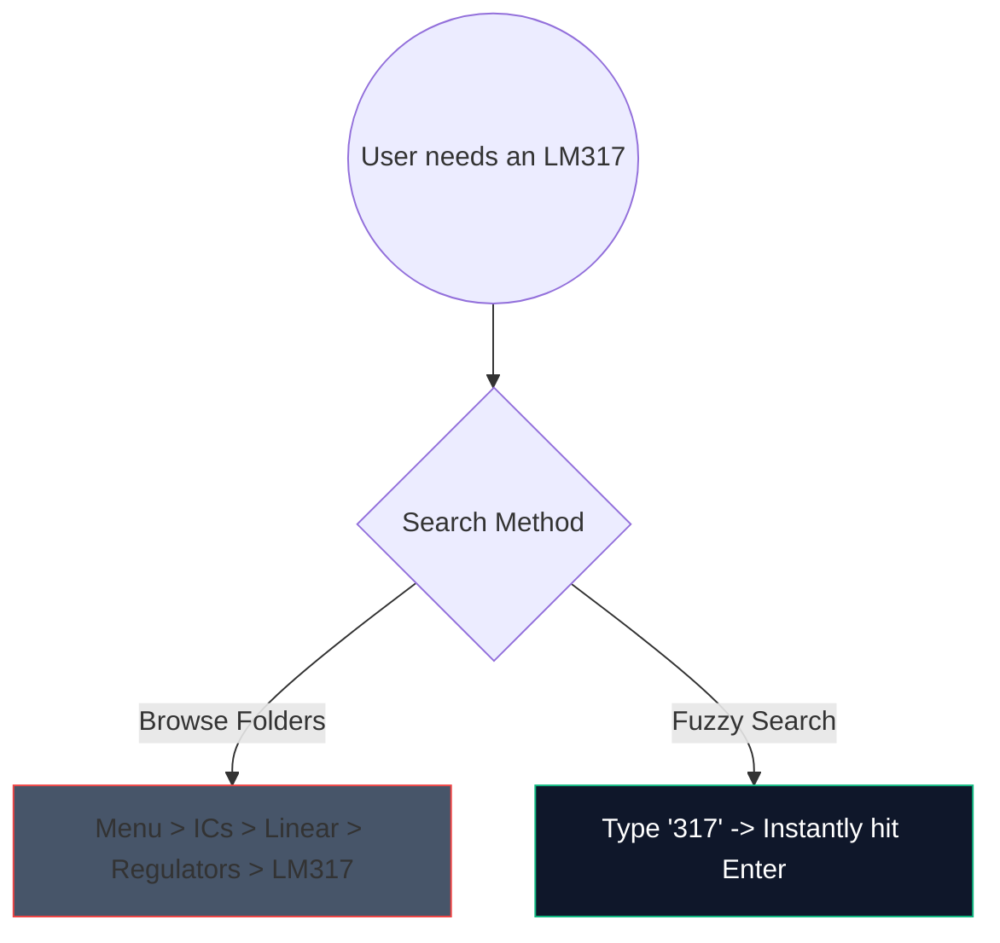

단순한 증폭기 회로를 스케치하기 위해 무거운 2GB 데스크톱 소프트웨어를 다운로드하던 시대는 끝났습니다. 브라우저 기반 CAD(Computer-Aided Design)가 등장했으며 이는 놀라울 정도로 빠릅니다.

최신 웹 도구를 활용하여 5분 이내에 생산 품질의 회로도를 생성하는 방법은 다음과 같습니다.

## 왜 브라우저 기반 회로 설계인가?

교육자, 학생 또는 취미로 문서를 작성하는 사람이라면 속도와 접근성이 원시 기능보다 중요합니다.

```mermaid
flowchart LR
    subgraph Traditional Workflow
    DL[Download/Install] --> CONF[Configure Libraries] --> DRAW1[Draw]
    end
    
    subgraph Web Workflow
    URL[Go to URL] --> DRAW2[Draw immediately]
    end
    
    style URL fill:#0f172a,stroke:#3b82f6
    style DRAW2 fill:#1e293b,stroke:#10b981
```

| 미터법 | 데스크탑 애플리케이션 | 회로도 작성기 |
| :--- | :--- | :--- |
| **저장 공간** | 1GB~5GB+ | 0MB(클라우드 기반) |
| **OS 호환성** | 종종 Windows 전용 또는 버그가 있는 포트 | 보편적인 웹 호환 |
| **시작 시간** | 15~30초 | 1초 미만 |
| **이식성** | 하나의 시스템으로 제한됨 | 어디서나 접근 가능 |

## 속도를 위한 핵심 작업 흐름 해킹

웹 편집기를 사용할 때 키보드 단축키를 사용하면 경험이 "클릭"에서 중단 없는 흐름 상태로 전환됩니다.

편집기에서 기억해야 할 가장 높은 ROI 단축키는 다음과 같습니다.

| 액션 | 단축키 명령 | 워크플로우 이점 |
| :--- | :--- | :--- |
| **와이어 라우팅** | 'W' | 커서를 연결 모드로 즉시 전환하여 도구 모음으로 이동하지 않고도 신속한 넷 라우팅이 가능합니다. |
| **구성요소 회전** | `R`(부분을 잡고 있는 동안) | 저항기나 트랜지스터를 배치하기 전에 방향을 지정하면 나중에 정리하는 데 드는 시간이 엄청나게 절약됩니다. |
| **중복 선택** | `Ctrl + D` 또는 `Alt-드래그` | 메뉴에서 8개의 LED를 당기지 마십시오. 하나를 배치하고 구성한 후 즉시 7번 복제하세요. |
| **팬 캔버스** | `스페이스바 + 드래그` | 방대하고 복잡한 레이아웃을 탐색하는 동안 확대/축소 수준을 일관되게 유지합니다. |

## 컴포넌트 검색 활용

방대한 드롭다운 메뉴를 통해 시각적으로 검색하는 것은 지루한 작업입니다. 우리는 강력한 퍼지 검색 메커니즘을 통합했습니다.

`반도체 -> 트랜지스터 -> BJT`를 클릭하는 대신 검색창을 누르고 `NPN`을 입력하기만 하면 됩니다. 이 도구는 가장 높은 확률의 일치 항목을 즉시 선별합니다.

## 전문가용으로 내보내기

다이어그램을 만드는 것은 전투의 절반에 불과합니다. 이를 논문이나 기술 블로그에 삽입하는 것이 나머지 절반입니다.

가능하면 항상 회로 패턴을 PNG나 JPG 대신 **SVG(Scalable Vector Graphics)**로 내보내세요. SVG는 픽셀이 아닌 수학적으로 정의된 선을 저장합니다. 즉, 회로도를 광고판 크기까지 확장할 수 있으며 래스터화 흐림 없이 영구적으로 선명한 상태를 유지합니다.

속도를 테스트할 준비가 되셨나요? **[앱을 실행](/editor/)**하고 555 타이머로 깜박이는 LED 회로를 만들어 보세요!