복잡한 설계도를 처음 열면 마치 외계 언어를 쳐다보는 듯한 느낌이 듭니다. 수십 개의 교차선, 수수께끼 같은 약어, 들쭉날쭉한 기호가 시각적 잡음의 벽으로 합쳐집니다.

그러나 숙련된 엔지니어는 전체 페이지를 보고 회로도를 읽지 않습니다. 그들은 고립시키고, 추적하고, 정복합니다. 다음은 회로도를 해독하는 단계별 방법입니다.

## 1단계: 핵심 전력 인프라 분리

회로의 *기능*을 이해하기 전에 *호흡 방법*을 이해해야 합니다.

모든 회로도에는 전기 에너지에 대한 진입점이 있습니다. 첫 번째 작업은 모든 주요 전압 레일과 접지 기준을 찾는 것입니다.

```mermaid
flowchart TD
    A[Start: Scan Edges] --> B{Look for Power Symbols}
    B -- Found Battery/Jack --> C[Trace the initial VCC and GND lines]
    B -- Found Net Labels --> D[Locate generic +5V, +3.3V pads]
    C --> E[Are there Voltage Regulators?]
    D --> E
    E -- Yes --> F[Mentally divide circuit into Voltage Zones]
    E -- No --> G[Circuit runs on single voltage]
    
    style A fill:#0f172a,stroke:#3b82f6
    style F fill:#1e293b,stroke:#f59e0b
```



| 기호/텍스트 | 의미 | 조치 요구사항 |
| :--- | :--- | :--- |
| `VCC` / `VDD` | IC용 양의 공급 전압. | 이를 추적하여 모든 IC에 전원이 공급되는지 확인하세요. |
| `GND` / `VSS` | 공통 접지 참조입니다. | 이러한 기호가 모두 물리적으로 서로 연결되어 있다고 가정합니다. |
| `LDO` / `벅` | 전압을 조절하는 칩입니다. | 새로운 저전압을 활용하는 다운스트림 구성요소는 무엇인지 확인하세요. |

## 2단계: '뇌'(IC)에 대한 이해하기

전력이 흐르는 위치를 알고 나면 페이지에서 가장 큰 직사각형을 찾으십시오. 집적 회로(IC)는 회로도의 주요 기능을 지정합니다.

'NE555' 또는 'ATmega328P'와 같은 알 수 없는 부품 번호가 있는 'U1' 라벨이 붙은 IC를 발견하면 즉시 회로도 읽기를 중단하십시오. 새 탭을 열고 **데이터시트**를 가져옵니다.

내부 반도체 물리학을 이해할 필요는 없습니다. 데이터시트의 "핀아웃 다이어그램"을 살펴보십시오. 핀 4가 'RESET'이고 핀 8이 'VCC'인 경우 즉시 해당 논리를 도면에 다시 매핑합니다.

## 3단계: 입력 및 출력 추적

회로는 기능적인 기계이다. 환경적인 입력을 받아 처리하고 결과를 출력합니다.

```mermaid
quadrantChart
    title Input/Output Hardware Identification
    x-axis Analog/Physical --> Digital/Data
    y-axis Input Devices --> Output Devices
    quadrant-1 Digital Receivers (e.g. WiFi)
    quadrant-2 Digital Displays (e.g. OLEDs)
    quadrant-3 Physical Actuators (e.g. Motors)
    quadrant-4 Physical Sensors (e.g. Thermistors)
    "Push Button": [0.1, 0.4]
    "Photoresistor": [0.2, 0.2]
    "UART RX": [0.8, 0.4]
    "UART TX": [0.8, 0.6]
    "Speaker": [0.3, 0.8]
    "LED": [0.4, 0.7]
```

중앙 IC에서 바깥쪽으로 와이어를 추적합니다. IC 핀이 LED에 연결되면 이는 시각적 출력입니다. 핀이 접지되는 SPST 스위치에 연결되면 이는 사람의 입력입니다.

## 4단계: 분기점 및 교차점 확인

초보자에게 가장 흔한 읽기 오류는 서로 교차하는 선을 오해하는 것입니다.

* **점은 매듭을 만듭니다.** 교차하는 두 선의 교차점에 단단한 점이 있으면 물리적으로 서로 납땜/연결된 것입니다. 전류는 그들 사이에 흐를 수 있습니다.
* **점은 다리를 형성하지 않습니다.** 두 선이 단순한 십자형(+)을 형성하는 경우 두 선은 닿지 *않습니다*. 이는 육교 위에서 서로를 지나가는 두 개의 고속도로와 유사합니다.

## 5단계: 하위 회로 인식(비밀 무기)

엔지니어가 처음부터 완전히 회로를 설계하는 경우는 거의 없습니다. 표준 모듈형 하위 회로를 서로 접착합니다. 이러한 시각적 '단어'를 인식하는 방법을 배우면 개별 '문자'를 읽는 것이 중단됩니다.

| 시각적 패턴 | 표준 하위 회로 | 기능 |
| :--- | :--- | :--- |
| IC 바로 옆에 'VCC'에서 'GND'로 교차하는 커패시터. | **디커플링 커패시터** | 소음을 흡수합니다. 논리적 흐름을 분석할 때는 무시하세요. |
| 최대 '+5V'까지 감싸는 디지털 핀의 저항기. | **풀업 저항** | 핀이 떠다니는 것을 방지합니다. 안정적인 HIGH 기본 상태를 보장합니다. |
| 전압과 접지 사이에 직렬로 배치된 저항 2개, 중앙에 탭이 있음. | **전압 분배기** | 센서 핀으로 안전하게 읽을 수 있도록 비례적으로 전압을 낮춥니다. |

이 이론을 실제로 적용해 보세요. **[회로도 편집기](/editor/)**를 열고 템플릿을 로드한 다음 전력, 두뇌, 입력 및 출력을 직접 매핑하세요!