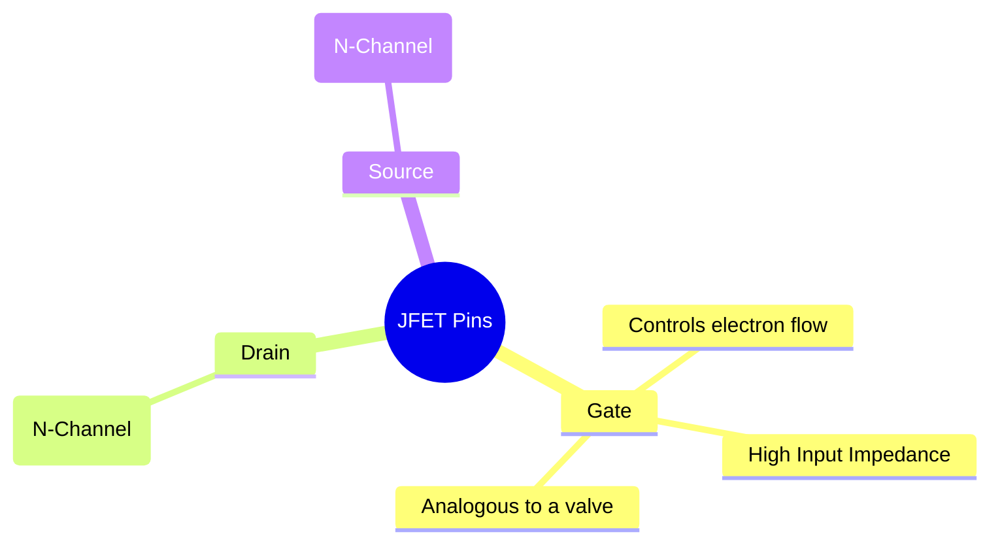

MOSFET이 대량으로 확산되기 전에는 **JFET**(Junction Field-Effect Transistor)가 고입력 임피던스 증폭의 왕이었습니다. 최신 디지털 로직에서는 자주 사용되지 않지만, 고성능 오디오 프리앰프, 민감한 계측기, RF 회로에서는 없어서는 안 될 요소로 남아 있습니다.

이산 아날로그 회로 설계를 탐구하는 모든 사람에게는 JFET 회로도 기호를 이해하는 것이 필수적입니다.

## 1. JFET 기호의 구조

전류 제어 장치인 BJT(양극 접합 트랜지스터)와 달리 JFET는 **전압 제어** 장치입니다. 회로도 기호는 내부 반도체 채널의 물리적 구성을 시각적으로 나타내려고 시도합니다.

기호는 채널을 나타내는 직선 수직선과 채널에 연결된 두 개의 수평선(드레인 및 소스)으로 구성됩니다. 세 번째 수직선은 게이트를 형성하며, 반도체 극성을 나타내는 화살표로 완성됩니다.

### N-채널 대 P-채널 JFET

BJT에 NPN과 PNP가 있는 것처럼 JFET에는 두 가지 뚜렷한 특징이 있습니다.

| 특징 | N채널 JFET | P채널 JFET |
| :--- | :--- | :--- |
| **기호 화살표** | 채널 라인을 향해 **IN**을 가리킵니다 | 채널에서 **OUT** 지점 |
| **주요 통신사** | 전자 | 구멍 |
| **핀치오프용 Vgs** | 음전압(예: -5V) | 양의 전압(예: +5V) |
| **일반적인 작업**| 일반적으로 ON -> 음전압 어레이를 적용하여 OFF | 일반적으로 ON -> 양의 전압 어레이를 적용하여 OFF |

> **메모리 트릭:** "IN을 가리키는 것"은 **N**-채널을 의미합니다. 게이트에 있는 화살표를 보세요. 라인 안쪽을 가리키는 경우 N채널 JFET(인기 있는 2N5457과 같은)를 다루는 것입니다.

## 2. 작업: 고갈 모드

JFET의 가장 큰 특징 중 하나는 **고갈 모드** 장치라는 것입니다. 이는 주위의 회로도를 설계하는 방법에 큰 영향을 미칩니다.

* **MOSFET(향상 모드):** 일반적으로 꺼져 있습니다. 게이트를 켜려면 게이트에 전압을 적용해야 합니다.
* **JFET(공핍 모드):** 일반적으로 ON입니다. 게이트에 0V가 있으면 최대 전류가 드레인에서 소스로 흐릅니다. 공핍 영역을 확장하고 문자 그대로 전자 흐름을 "핀치 오프"하여 장치를 끄려면 *역 바이어스* 전압(N 채널의 경우 음수)을 적용해야 합니다.

```mermaid
flowchart LR
    VGS[V_GS = 0V] --> I1[Maximum Drain Current flows]
    VGS2[V_GS = -2V] --> I2[Current is restricted]
    VGS3[V_GS = -5V] --> I3[Pinch-Off reached. Circuit is OFF]
    
    style VGS fill:#1e293b,stroke:#f59e0b
    style VGS3 fill:#1e293b,stroke:#ef4444
```

## 3. 일반적인 회로도 애플리케이션

JFET의 게이트는 작동 중에 역바이어스되기 때문에 본질적으로 전류가 0으로 흐릅니다. 이는 천문학적으로 높은 입력 임피던스(종종 수백 메가옴으로 측정됨)를 생성합니다.

| 회로 응용 | JFET를 선택한 이유 | 도식적 단서 |
| :--- | :--- | :--- |
| **오디오 프리앰프** | 극도로 낮은 노이즈와 대규모 입력 임피던스로 민감한 일렉트릭 기타 픽업의 로딩을 방지합니다. | 소스 팔로어 버퍼 단계로 작동하는 경우가 많습니다. |
| **아날로그 스위치** | 게이트 전류 없이 순수하게 전압 제어되기 때문에 제로 스위칭 과도 현상을 신호 경로에 주입합니다. | 드레인-소스 채널을 통과하는 아날로그 신호와 직렬로 배치됩니다. |
| **정전류 소스** | JFET는 게이트가 소스에 직접 연결될 때 기본적으로 정전류 싱크로 동작합니다. | 게이트 터미널은 소스 터미널 주변에 직접 연결됩니다. |

이러한 특수 아날로그 회로를 다이어그램으로 작성할 때 정밀도가 핵심입니다. 제조 실패를 방지하려면 게이트 화살표 방향이 올바른지 확인하십시오. **[회로도 작성기](/editor/)**에서 엄선된 개별 반도체 라이브러리를 사용하여 표준 N 채널 및 P 채널 JFET 기호를 다음 캔버스에 정확하게 배치하세요.