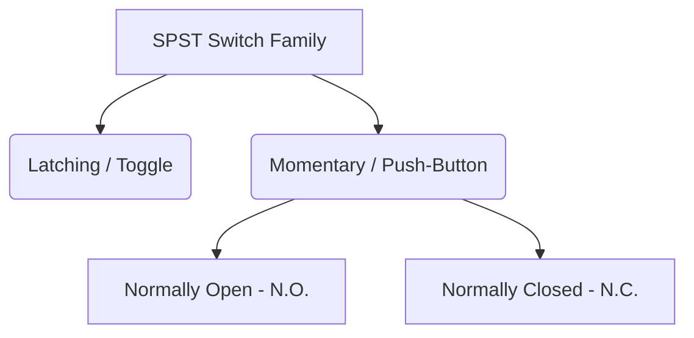

인간이 전기를 제어하기 위해 사용하는 모든 인터페이스의 중심에는 기계식 스위치가 있습니다. 이 구성 요소의 가장 간단하고 보편적인 구현은 **SPST** 또는 단극 단투형 스위치입니다.

고전압 주전원 차단기를 설계하든 단순히 Arduino 브레드보드의 푸시 버튼을 매핑하든 SPST 기호는 논리적인 출발점이 됩니다.

## 1. SPST의 실제 의미

엔지니어는 **폴**과 **던지기**라는 두 가지 변수를 사용하여 스위치를 분류합니다.

* **Pole(P):** 스위치가 동시에 제어할 수 있는 독립적인 전기 회로의 수입니다. 
* **투척(T):** 각 극이 갖는 닫힌 상태(ON 위치)의 수입니다.

따라서 SPST는 *단극*(하나의 회로 제어) 및 *단투형*(단 하나의 닫힌 전도 위치만 가짐)입니다.

```mermaid
flowchart LR
    A[Human Input] --> B((SPST Mechanism))
    B -- Open / Default --> C[Infinite Resistance / OFF]
    B -- Closed / Actuated --> D[Zero Resistance / ON]
    
    style B fill:#0f172a,stroke:#f59e0b
```

## 2. SPST 회로도 기호 읽기

SPST 스위치의 표준 IEEE 기호는 매우 직관적입니다. 문자 그대로 그 기능과 비슷해 보입니다.

| 시각적 요소 | 현실 세계에서의 의미 |
| :--- | :--- |
| **두 개의 열린 원** | 전선이 끝나는 고정된 전기 접촉 패드입니다. |
| **대각선 파선** | 기계적 전도성 암은 두 번째 패드에서 물리적으로 분리되어 '열림' 기본 상태를 나타냅니다. |
| **지정자(`S` 또는 `SW`)** | 표준 참조 태그. 예: 'SW1'. |

> **정상 상태 가정:** 달리 지정하지 않는 한 기계식 스위치는 **작동되지 않은 정지 상태**로 그려집니다. 표준 SPST 전등 스위치의 경우 이는 회로도에서 이를 OFF로 표시함을 의미합니다.

## 3. SPST의 변형: 푸시 버튼

토글 스위치는 사용자가 놓은 위치에 유지됩니다(래칭). 푸시 버튼은 손가락이 위에 있는 동안에만 작동됩니다(순간). SPST 지정은 두 가지 모두에 적용되지만 인간 상호 작용 모드를 구별하기 위해 기호가 약간 변경됩니다.

| 스위치 유형 | 회로도 변경 | 실제 사례 |
| :--- | :--- | :--- |
| **푸시 버튼(N.O.)** | 각진 팔 대신 ​​평평한 브리지가 두 개의 접촉 패드 *위*에 떠 있습니다. 아래로 밀면 간격이 메워집니다. | 키보드 키, 컴퓨터 전원 버튼, 초인종 버튼. |
| **푸시 버튼(N.C.)** | 플랫 브리지는 *아래*에 놓이거나 패드에 닿아 기본적으로 회로를 ON으로 유지합니다. 아래로 누르면 연결이 끊어집니다. | 중장비의 비상 정지(E-Stop) 버튼. |

## 4. 하드웨어 구현 경고

SPST 스위치를 디지털 논리 회로(예: Raspberry Pi GPIO 핀)에 통합할 때 순진한 회로 설계는 예측할 수 없는 소프트웨어 동작을 초래합니다.

### "플로팅 핀" 문제

SPST 스위치의 한쪽을 5V에 연결하고 다른 쪽을 마이크로 컨트롤러 핀에 직접 연결하면 스위치가 열리면 어떻게 될까요? 핀이 0V를 판독하지 않습니다. 연결이 끊어지고 "부동"되어 주변 전자기파를 포착하는 안테나처럼 작동합니다.

**수정 사항: 풀다운 저항기**

항상 디지털 핀과 접지 사이에 연결된 저항기(일반적으로 10kΩ)를 포함하십시오.

1. **스위치 끄기:** 핀은 저항을 통해 0V를 안전하게 읽습니다.
2. **켜기:** 5V 공급 장치가 저항기를 압도하여 안전한 HIGH 상태를 트리거합니다.

**[회로도 편집기](/editor/)**를 통해 SPST 변형을 설계에 안전하게 통합하세요. N.O.를 찾기 위해 왼쪽 'Switches' 라이브러리를 확장합니다. 그리고 N.C. 구현!