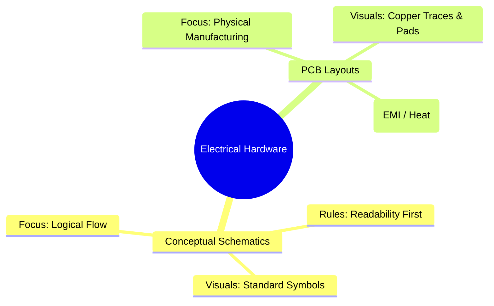
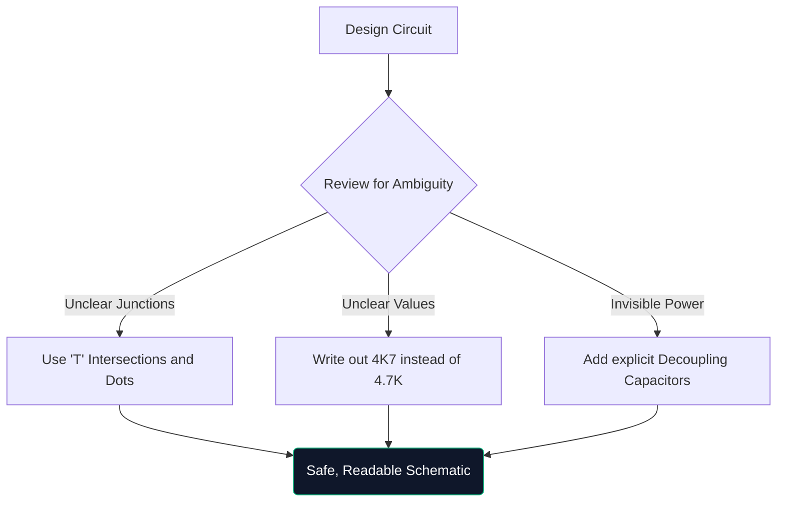

회로도에 대한 최종 마스터클래스에 오신 것을 환영합니다. 주말에 Arduino 프로토타입을 함께 해킹하거나 전기 공학을 공부하는 경우 회로도 아키텍처를 이해하는 것은 타협할 수 없습니다.

이 가이드는 기본 사항을 넘어 현대 다이어그램의 구성, 검증 및 제조 방법을 평가합니다.

## 이론적인 회로도와 PCB 레이아웃

가장 흔히 혼동되는 점은 회로도와 인쇄 회로 기판(PCB) 레이아웃 간의 차이입니다. 그것들은 동일한 전기적 진실을 완전히 다르게 표현한 것입니다.

| 특성 | 개략도 | PCB 레이아웃 |
| :--- | :--- | :--- |
| **목적** | 회로가 논리적으로 작동하는 *방법*을 이해하려면 | 구리가 물리적으로 가는 *어디*를 지시하려면 |
| **구성요소 표현** | 추상 기호(삼각형, 지그재그) | 물리적 1:1 풋프린트 패드(예: SOIC-8, 0805) |
| **연결** | 완벽한 기하학적 라인 | 45도 각도 구리 트레이스 |
| **환경** | 깨끗하고 흰색 배경 종이 | 다층 문자 그대로의 3D 공간 |

## 고급 회로도 분석

회로가 100개 이상의 구성 요소를 초과하면 시각적 패러다임이 전환됩니다. 단순히 그려진 선으로 모든 것을 연결할 수는 없습니다.

1. **제목 블록**: 전문 회로도에는 항상 오른쪽 하단에 회사 이름, 기록 엔지니어, 개정 번호 및 날짜를 ​​나타내는 블록이 있습니다.
2. **네트 라벨 및 포트**: 전선은 하위 시스템을 연결하지 않습니다. 명명된 레이블이 그렇습니다. 두 전선에 'CLK_OUT' 라벨이 붙어 있으면 서로 다른 페이지에 있더라도 전기적으로 연결된 것입니다.
3. **계층적 블록**: 대규모 디자인(예: 컴퓨터 마더보드)에서는 계층 구조를 사용합니다. "메모리 인터페이스"라고 표시된 단일 직사각형 블록 내부에는 완전히 별도의 회로도 페이지가 포함되어 있습니다.

## "방어 무승부"의 법칙

방어 운전과 유사하게, 방어 그림은 설계도를 읽는 사람이 명시적으로 안내하지 않는 한 이를 오해할 것이라고 가정하는 것을 의미합니다.

> **`4K7`이라고 쓰는 이유는 무엇입니까?** 인쇄되거나 복사된 회로도에서는 작은 소수점(`.`)이 인공물 때문에 쉽게 사라집니다. '4.7K'라고 쓰면 누군가가 '47K'로 읽을 위험이 있어 구성 요소가 손상될 수 있습니다. '4K7'을 쓰면 곱셈기가 소수점 역할을 하여 실제로 잘못 읽히는 일이 없어집니다.

## 디지털 CAD 도구로 전환

모눈종이에 그림을 그리는 것은 브레인스토밍에는 탁월하지만 제작에는 사실상 쓸모가 없습니다. 설계를 [회로도 작성기](/editor/)와 같은 도구로 마이그레이션하면 다음과 같은 몇 가지 강력한 기능을 얻을 수 있습니다.

* **넷리스트**: 디지털 도구로 수학적으로 연결을 증명합니다.
* **재사용성**: 이전 프로젝트의 복잡한 조정 전원 공급 장치를 복사하여 붙여넣으면 시간이 절약됩니다.
* **벡터 품질**: SVG로 내보내면 확대 정도에 관계없이 완벽하고 선명한 선이 보장됩니다.

이론에서 현실로의 도약은 잘 그려진 선에서 시작됩니다. 오늘 여행을 시작해보세요!