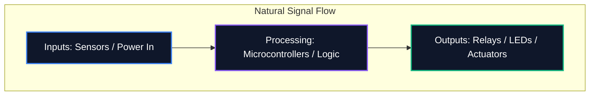

Sama ada anda berkongsi gambar rajah di forum atau menyerahkannya untuk fabrikasi PCB profesional, kebolehbacaan skema anda adalah sama pentingnya dengan ketepatan logiknya. Skema yang tidak kemas membawa kepada ralat penghalaan, komponen yang salah faham dan masa yang sia-sia.

Panduan ini menggariskan amalan terbaik teras yang digunakan oleh jurutera elektronik profesional untuk mencipta gambar rajah litar yang bersih, boleh diselenggara dan sangat mudah dibaca.

## 1. Aliran Skema: Kiri ke Kanan, Atas ke Bawah

Skema ialah dokumen teknikal, dan seperti mana-mana dokumen, ia harus dibaca secara semula jadi. Dalam reka bentuk elektronik, konvensyen standard menentukan bahawa input mengalir dari kiri, dan output keluar ke kanan.

Begitu juga, voltan yang lebih tinggi harus diletakkan secara eksplisit di bahagian atas skema, dan voltan rendah atau tanah di bahagian bawah.



## 2. Kuasa dan Simbol Tanah

Jangan sekali-kali lukis wayar panjang berliku yang menyambungkan setiap pin tanah bersama-sama. Ia mencipta sarang labah-labah yang mustahil untuk dibaca. Sebaliknya, gunakan kuasa tempatan dan simbol tanah pada komponen.

| Amalan Buruk | Amalan Terbaik | Mengapa Ia Penting |
| :--- | :--- | :--- |
| Mengikat semua alasan dengan wayar berterusan tunggal | Menggunakan simbol `GND` tempatan pada setiap komponen | Mengurangkan kekacauan visual; secara eksplisit mentakrifkan laluan kembali tanpa pengesanan kompleks |
| Meletakkan garisan VCC yang melintasi jejak isyarat | Menggunakan simbol `VCC` / `+5V` tempatan menghala ke atas | Menghalang talian isyarat daripada dikelirukan secara visual dengan penghantaran kuasa |
| Melabelkan alasan yang berbeza dengan simbol yang sama | Membezakan Tanah Analog (AGND) dan Tanah Digital (DGND) | Kritikal untuk mengelakkan gelung tanah dan perambatan hingar dalam reka bentuk isyarat bercampur |

## 3. Titik Persimpangan lwn Lintasan

Salah satu kesilapan yang paling berbahaya dalam reka bentuk skematik ialah kekaburan di mana wayar bersilang.

```mermaid
graph TD
    A[Is it a connection?]
    A --> B{Is there a junction dot?}
    B -- Yes --> C[Wires are electrically connected (Node)]
    B -- No --> D[Wires are crossing without connecting]
    
    style A fill:#1e293b,stroke:#f59e0b
    style C fill:#1e293b,stroke:#10b981
    style D fill:#1e293b,stroke:#ef4444
```

> **Petua Pro:** Jangan sekali-kali menggunakan simpang "4 hala" (berbentuk salib seperti '+'). Jika empat wayar perlu bertemu, mengimbanginya menjadi dua persimpangan 'T' 3 hala. Ini benar-benar menghapuskan kekaburan; jika titik simpang hilang semasa mencetak atau menskala, bentuk 'T' masih jelas menunjukkan sambungan, manakala salib kosong tidak.

## 4. Pengumpulan Komponen Logik

Apabila berurusan dengan skema besar yang mengandungi mikropengawal dengan 64+ pin, cuba menarik setiap wayar secara fizikal ke komponen adalah satu latihan yang sia-sia. Sebaliknya, alatan profesional menggunakan **Label Bersih**.

Kumpulan blok berfungsi litar anda ke dalam zon visual. Sebagai contoh, letakkan bekalan kuasa di satu sudut, MCU di tengah, dan pemandu motor di sudut lain. Sambungkan mereka semata-mata menggunakan Label Bersih deskriptif (cth., `SPI_MOSI`, `UART_TX`, `MOTOR_PWM`).

## 5. Penentu Rujukan dan Nilai

Simbol perintang kosong tidak memberitahu penonton apa-apa. Setiap komponen mesti mempunyai penunjuk rujukan unik dan nilai eksplisit.

| Kategori Komponen | Awalan Standard | Contoh |
| :--- | :--- | :--- |
| **Perintang** | `R` | `R1 (10kΩ)` |
| **Kapasitor** | `C` | `C4 (100nF)` |
| **Litar Bersepadu** | `U` atau `IC` | `U2 (LM358)` |
| **Diod / LED** | `D` | `D1 (1N4148)` |
| **Transistor / MOSFET** | `Q` | `S1 (2N2222)` |
| **Induktor** | `L` | `L1 (4.7μH)` |
| **Penyambung/Pengepala** | `J` atau `P` | `J1 (Bicu Kuasa)` |

Mematuhi konvensyen ini menjamin bahawa skema anda akan difahami serta-merta oleh mana-mana jurutera, di mana-mana sahaja di dunia. Mula menggunakan peraturan ini hari ini dalam [Editor Diagram Litar](/editor/).