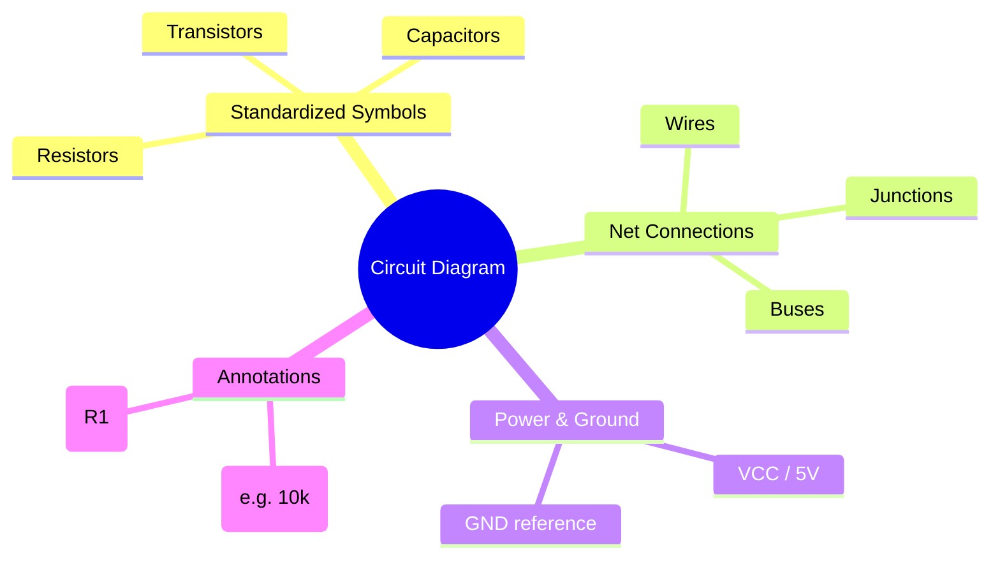
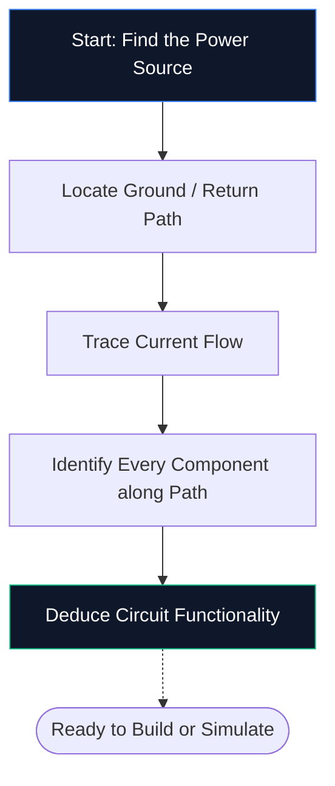

Jika anda tidak pernah membuka editor skematik sebelum ini, ini adalah satu-satunya panduan yang anda perlukan. Kami akan menelusuri asas-asasnya — apakah gambarajah litar, cara menyahkod simbol, dan cara melukis skema pertama anda di dalam **Pembuat Rajah Litar** — semuanya tanpa memasang satu perisian pun.

## Apakah Sebenarnya Gambarajah Litar?

Gambar rajah litar ialah peta bagi tenaga elektrik. Sama seperti peta kereta api bawah tanah menunjukkan cara stesen bersambung tanpa menggambarkan terowong mengikut skala, gambar rajah litar menunjukkan cara komponen elektronik bersambung tanpa perlu risau tentang saiz fizikal atau penempatan papan.

Daripada lukisan realistik, skema menggunakan **simbol piawai**. Perintang muncul sebagai garis zigzag, kapasitor sebagai dua plat selari, dan diod sebagai segitiga bertemu bar. Kata pintas universal ini memastikan gambar rajah bersih, boleh dicetak dan boleh dibaca di setiap negara dan bahasa.

> **Mengapa abstraksi penting:** Perintang fizikal ialah silinder kecil dengan jalur berwarna, namun pada skema 50 komponen perincian itu akan menimbulkan huru-hara visual. Simbol memampatkan gambar supaya otak anda boleh memfokus pada *bagaimana perkara bersambung* dan bukannya *rupanya*.

## 10 Simbol Mesti Tahu untuk Setiap Pemula

Sebelum anda boleh membaca — atau melukis — satu skema, anda perlu mengenali blok binaan teras. Hafal jadual di bawah dan anda akan dapat menyahkod kebanyakan litar hobi apabila dilihat.

| Bentuk Simbol | Komponen | Fungsi Utama | Penama |
| :--- | :--- | :--- | :--- |
| **Barisan zigzag** | Perintang | Hadkan aliran semasa | `R` |
| **Dua garis selari** | Kapasitor | Menyimpan caj, menapis bunyi | `C` |
| **Siri gelung** | Induktor | Menyimpan tenaga dalam medan magnet | `L` |
| **Segitiga + bar** | Diod | Membenarkan arus dalam satu arah | `D` |
| **Segitiga + bar + anak panah** | LED | Memancarkan cahaya apabila condong ke hadapan | `D` / `LED` |
| **Garis selari panjang / pendek** | Bateri | Menyediakan voltan DC | `BT` |
| **Tiga baris bertindan** | Tanah | Titik rujukan pada 0 V | `GND` |
| **Bentuk segitiga** | Op-Amp | Menguatkan perbezaan voltan | `U` / `IC` |
| **Segi empat tepat dengan pin** | Litar Bersepadu | Menjalankan fungsi kompleks | `U` / `IC` |
| **Garis lurus** | Wayar | Membawa arus antara komponen | *(Tiada)* |

## Cara Membaca Skema dalam Lima Langkah

Membaca gambar rajah litar mengikut proses mental yang sama setiap kali. Amalkan lima langkah ini pada mana-mana skema dan corak akan menjadi sifat kedua.

1. **Cari sumber kuasa** — Cari simbol atau label bateri seperti VCC, 5 V atau 3.3 V. Di sinilah tenaga elektrik memasuki litar.
2. **Cari tanah** — Cari simbol tanah tiga baris atau label GND. Setiap litar mesti mempunyai laluan balik.
3. **Jejak aliran arus** — Ikuti wayar dari terminal positif, melalui setiap komponen, dan kembali ke tanah. Arus konvensional mengalir dari positif ke negatif.
4. **Kenal pasti setiap komponen** — Padankan setiap simbol dengan jadual di atas, kemudian baca label di sebelahnya untuk nilai yang tepat (contohnya 10 kΩ bermaksud 10,000 ohm).
5. **Fahami tujuan** — Tanya diri anda apa yang dilakukan oleh litar. LED ditambah perintang ialah lampu penunjuk mudah. Op-amp dengan perintang maklum balas ialah penguat isyarat.

## Skema Pertama Anda: Litar LED

Setiap pemula elektronik bermula di sini — LED dikuasakan melalui perintang pengehad arus. Buka [editor Pembuat Diagram Litar](/editor/) dan ikuti.

**Saluran Paip Seni Bina Litar:**

```mermaid
graph LR
    PWR(Battery 9V) -- Positive Wire --> R1(Resistor 330Ω)
    R1 -- Controlled Current --> D1((Red LED))
    D1 -- Return Path --> GND(Ground)
    
    style PWR fill:#1e293b,stroke:#f59e0b
    style R1 fill:#1e293b,stroke:#3b82f6
    style D1 fill:#1e293b,stroke:#ef4444
    style GND fill:#1e293b,stroke:#64748b
```

**Arahan langkah demi langkah:**

1. Seret simbol **Bateri** dari bar sisi ke kanvas.
2. Letakkan **Perintang** di sebelah kanan bateri.
3. Letakkan **LED** di sebelah kanan perintang.
4. Tekan **W** untuk mengaktifkan mod Wayar.
5. Klik terminal positif bateri, kemudian klik pin kiri perintang untuk menarik wayar.
6. Sambungkan pin kanan perintang ke anod LED.
7. Dawaikan katod LED kembali ke terminal negatif bateri.
8. Klik dua kali pada perintang dan taip **330 Ω**.
9. Klik **Eksport → SVG** untuk menyimpan fail kualiti penerbitan.

## Lima Kesilapan Biasa (dan Cara Mengelakkannya)

| Kesilapan | Apa yang Silap | Pembetulan Pantas |
| :--- | :--- | :--- |
| **Jalur tanah hilang** | Litar kelihatan terbuka; arus tidak boleh mengalir | Sentiasa wayar laluan kembali ke tanah |
| **Penyilangan wayar tanpa titik** | Dua wayar yang bersilang kelihatan bersambung apabila ia tidak | Tambahkan titik simpang hanya di mana wayar sebenarnya bercantum |
| **Tiada nilai komponen** | Penyemak tidak boleh mengesahkan reka bentuk anda | Labelkan setiap perintang, kapasitor dan IC |
| **Pendawaian tidak kemas** | Wayar pepenjuru atau bertindih mengurangkan kebolehbacaan | Gunakan penghalaan Manhattan (mendatar dan menegak sahaja) |
| **Tiada penunjuk rujukan** | Senarai bahagian menjadi mustahil untuk dibuat | Labelkan setiap bahagian R1, C1, U1, D1 dan seterusnya |

## Ke Mana Seterusnya

Setelah anda selesa melukis skema asas, terokai sumber ini untuk meningkatkan tahap:

* **[Simbol Gambarajah Litar Dijelaskan](/blog/circuit-diagram-symbols-explained/)** — menyelami setiap kategori simbol
* **[Cara Membuat Rajah Litar Dalam Talian](/blog/how-to-make-circuit-diagram-online/)** — teknik lanjutan dan petua aliran kerja
* **[Perpustakaan Komponen](/komponen/)** — semak imbas semua 40+ simbol yang tersedia dalam Pembuat Rajah Litar