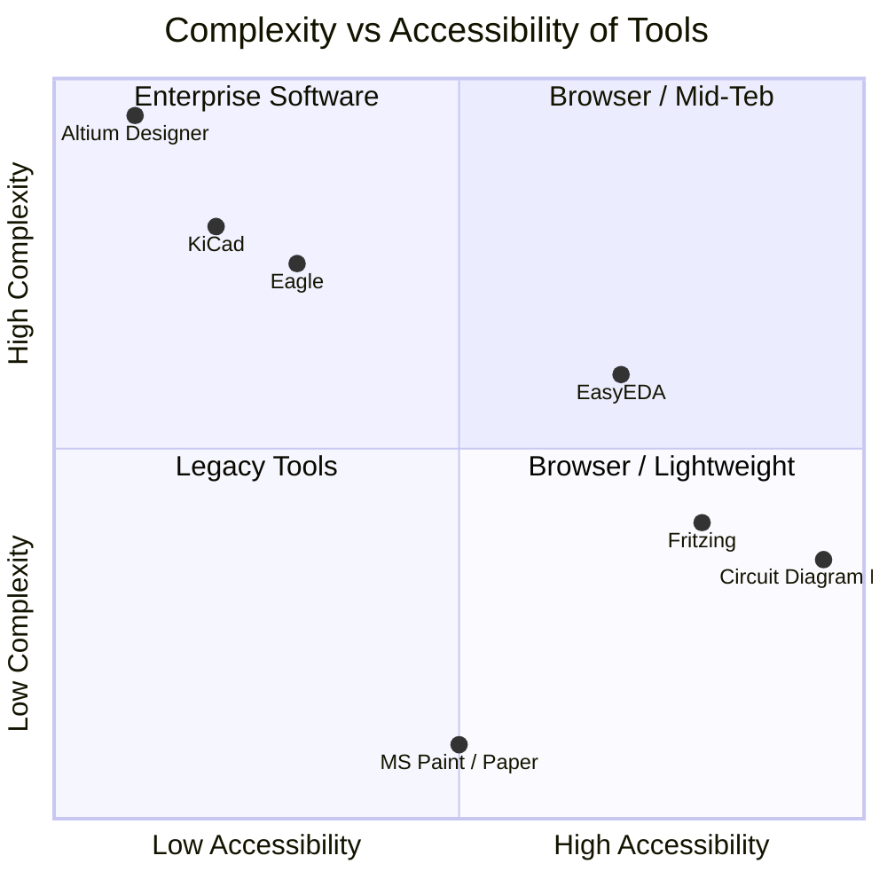
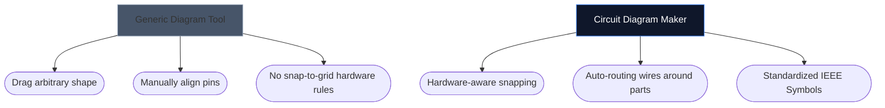

Memilih alat yang betul untuk melukis skema elektronik anda selalunya boleh menentukan seberapa pantas anda boleh mengulangi projek perkakasan baharu. Walaupun pereka PCB lanjutan memerlukan persekitaran desktop kelas berat, penggemar, pelajar dan pembuat sering memerlukan sesuatu yang sama sekali berbeza: kebolehcapaian dan kelajuan.

Di bawah, kami menganalisis cara alat kami bertindan berbanding alternatif industri utama.

## Matriks Pengkategorian Alat

Sebelum menyelam ke dalam alat individu, adalah penting untuk memahami peringkat perisian yang sebenarnya diperlukan oleh projek anda. Menggunakan perisian PCB perusahaan untuk melakar susun atur LED 4 komponen adalah berlebihan.

## 1. Pembuat Rajah Litar lwn Fritzing

Fritzing terkenal kerana merapatkan jurang antara prototaip papan roti dan skema. Walau bagaimanapun, Fritzing memerlukan pemasangan dan telah bergelut dengan kemas kini penyelenggaraan selama ini.

| Ciri | Pembuat Rajah Litar | Fritzing |
| :--- | :--- | :--- |
| **Fokus Utama** | Reka Letak Skema Standard | Visualisasi Breadboard |
| **Pemasangan** | Tiada (100% berasaskan Pelayar) | Pemasangan Desktop Diperlukan |
| **Kos** | 100% Percuma | Berbayar (Perisian Derma) |
| **Keluk Pembelajaran** | Sangat Rendah | Sederhana |

> **Keputusan:** Jika anda secara khusus perlu memvisualisasikan wayar fizik yang menjunam ke papan roti, Fritzing adalah unggul. Jika anda memerlukan skema elektronik standard dan universal *segera*, gunakan Pembuat Rajah Litar.

## 2. Pembuat Rajah Litar lwn KiCad & Altium

KiCad ialah suite PCB sumber terbuka yang legenda, dan Altium Designer ialah piawaian industri perusahaan. Mereka sangat berkuasa.

| Lapisan Keupayaan | Pembuat Rajah Litar | KiCad / Altium |
| :--- | :--- | :--- |
| **Jenis Output** | Imejan SVG/PNG | Fail Gerber, BOM, Pilih&Tempat |
| **Simulasi** | Visual / Simplistik | Penyepaduan Deep SPICE |
| **Kelajuan ke Skema Pertama** | < 10 saat | 10–30 Minit (Persediaan/Konfigurasi) |

> **Keputusan:** Gunakan KiCad atau Altium apabila anda menghantar lapisan tembaga ke kilang di Shenzhen. Gunakan Pembuat Rajah Litar apabila anda melampirkan skema pada tugasan fizik, catatan blog atau soalan forum.

## 3. Pembuat Rajah Litar lwn draw.io / Lucidchart

Alat gambar rajah generik seperti draw.io sangat popular untuk carta alir. Walau bagaimanapun, mereka kurang memahami semantik elektronik.

Apabila anda menggunakan alat elektronik khusus, editor memahami bahawa wayar tidak boleh "menamatkan" secara rawak tanpa persimpangan, dan ia sememangnya memetakan sifat standard (seperti Ohm kepada perintang).

## Alat Mana yang Sesuai untuk Anda?

Alat terbaik ialah alat yang menghalang anda. Untuk idea pantas, tugasan pendidikan dan penerbitan web, [Circuit Diagram Maker](/editor/) menawarkan gabungan kelajuan dan estetika moden yang tiada tandingan.