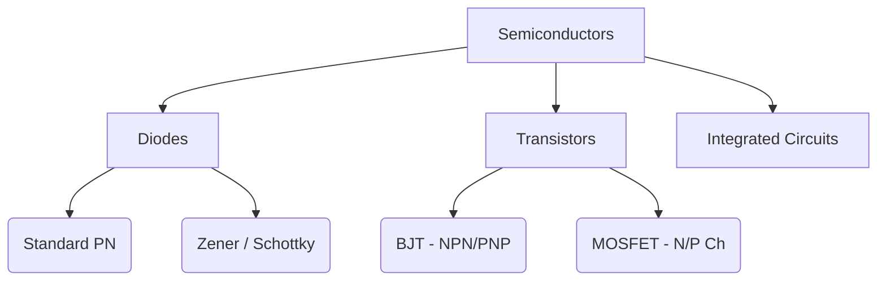

Simbol elektronik ialah bahasa universal kejuruteraan perkakasan. Sama seperti nota muzik menentukan pic dan irama, simbol litar menyampaikan fungsi elektrik, sifat dan ketersambungan di atas sekeping kertas.

Dalam panduan komprehensif ini, kami membedah morfologi visual elemen paling penting yang akan anda temui dalam mana-mana skema.

## Perbezaan Standard Global: IEEE lwn. IEC

Sebelum menyelam ke dalam simbol tertentu, adalah penting untuk mengenali bahawa simbol boleh kelihatan berbeza bergantung pada tempat skema dilukis. Dua piawaian yang dominan ialah **IEEE/ANSI** (kebanyakannya Amerika) dan **IEC** (Eropah dan antarabangsa).

```mermaid
flowchart LR
    subgraph Regional Standards
    A((Schematic Origin))
    A -- US / Americas --> B[IEEE / ANSI]
    A -- Europe / Int'l --> C[IEC]
    end
    
    B -.-> D(Zigzag Resistors)
    C -.-> E(Rectangle Resistors)
    
    style B fill:#1e293b,stroke:#f59e0b
    style C fill:#1e293b,stroke:#3b82f6
```

Dalam Pembuat Rajah Litar, kami menggunakan piawaian IEEE/ANSI terutamanya, kerana ia kekal sangat popular dalam ekosistem digital dan penggemar, walaupun kedua-duanya betul dari segi teknikal.

## Komponen Pasif

Komponen pasif tidak memerlukan sumber kuasa luaran untuk beroperasi dan tidak boleh menguatkan isyarat.

| Komponen | Penampilan Simbol Standard | Penerangan Fungsian |
| :--- | :--- | :--- |
| **Perintang** | Ditakrifkan oleh garis zigzag yang tajam dan bergerigi. Varian boleh ubah menampilkan anak panah yang menembusi garisan. | Melesapkan kuasa sebagai haba untuk menyekat pengaliran arus elektrik. |
| **Kapasitor** | Dua garis selari yang dipisahkan oleh jurang. Varian terpolarisasi melengkung salah satu garis untuk menunjukkan terminal negatif. | Menyimpan tenaga elektrik buat sementara waktu dalam medan elektrik. |
| **Induktor** | Satu siri gelung bulat atau separuh bulatan yang mewakili gegelung wayar. | Menentang perubahan aliran arus dengan menyimpan tenaga dalam medan magnet. |

## Komponen Aktif (Semikonduktor)

Komponen aktif memerlukan sumber kuasa dan boleh mengawal aliran elektrik, selalunya menguatkan isyarat.

| Komponen | Penunjuk Visual | Penggunaan Teras |
| :--- | :--- | :--- |
| **Diod** | Segi tiga menunjuk ke arah garis rata. Garis menunjukkan katod (negatif). | Injap sehala untuk elektrik. |
| **LED** | Simbol diod standard dengan dua anak panah kecil menghala ke luar, menandakan pelepasan cahaya. | Penunjuk visual dan optoelektronik. |
| **Transistor BJT** | Garis menegak yang diapit oleh tiga sambungan: tapak, pengumpul dan pemancar dengan anak panah menentukan NPN atau PNP. | Suis dan penguat terkawal semasa. |
| **MOSFET** | Mempunyai garis sempadan yang dipisahkan yang menonjolkan pintu terpencil dan diod substrat dalaman. | Pensuisan dikawal voltan untuk kuasa tinggi. |

## Mekanikal dan Peranti Output

Bahagian ini berinteraksi dengan dunia fizikal, sama ada mengambil input manusia atau menghasilkan output fizikal.

| Komponen | Shorthand Skema | Permohonan |
| :--- | :--- | :--- |
| **Tukar (SPST)** | Garis putus yang boleh berputar ke bawah untuk melengkapkan litar. | Kawalan kuasa ON/OFF asas. |
| **Geganti** | Biasanya digambarkan sebagai induktor (gegelung dalaman) ditambah dengan sesentuh suis terpencil. | Menukar beban voltan tinggi melalui mikropengawal voltan rendah. |
| **Motor** | Bulatan yang mengandungi 'M', selalunya dengan terminal positif dan negatif yang ditetapkan. | Menukarkan arus elektrik kepada kinetik putaran. |

> **Petua Reka Bentuk:** Setiap kali menggunakan suis atau relay mekanikal, sentiasa sertakan *diod flyback* merentas beban induktif untuk melindungi komponen semikonduktor anda daripada lonjakan voltan!

Memahami simbol ini adalah langkah pertama ke arah kelancaran litar. Lihat [editor dalam talian](/editor/) kami untuk menyeret, menjatuhkan dan mencuba bentuk ini serta-merta.