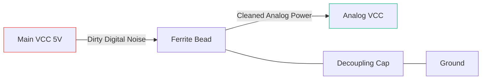

Elektronik digital berkelajuan tinggi menghasilkan banyak bunyi elektromagnet. Tanpa pengurangan, gangguan frekuensi tinggi ini mengalir ke dalam talian analog sensitif atau memancar ke luar, menyebabkan peranti anda gagal dalam ujian pelepasan FCC.

Senjata utama menentang gangguan ini ialah **manik ferit**. Memahami simbol skematik dan penempatannya menentukan sama ada litar anda beroperasi dengan bersih atau tenggelam dalam bunyinya sendiri.

## 1. Menggambarkan Simbol Manik Ferrite

Manik ferit beroperasi secara semula jadi seperti induktor yang sangat rugi. Oleh sebab itu, simbol skematiknya berkait rapat dengan simbol induktor standard, tetapi disesuaikan untuk menekankan peranan khususnya.

```mermaid
graph LR
    A[Inductor Basis] --> B(Standard Inductor Symbol)
    A --> C(Rectangle Over Wire)
    B -.-> D(Addition of a dashed line or solid bar)
    D --> E[IEEE Ferrite Symbol]
    C --> F[IEC Ferrite Symbol]
    
    style E fill:#0f172a,stroke:#3b82f6
    style F fill:#0f172a,stroke:#10b981
```

| Sifat | Piawaian IEEE/ANSI | Piawaian IEC | Nota |
| :--- | :--- | :--- | :--- |
| **Bentuk** | Siri separuh bulatan dengan bar/kotak | Bongkah segi empat tepat pepejal | Secara fungsian sama dalam hasil |
| **Awalan Pereka ** | `FB` | `FB` atau `L` | Menggunakan `FB` amat disyorkan untuk mengelakkan kekeliruan dengan induktor kuasa |
| **Unit Pengukuran** | Ohm (Ω) pada MHz tertentu | Ohm (Ω) pada MHz tertentu | Tidak seperti induktor yang diukur dalam Henry (H) |

> **Perbezaan Penting:** Jangan sekali-kali menilai manik ferit mengikut kearuhan. Manik ferit ditentukan oleh **impedansnya (dalam Ohm) pada frekuensi tertentu** (biasanya 100 MHz).

## 2. Mekanik Operasi Teras

Mengapa menggunakan manik ferit dan bukannya induktor standard?

* **Induktor** menyimpan tenaga dan mengembalikannya ke litar. Ia sangat reaktif dan mengekalkan tenaga.
* Sebuah **manik ferit** direka secara aktif untuk menjadi *kerugian*. Pada frekuensi tinggi, ia berkelakuan seperti perintang, menukar bunyi frekuensi tinggi yang tidak diingini terus kepada haba.

| Julat Kekerapan | Gelagat Manik Ferrite | Keputusan pada Litar |
| :--- | :--- | :--- |
| **Kekerapan Rendah / DC** | Di bawah 1 MHz | Bertindak seperti wayar ringkas (~0 Ω). Kuasa DC melepasi secara bebas. |
| **Kekerapan Resonan** | Sangat Reaktif | Menyimpan tenaga secara ringkas. |
| **Kekerapan Tinggi** | Lebih 50 MHz+ | Bertindak seperti perintang bernilai tinggi. Menyekat dan menghilangkan bunyi RF sebagai haba. |

## 3. Amalan Terbaik untuk Penempatan Skema

Penggunaan simbol FB dengan betul memerlukan penempatan yang strategik. Menampar manik ferit secara rawak pada skema sebenarnya boleh memburukkan deringan dan resonans.

### Menyahganding Bekalan Kuasa (Pi-Filters)

Penggunaan mutlak yang paling biasa untuk simbol `FB` ialah mengasingkan kuasa digital yang kotor daripada kuasa analog yang bersih.

Dalam konfigurasi di atas (sebahagian daripada Penapis Pi), manik ferit menyekat transien frekuensi tinggi daripada memasuki talian AVCC, manakala kapasitor mengelak sebarang riak yang tinggal ke tanah.

### Penindasan EMI Talian Data

Apabila menghalakan kabel data USB yang panjang atau surih HDMI, simbol `FB` selalunya diletakkan secara bersiri berhampiran penyambung. Ini memastikan wayar yang panjang dan terdedah secara fizikal tidak bertindak sebagai antena dan memancarkan bunyi CPU ke seluruh bilik.

Untuk menambah manik ferit pada skema anda yang seterusnya, buka **[Editor Gambarajah Litar](/editor/)**, cari "Ferrite," dan nyatakan penarafan impedans anda!