Membina penyongsang kuasa—menukar bateri kereta 12V kepada arus ulang alik 220V yang mampu menjalankan perkakas rumah—adalah satu upacara untuk jurutera elektronik.

Sebelum mengangkat besi pematerian, anda mesti mencapai pemahaman yang sempurna tentang skema asas. Litar voltan tinggi tidak boleh dimaafkan, dan gambar rajah yang dilukis dengan teruk menjamin MOSFET terbakar atau kejutan elektrik yang teruk. Panduan ini menguraikan seni bina penyongsang gelombang empat segi asas.

> **Amaran Keselamatan:** Kuasa AC 220V boleh membawa maut. Artikel ini ialah penerokaan logik skematik dan reka bentuk teori, bukan cetakan biru pembuatan. Jangan sekali-kali membina litar voltan tinggi tanpa latihan elektrik lanjutan.

## Senibina Tiga Tiang

Tidak kira betapa kompleksnya penyongsang moden, skema sentiasa boleh dibahagikan secara visual dan logik kepada tiga blok berfungsi yang berbeza.

```mermaid
flowchart LR
    DC_SRC[(12V DC Battery)] --> OSC[1. Oscillator Block]
    OSC -- Low Power Square Wave --> AMP[2. Power Switch Block]
    AMP -- High Current 12V Wave --> TX[3. Step-Up Transformer]
    TX -- Magnetic Induction --> AC_OUT((220V AC Output))
    
    style OSC fill:#0f172a,stroke:#3b82f6
    style AMP fill:#0f172a,stroke:#f59e0b
    style TX fill:#0f172a,stroke:#ef4444
```

### Peringkat 1: Pengayun (Otak)

Arus Terus (DC) daripada bateri mengalir dalam garis lurus. Transformer tidak boleh menaikkan garis lurus; mereka memerlukan medan magnet yang turun naik. Oleh itu, kita mesti menukar DC kepada gelombang AC buatan (biasanya 50Hz atau 60Hz bergantung pada kawasan geografi).

| Komponen Digunakan | Peranan Skema | Mengapa ia Dipilih |
| :--- | :--- | :--- |
| **CD4047 IC / 555 Pemasa** | Multivibrator Astabil | Menghasilkan gelombang persegi yang sangat stabil melalui pengiraan pemalar masa RC. |
| **Rangkaian Perintang & Kapasitor** | Penentukuran masa | Nilai (cth., `R=100kΩ`, `C=0.1μF`) secara unik menentukan frekuensi 50Hz yang tepat. |

### Peringkat 2: Suis Kuasa (Otot)

Cip logik menghasilkan gelombang 50Hz yang murni, tetapi pada had arus yang sangat rendah (selalunya di bawah 20mA). Jika anda memasukkannya ke dalam pengubah, ia tidak akan menghasilkan fluks magnet yang mencukupi untuk menjalankan mentol lampu.

Kami meletakkan transistor berkuasa tinggi di antara pengayun dan gegelung pengubah.

1. Isyarat lemah pengayun mencecah **Gate** MOSFET Saluran-N yang besar (seperti IRF3205).
2. MOSFET bertindak sebagai geganti tugas berat elektronik.
3. Ia mengalihkan ampere besar besar-besaran daripada bateri 12V secara terus melalui gegelung pengubah 50 kali sesaat.

### Peringkat 3: Pengubah Langkah Naik

Pada ketika ini dalam skema, kami mempunyai sejumlah besar arus 12V yang berdenyut ke depan dan ke belakang. Peringkat akhir memerlukan penghalaan ini melalui gegelung utama pengubah.

| Ciri | Butiran Skema | Implikasi Dunia Nyata |
| :--- | :--- | :--- |
| **Gegelung Utama (Kiri)** | Konfigurasi diketuk tengah (`12V - 0 - 12V`) | Membenarkan penukaran tolak-tolak ke belakang dan ke hadapan daripada dua MOSFET berselang-seli. |
| **Garis Teras** | Dua garisan pepejal dilukis secara menegak | Mewakili teras besi/ferit yang diperlukan untuk aruhan magnet berkecekapan tinggi. |
| **Gegelung Sekunder (Kanan)** | Nisbah penggulungan meningkat secara besar-besaran | Fizik menaikkan fluks magnet 12V yang berdenyut menjadi gelombang 220V yang boleh membawa maut. |

## Melukis Pertimbangan

Apabila menggunakan **[Editor Diagram Litar](/editor/)** untuk mendraf reka bentuk ini, ingat amalan terbaik reka letak:

* Lukis garisan berat yang membawa arus Bateri 12V lebih tebal daripada garisan pengayun kuasa rendah.
* Tanahkan pin Sumber MOSFET secara eksplisit dan unik; jangan halakan mereka kembali berhampiran tanah pengayun sensitif untuk mengelakkan gandingan hingar.
* Gariskan output 220V secara grafik! Letakkan label amaran dan port output (seperti simbol soket) dan bukannya meninggalkan wayar kosong yang ditamatkan dalam kekosongan.