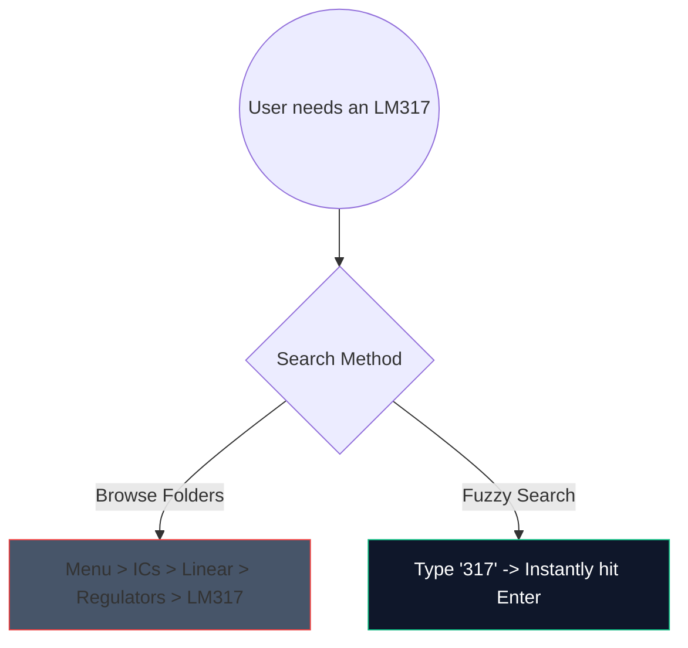

Hari-hari memuat turun perisian desktop 2 gigabait yang berat hanya untuk melakar litar penguat ringkas telah berakhir. CAD (Reka Bentuk Bantuan Komputer) berasaskan penyemak imbas ada di sini, dan ia sangat pantas.

Beginilah cara anda boleh menggunakan alatan web moden untuk menjana skema kualiti pengeluaran dalam masa kurang dari 5 minit.

## Mengapa Reka Bentuk Litar Berasaskan Pelayar?

Jika anda seorang pendidik, pelajar atau penggemar dokumentasi penulisan, kelajuan dan kebolehcapaian mengatasi ciri mentah.

```mermaid
flowchart LR
    subgraph Traditional Workflow
    DL[Download/Install] --> CONF[Configure Libraries] --> DRAW1[Draw]
    end
    
    subgraph Web Workflow
    URL[Go to URL] --> DRAW2[Draw immediately]
    end
    
    style URL fill:#0f172a,stroke:#3b82f6
    style DRAW2 fill:#1e293b,stroke:#10b981
```

| Metrik | Aplikasi Desktop | Pembuat Rajah Litar |
| :--- | :--- | :--- |
| **Ruang Storan** | 1GB - 5GB+ | 0 MB (berasaskan awan) |
| **Keserasian OS** | Selalunya port Windows sahaja atau buggy | Serasi Web secara universal |
| **Masa Mula** | 15–30 saat | < 1 saat |
| **Kemudahalihan** | Terhad kepada satu mesin | Boleh diakses di mana-mana |

## Peretasan Aliran Kerja Teras untuk Kepantasan

Apabila menggunakan editor web, menggunakan pintasan papan kekunci mengubah pengalaman daripada "mengklik" kepada keadaan aliran tanpa gangguan.

Berikut ialah pintasan ROI tertinggi untuk dihafal dalam editor kami:

| Tindakan | Perintah Hotkey | Faedah Aliran Kerja |
| :--- | :--- | :--- |
| **Penghalaan Kawat** | `W` | Tukar kursor anda kepada mod sambungan dengan serta-merta, membenarkan penghalaan jaringan pantas tanpa beralih ke bar alat. |
| **Putaran Komponen** | `R` (sambil memegang bahagian) | Mengorientasikan perintang atau transistor sebelum meletakkannya menjimatkan sejumlah besar masa pembersihan kemudian. |
| **Pilihan Pendua** | `Ctrl + D` atau `Alt-Drag` | Jangan tarik 8 LED daripada menu; letakkan satu, konfigurasikannya dan salinnya 7 kali serta-merta. |
| **Sana Kanvas** | `Bar Ruang + Seret` | Memastikan tahap zum anda konsisten semasa menavigasi reka letak yang besar dan kompleks. |

## Menggunakan Carian Komponen

Mencari secara visual melalui menu lungsur besar-besaran adalah membosankan. Kami menyepadukan mekanisme carian kabur yang teguh.

Hanya tekan bar carian dan taip `NPN` daripada mengklik melalui `Semikonduktor -> Transistor -> BJT`. Alat ini menyusun padanan kebarangkalian tertinggi dengan serta-merta.

## Mengeksport untuk Kegunaan Profesional

Mencipta rajah hanyalah separuh daripada pertempuran; menyuntiknya ke dalam tesis atau blog teknikal anda adalah separuh lagi.

Sentiasa eksport corak litar anda sebagai **SVG (Grafik Vektor Boleh Skala)** apabila boleh, bukannya PNG atau JPG. SVG menyimpan garis yang ditakrifkan secara matematik dan bukannya piksel, bermakna anda boleh menskalakan skema anda kepada saiz papan iklan dan ia akan kekal tajam secara berterusan tanpa kabur rasterisasi.

Bersedia untuk menguji kelajuan anda? **[Lancarkan Apl](/editor/)** dan cuba buat litar LED berkelip 555 pemasa!