Membuka skema yang kompleks buat kali pertama terasa seperti menatap bahasa asing. Puluhan garis bersilang, singkatan samar dan simbol bergerigi bergabung menjadi dinding bunyi visual.

Walau bagaimanapun, jurutera berpengalaman tidak membaca skema dengan merenung seluruh halaman. Mereka mengasingkan, mengesan, dan menakluki. Berikut ialah metodologi langkah demi langkah untuk mentafsir sebarang rajah litar.

## Langkah 1: Asingkan Infrastruktur Kuasa Teras

Sebelum memahami apa yang *dilakukan* oleh litar, anda mesti memahami *bagaimana ia bernafas*.

Setiap skema mempunyai pintu masuk untuk tenaga elektrik. Tugas pertama anda ialah mencari semua rel voltan utama dan rujukan tanah.

```mermaid
flowchart TD
    A[Start: Scan Edges] --> B{Look for Power Symbols}
    B -- Found Battery/Jack --> C[Trace the initial VCC and GND lines]
    B -- Found Net Labels --> D[Locate generic +5V, +3.3V pads]
    C --> E[Are there Voltage Regulators?]
    D --> E
    E -- Yes --> F[Mentally divide circuit into Voltage Zones]
    E -- No --> G[Circuit runs on single voltage]
    
    style A fill:#0f172a,stroke:#3b82f6
    style F fill:#1e293b,stroke:#f59e0b
```



| Simbol/Teks | Maksudnya | Keperluan Tindakan |
| :--- | :--- | :--- |
| `VCC` / `VDD` | Voltan bekalan positif untuk IC. | Jejaki ini untuk memastikan setiap IC menerima kuasa. |
| `GND` / `VSS` | Rujukan asas bersama. | Anggap semua simbol ini bersambung secara fizikal. |
| `LDO` / `buck` | Sebuah cip mengawal voltan turun. | Perhatikan komponen hiliran yang menggunakan voltan rendah baharu. |

## Langkah 2: Demystify "Otak" (IC)

Sebaik sahaja anda tahu di mana kuasa mengalir, cari segi empat tepat terbesar pada halaman. Litar Bersepadu (IC) menentukan fungsi utama skema.

Jika anda menemui IC berlabel `U1` dengan nombor bahagian samar seperti `NE555` atau `ATmega328P`, hentikan membaca skema dengan serta-merta. Buka tab baharu dan tarik **helaian data**.

Anda tidak perlu memahami fizik semikonduktor dalaman; hanya lihat pada "Rajah Pinout" lembaran data. Jika pin 4 ialah `RESET` dan pin 8 ialah `VCC`, segera petakan logik itu kembali ke lukisan.

## Langkah 3: Jejaki Input dan Output

Litar ialah mesin berfungsi. Mereka menerima input alam sekitar, memprosesnya, dan mengeluarkan hasil.

```mermaid
quadrantChart
    title Input/Output Hardware Identification
    x-axis Analog/Physical --> Digital/Data
    y-axis Input Devices --> Output Devices
    quadrant-1 Digital Receivers (e.g. WiFi)
    quadrant-2 Digital Displays (e.g. OLEDs)
    quadrant-3 Physical Actuators (e.g. Motors)
    quadrant-4 Physical Sensors (e.g. Thermistors)
    "Push Button": [0.1, 0.4]
    "Photoresistor": [0.2, 0.2]
    "UART RX": [0.8, 0.4]
    "UART TX": [0.8, 0.6]
    "Speaker": [0.3, 0.8]
    "LED": [0.4, 0.7]
```

Jejak wayar keluar dari IC pusat. Jika pin IC disambungkan ke LED, itu adalah output visual. Jika pin disambungkan ke suis SPST ke tanah, itu adalah input manusia.

## Langkah 4: Sahkan Persimpangan dan Persimpangan

Ralat bacaan yang paling biasa untuk pemula melibatkan salah faham wayar yang bersilang antara satu sama lain.

* **Titik Menghasilkan Simpulan:** Jika dua garis bersilang menampilkan titik padu pada persilangannya, ia dipateri/disambungkan secara fizikal bersama. Arus boleh mengalir di antara mereka.
* **Tiada Titik Menghasilkan Jambatan:** Jika dua garisan membentuk silang biasa (+), ia *tidak* bersentuhan. Ia serupa dengan dua lebuh raya yang melepasi satu sama lain di atas jejantas.

## Langkah 5: Kenali Sub-Litar (Senjata Rahsia)

Jurutera jarang mereka bentuk litar sepenuhnya dari awal. Mereka melekatkan bersama sub-litar modular standard. Sebaik sahaja anda belajar mengenali 'perkataan' visual ini, anda berhenti membaca 'huruf' individu.

| Corak Visual | Litar Kecil Piawai | Fungsi |
| :--- | :--- | :--- |
| Kapasitor bersilang dari `VCC` ke `GND` betul-betul di sebelah IC. | **Kapasitor Penyahgandingan** | Menyerap bunyi. Abaikan apabila menganalisis aliran logik. |
| Perintang daripada pin digital membalut sehingga `+5V`. | **Perintang Tarik Ke Atas** | Menghalang pin terapung; memastikan keadaan lalai TINGGI yang stabil. |
| Dua perintang diletakkan secara bersiri antara voltan dan tanah, diketuk di tengah. | **Pembahagi Voltan** | Menjatuhkan voltan secara berkadar untuk dibaca dengan selamat oleh pin sensor. |

Amalkan teori ini. Buka **[Editor Diagram Litar](/editor/)**, muatkan templat dan petakan kuasa, otak, input dan output untuk diri sendiri!