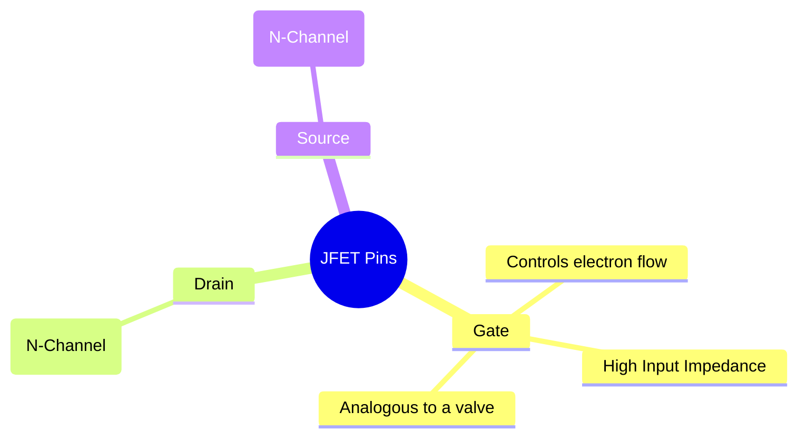

Sebelum percambahan besar-besaran MOSFET, **JFET** (Junction Field-Effect Transistor) adalah raja penguatan galangan input tinggi. Walaupun tidak digunakan sekerap dalam logik digital moden, ia kekal sebagai artifak yang amat diperlukan dalam prapenguat audio ketelitian tinggi, instrumentasi sensitif dan litar RF.

Memahami simbol skema JFET adalah penting bagi sesiapa yang mendalami reka bentuk litar analog diskret.

## 1. Anatomi Simbol JFET

Tidak seperti Transistor Persimpangan Bipolar (BJT) yang merupakan peranti terkawal semasa, JFET ialah peranti **terkawal voltan**. Simbol skematik cuba untuk mewakili secara visual pembinaan fizikal saluran semikonduktor dalamannya.

Simbol ini terdiri daripada garis menegak lurus yang mewakili saluran, dengan dua garisan mendatar bersambung ke dalamnya (Longkang dan Sumber). Garis serenjang ketiga membentuk Gate, lengkap dengan anak panah yang menentukan kekutuban semikonduktor.

### N-Saluran lwn. JFET Saluran P

Sama seperti BJT yang mempunyai NPN dan PNP, JFET datang dalam dua perisa yang berbeza.

| Ciri | N-Saluran JFET | P-Channel JFET |
| :--- | :--- | :--- |
| **Anak Panah Simbol** | Titik **IN** ke arah saluran saluran | Mata **KELUAR** dari saluran |
| **Majoriti Pembawa** | Elektron | Lubang |
| **Vgs untuk Pinch-Off** | Voltan Negatif (cth., -5V) | Voltan Positif (cth., +5V) |
| **Kendalian Biasa**| Biasanya HIDUP -> Gunakan tatasusunan voltan negatif untuk MATI | Biasanya HIDUP -> Gunakan tatasusunan voltan positif untuk MATI |

> **Tipu Memori:** "Menunjuk KE DALAM" bermaksud **N**-Saluran. Lihatlah anak panah di Pintu. Jika ia menghala ke dalam ke garisan, anda sedang berurusan dengan JFET-Saluran N (seperti 2N5457 yang popular).

## 2. Operasi: Mod Penghabisan

Salah satu ciri JFET yang paling menentukan ialah ia ialah peranti **Mod Penghabisan**. Ini sangat mempengaruhi cara anda mereka bentuk skema di sekelilingnya.

* **MOSFET (Mod Peningkatan):** Biasanya DIMATIKAN. Anda mesti menggunakan voltan pada pintu untuk menghidupkannya.
* **JFET (Mod Penghabisan):** Biasanya HIDUP. Dengan 0 Volt di pintu pagar, arus maksimum mengalir dari Longkang ke Sumber. Anda mesti menggunakan voltan *pincang songsang* (negatif untuk N-Channel) untuk mengembangkan kawasan penyusutan dan secara literal "mencubit" aliran elektron, mematikan peranti.

```mermaid
flowchart LR
    VGS[V_GS = 0V] --> I1[Maximum Drain Current flows]
    VGS2[V_GS = -2V] --> I2[Current is restricted]
    VGS3[V_GS = -5V] --> I3[Pinch-Off reached. Circuit is OFF]
    
    style VGS fill:#1e293b,stroke:#f59e0b
    style VGS3 fill:#1e293b,stroke:#ef4444
```

## 3. Aplikasi Skema Lazim

Because the Gate of a JFET is reverse-biased during operation, essentially zero current flows into it. This yields an astronomically high input impedance (often measured in hundreds of Megaohms).

| Aplikasi Litar | Mengapa JFET Dipilih | Petunjuk Skema |
| :--- | :--- | :--- |
| **Penguat Audio** | Bunyi yang sangat rendah dan impedans input yang besar menghalang pemuatan pikap gitar elektrik yang sensitif. | Selalunya dilihat bertindak sebagai peringkat penimbal Pengikut Sumber. |
| **Suis Analog** | Kerana ia dikawal voltan semata-mata tanpa arus get, ia menyuntik transien pensuisan sifar ke dalam laluan isyarat. | Diletakkan secara bersiri dengan isyarat analog yang melalui saluran sumber saliran. |
| **Sumber Semasa Malar** | JFET berkelakuan asli sebagai sinki arus malar apabila pintu pagar diikat terus ke punca. | Terminal gerbang berwayar terus ke terminal Sumber. |

Apabila membuat gambarajah litar analog khusus ini, ketepatan adalah kunci. Pastikan orientasi anak panah Gerbang anda betul untuk mengelakkan kegagalan pembuatan. Gunakan perpustakaan semikonduktor diskret yang dipilih susun dalam **[Circuit Diagram Maker](/editor/)** untuk meletakkan simbol JFET Saluran-N dan P-Channel standard dengan tepat pada kanvas anda yang seterusnya.