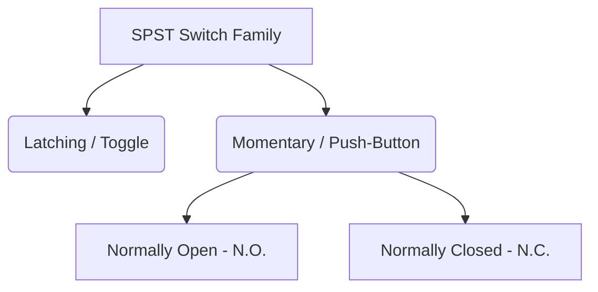

Di tengah-tengah setiap antara muka yang digunakan manusia untuk mengawal elektrik terletak suis mekanikal. Penjelmaan komponen ini yang paling mudah dan paling banyak terdapat di mana-mana ialah **SPST**, atau suis Balingan Tunggal Kutub Tunggal.

Sama ada anda mereka bentuk pemutus sesalur kuasa voltan tinggi atau hanya memetakan butang tekan pada papan roti Arduino, simbol SPST ialah titik permulaan logik anda.

## 1. Apa Maksud SPST Sebenarnya

Jurutera mengelaskan suis menggunakan dua pembolehubah: **Tiang** dan **Balingan**.

* **Tiang (P):** Bilangan litar elektrik bebas yang boleh dikawal oleh suis secara serentak. 
* **Baling (T):** Bilangan keadaan tertutup (kedudukan ON) yang ada pada setiap tiang.

Oleh itu, SPST ialah *Kutub Tunggal* (mengawal satu litar) dan *Balingan Tunggal* (hanya mempunyai satu kedudukan tertutup, konduktif).

```mermaid
flowchart LR
    A[Human Input] --> B((SPST Mechanism))
    B -- Open / Default --> C[Infinite Resistance / OFF]
    B -- Closed / Actuated --> D[Zero Resistance / ON]
    
    style B fill:#0f172a,stroke:#f59e0b
```

## 2. Membaca Simbol Skema SPST

Simbol IEEE standard untuk suis SPST sangat intuitif—ia benar-benar kelihatan seperti apa yang dilakukannya.

| Elemen Visual | Makna di Alam Nyata |
| :--- | :--- |
| **Dua Bulatan Terbuka** | Pad sesentuh elektrik pegun tempat wayar ditamatkan. |
| **Garis Putus Pepenjuru** | Lengan pengalir mekanikal, terputus secara fizikal dari pad kedua untuk menunjukkan keadaan lalai 'Buka'. |
| **Penentukan (`S` atau `SW`)** | Tag rujukan standard. cth., `SW1`. |

> **Andaian Keadaan Biasa:** Melainkan dinyatakan sebaliknya, suis mekanikal dilukis dalam **keadaan rehat yang tidak digerakkan**. Untuk suis lampu SPST standard, ini bermakna skema menggambarkannya sebagai MATI.

## 3. Variasi SPST: Butang Tekan

Suis togol kekal di tempat anda meletakkannya (menyelak). Butang tekan hanya digerakkan semasa jari anda berada di atasnya (sekejap). Penamaan SPST digunakan untuk kedua-duanya, tetapi simbol berubah sedikit untuk membezakan mod interaksi manusia.

| Jenis Suis | Pengubahan Skema | Contoh Dunia Sebenar |
| :--- | :--- | :--- |
| **Tekan Butang (N.O.)** | Daripada lengan bersudut, jambatan rata berlegar *di atas* dua pad sesentuh. Menolak ke bawah merapatkan jurang. | Kekunci papan kekunci, butang kuasa komputer, butang loceng pintu. |
| **Tekan Butang (N.C.)** | Jambatan rata terletak *di bawah* atau menyentuh pad, memastikan litar HIDUP secara lalai. Menolak ke bawah memutuskan sambungan. | Butang Berhenti Kecemasan (E-Stop) pada jentera berat. |

## 4. Amaran Pelaksanaan Perkakasan

Apabila memasukkan suis SPST ke dalam litar logik digital (seperti pin Raspberry Pi GPIO), reka bentuk skematik yang naif akan membawa kepada tingkah laku perisian yang tidak dapat diramalkan dengan teruk.

### Masalah "Pin Terapung".

Jika anda menyambungkan sebelah suis SPST ke 5V dan sebelah lagi terus ke pin mikropengawal, apakah yang berlaku apabila suis dibuka? Pin tidak membaca 0V—ia terputus dan "terapung", bertindak seperti antena yang menangkap elektromagnetisme sekeliling.

**Pembetulan: Perintang Pull-Down**

Sentiasa sertakan perintang (biasanya 10kΩ) yang disambungkan antara pin digital dan Ground.

1. **MATIKAN:** ​​Pin membaca 0V dengan selamat melalui perintang.
2. **HIDUPKAN:** ​​Bekalan 5V mengatasi perintang, mencetuskan keadaan TINGGI yang selamat.

Menggabungkan variasi SPST ke dalam reka bentuk anda dengan selamat melalui **[Editor Gambarajah Litar](/editor/)**. Kembangkan pustaka 'Tukar' kiri untuk mencari N.O. dan pelaksanaan N.C.!