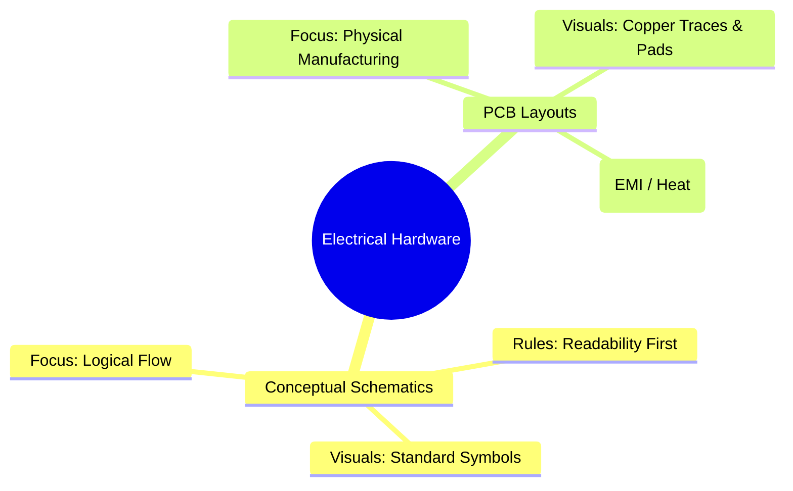
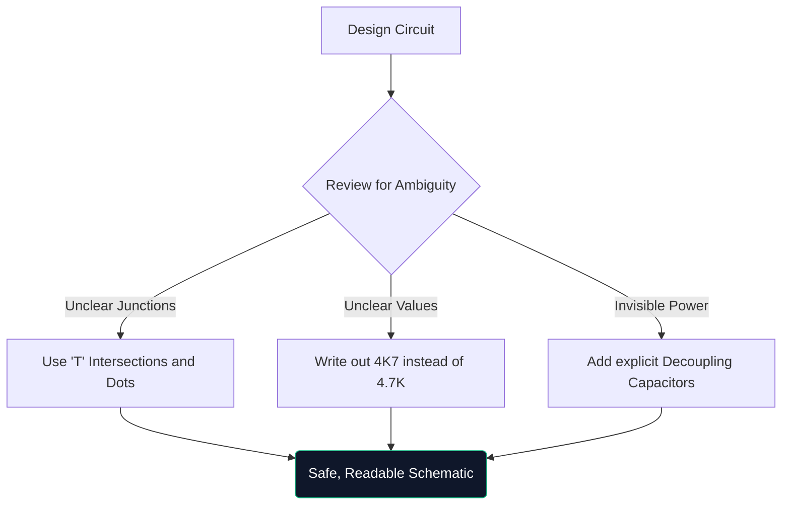

Selamat datang ke kelas induk muktamad pada rajah litar. Sama ada anda menggodam bersama prototaip Arduino pada hujung minggu atau belajar kejuruteraan elektrik, memahami seni bina skematik tidak boleh dirundingkan.

Panduan ini melangkaui asas, menilai cara gambar rajah moden dibina, disahkan dan dihasilkan.

## Skema Teoritikal lwn. Reka Letak PCB

Titik kekeliruan yang sangat biasa ialah perbezaan antara gambar rajah skema dan susun atur Papan Litar Bercetak (PCB). Mereka adalah perwakilan yang sama sekali berbeza dari kebenaran elektrik yang sama.

| Sifat | Gambarajah Skema | Susun Atur PCB |
| :--- | :--- | :--- |
| **Tujuan** | Untuk memahami *bagaimana* litar berfungsi secara logik | Untuk menentukan *ke mana* tembaga pergi secara fizikal |
| **Perwakilan Komponen** | Simbol abstrak (segi tiga, zigzag) | Pad tapak kaki fizikal 1:1 (cth., SOIC-8, 0805) |
| **Sambungan** | Garis geometri sempurna | Surih kuprum sudut 45 darjah |
| **Persekitaran** | Kertas latar belakang putih bersih | Ruang 3D literal berbilang lapisan |

## Anatomi Skema Lanjutan

Apabila litar berkembang melebihi 100 komponen, paradigma visual berubah. Anda tidak boleh hanya menyambungkan semuanya dengan wayar yang dilukis.

1. **Blok Tajuk**: Skema profesional sentiasa menampilkan blok di sudut kanan bawah yang menunjukkan Nama Syarikat, Jurutera Rekod, Nombor Semakan dan Tarikh.
2. **Label & Pelabuhan Bersih**: Wayar tidak menyambungkan subsistem; label bernama lakukan. Jika dua wayar dilabelkan `CLK_OUT`, ia disambungkan secara elektrik, walaupun ia berada pada halaman yang berbeza.
3. **Blok Hierarki**: Reka bentuk besar-besaran (seperti papan induk komputer) menggunakan hierarki. Satu blok segi empat tepat berlabel "Antara Muka Memori" mengandungi halaman skematik yang berasingan di dalamnya.

## Peraturan "Lukisan Pertahanan"

Sama seperti pemanduan bertahan, lukisan pertahanan membayangkan andaian orang yang membaca skema anda akan salah faham melainkan anda membimbing mereka secara eksplisit.

> **Mengapa menulis `4K7`?** Dalam skema yang dicetak atau difotostat, titik perpuluhan kecil (`.`) mudah hilang disebabkan oleh artifak. Menulis `4.7K` berisiko seseorang membacanya sebagai `47K`, yang boleh menggoreng komponen. Menulis `4K7` menjadikan pengganda bertindak sebagai titik perpuluhan, secara praktikal menghapuskan salah baca.

## Beralih kepada Alat CAD Digital

Melukis pada kertas graf sangat baik untuk sumbang saran, tetapi boleh dikatakan tidak berguna untuk pengeluaran. Apabila anda memindahkan reka bentuk anda kepada alat seperti [Circuit Diagram Maker](/editor/), anda memperoleh beberapa kuasa besar:

* **Netlists**: Alat digital matematik membuktikan sambungan.
* **Kebolehgunaan semula**: Salin-tampal bekalan kuasa terkawal kompleks daripada projek sebelumnya menjimatkan masa.
* **Kualiti Vektor**: Mengeksport sebagai SVG menjamin garisan yang jelas dengan sempurna tidak kira berapa banyak anda mengezum masuk.

Lonjakan daripada teori kepada realiti bermula dengan garis yang dilukis dengan baik. Mulakan perjalanan anda hari ini!