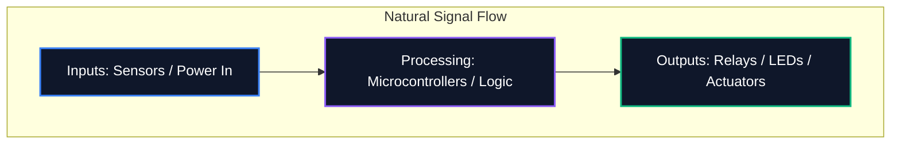

Niezależnie od tego, czy udostępniasz diagram na forum, czy przesyłasz go do profesjonalnej produkcji płytek PCB, czytelność schematu jest tak samo ważna, jak jego poprawność logiczna. Niechlujny schemat prowadzi do błędów w routingu, niezrozumienia komponentów i straty czasu.

W tym przewodniku przedstawiono podstawowe najlepsze praktyki stosowane przez profesjonalnych inżynierów elektroników w celu tworzenia przejrzystych, łatwych w utrzymaniu i wysoce czytelnych schematów obwodów.

## 1. Przebieg schematu: od lewej do prawej, od góry do dołu

Schemat jest dokumentem technicznym i jak każdy dokument należy go czytać w sposób naturalny. W projektowaniu elektroniki standardowa konwencja określa, że ​​wejścia płyną z lewej strony, a wyjścia wychodzą z prawej strony.

Podobnie wyższe napięcia powinny być wyraźnie umieszczone na górze schematu, a niższe napięcia lub masa na dole.



## 2. Symbole mocy i uziemienia

Nigdy nie ciągnij długich, zwiniętych przewodów łączących ze sobą każdy pojedynczy pin uziemiający. Tworzy pajęczynę, której nie da się odczytać. Zamiast tego użyj lokalnych symboli zasilania i uziemienia na komponencie.

| Zła praktyka | Najlepsza praktyka | Dlaczego to ma znaczenie |
| :--- | :--- | :--- |
| Wiązanie wszystkich mas jednym ciągłym drutem | Wykorzystanie lokalnych symboli „GND” na każdym komponencie | Zmniejsza bałagan wizualny; jawnie definiuje ścieżki powrotne bez skomplikowanego śledzenia |
| Umiejscowienie linii VCC przecinających ścieżki sygnałowe | Używanie lokalnych symboli `VCC` / `+5V` skierowanych w górę | Zapobiega wizualnemu pomyleniu linii sygnałowych z dostarczaniem mocy |
| Oznaczanie różnych gruntów tym samym symbolem | Różnicowanie uziemienia analogowego (AGND) i uziemienia cyfrowego (DGND) | Kluczowe znaczenie dla uniknięcia pętli uziemienia i propagacji szumu w projektach z sygnałami mieszanymi |

## 3. Punkty skrzyżowań a skrzyżowania

Jednym z najniebezpieczniejszych błędów w projektowaniu schematów jest niejednoznaczność w miejscach krzyżowania się przewodów.

```mermaid
graph TD
    A[Is it a connection?]
    A --> B{Is there a junction dot?}
    B -- Yes --> C[Wires are electrically connected (Node)]
    B -- No --> D[Wires are crossing without connecting]
    
    style A fill:#1e293b,stroke:#f59e0b
    style C fill:#1e293b,stroke:#10b981
    style D fill:#1e293b,stroke:#ef4444
```

> **Wskazówka dla profesjonalistów:** Nigdy nie używaj skrzyżowań „czterokierunkowych” (krzyżyka w kształcie „+”). Jeśli cztery przewody muszą się spotkać, przesuń je w dwa trójdrożne złącza typu „T”. To całkowicie eliminuje niejednoznaczność; jeśli kropka łącząca zniknie podczas drukowania lub skalowania, kształt litery „T” nadal jednoznacznie sugeruje połączenie, podczas gdy goły krzyż nie.

## 4. Logiczne grupowanie komponentów

W przypadku dużych schematów zawierających mikrokontrolery z ponad 64 pinami próba fizycznego narysowania każdego przewodu do komponentu jest daremnym ćwiczeniem. Zamiast tego profesjonalne narzędzia wykorzystują **Etykiety sieciowe**.

Pogrupuj bloki funkcjonalne swojego obwodu w strefy wizualne. Na przykład umieść zasilacz w jednym rogu, MCU na środku, a sterowniki silników w drugim. Połącz je wyłącznie za pomocą opisowych etykiet sieciowych (np. `SPI_MOSI`, `UART_TX`, `MOTOR_PWM`.

## 5. Oznaczenia odniesienia i wartości

Symbol gołego rezystora nic nie mówi widzowi. Każdy komponent musi mieć unikalny desygnator odniesienia i wyraźną wartość.

| Kategoria komponentu | Standardowy przedrostek | Przykład |
| :--- | :--- | :--- |
| **Rezystory** | `R` | `R1 (10kΩ)` |
| **Kondensatory** | `C` | „C4 (100nF)” |
| **Układy scalone** | „U” lub „IC” | `U2 (LM358)` |
| **Diody / Diody LED** | `D` | „D1 (1N4148)” |
| **Tranzystory / MOSFETy** | `Q` | `Q1 (2N2222)` |
| **Induktory** | `L` | „L1 (4,7 μH)” |
| **Złącza/Gniazda** | „J” lub „P” | `J1 (gniazdo zasilania)` |

Przestrzeganie tych konwencji gwarantuje, że Twój schemat będzie natychmiast zrozumiały dla każdego inżyniera w dowolnym miejscu na świecie. Zacznij stosować te zasady już dziś w [Edytorze schematów obwodów](/editor/).