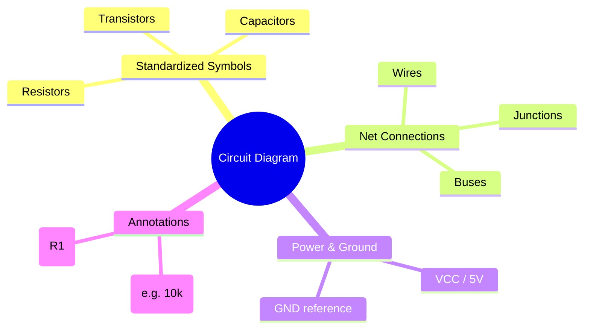
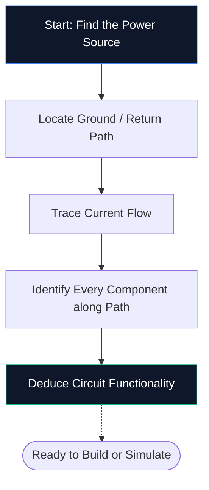

Jeśli nigdy wcześniej nie otwierałeś edytora schematów, jest to jedyny przewodnik, jakiego potrzebujesz. Omówimy podstawy — czym jest schemat obwodu, jak odszyfrować symbole i jak narysować pierwszy schemat w **Kreatorze schematów obwodów** — a wszystko to bez instalowania ani jednego oprogramowania.

## Czym dokładnie jest schemat obwodu?

Schemat obwodu to mapa energii elektrycznej. Tak jak mapa metra pokazuje, w jaki sposób stacje się łączą, bez przedstawiania tuneli w odpowiedniej skali, tak schemat obwodu pokazuje, w jaki sposób łączą się komponenty elektroniczne, nie martwiąc się o rozmiar fizyczny ani rozmieszczenie płytek.

Zamiast realistycznych rysunków schematy wykorzystują **znormalizowane symbole**. Rezystor pojawia się jako linia zygzakowata, kondensator jako dwie równoległe płytki, a dioda jako trójkąt stykający się z poprzeczką. Dzięki temu uniwersalnemu skrótowi diagramy są czyste, możliwe do wydrukowania i czytelne w każdym kraju i języku.

> **Dlaczego abstrakcje mają znaczenie:** Rezystor fizyczny to mały cylinder z kolorowymi paskami, ale na schemacie składającym się z 50 elementów taki szczegół spowodowałby wizualny chaos. Symbole kompresują obraz, dzięki czemu Twój mózg może skupić się na *jak rzeczy się łączą*, a nie *jak wyglądają*.

## 10 symboli, które każdy początkujący musi znać

Zanim będziesz mógł przeczytać — lub narysować — pojedynczy schemat, musisz rozpoznać podstawowe elementy składowe. Zapamiętaj poniższą tabelę, a będziesz w stanie od razu rozszyfrować większość obwodów hobbystycznych.

| Kształt symbolu | Składnik | Funkcja podstawowa | Oznaczenie |
| :--- | :--- | :--- | :--- |
| **Linia zygzakowata** | Rezystor | Ogranicza przepływ prądu | `R` |
| **Dwie równoległe linie** | Kondensator | Przechowuje ładunek, filtruje hałas | `C` |
| **Seria pętli** | Cewka | Przechowuje energię w polu magnetycznym | `L` |
| **Trójkąt + słupek** | dioda | Umożliwia prąd w jednym kierunku | `D` |
| **Trójkąt + słupek + strzałki** | dioda | Emituje światło, gdy jest skierowane do przodu | `D` / `LED` |
| **Długie/krótkie linie równoległe** | Bateria | Zapewnia napięcie stałe | `BT` |
| **Trzy nałożone na siebie linie** | Ziemia | Punkt odniesienia przy 0 V | `GND` |
| **Kształt trójkąta** | Wzmacniacz operacyjny | Wzmacnia różnicę napięcia | `U` / `IC` |
| **Prostokąt ze szpilkami** | Układ scalony | Wykonuje złożone funkcje | `U` / `IC` |
| **Proste** | Przewody | Przenoszenie prądu pomiędzy komponentami | *(Brak)* |

## Jak czytać schemat w pięciu krokach

Czytanie schematu obwodu przebiega za każdym razem według tego samego procesu myślowego. Przećwicz te pięć kroków na dowolnym schemacie, a wzór stanie się drugą naturą.

1. **Znajdź źródło zasilania** — Poszukaj symbolu baterii lub etykiet, np. VCC, 5 V lub 3,3 V. To tutaj energia elektryczna wchodzi do obwodu.
2. **Zlokalizuj uziemienie** — Znajdź trzyliniowy symbol uziemienia lub etykietę GND. Każdy obwód musi mieć ścieżkę powrotną.
3. **Śledź przepływ prądu** — Podążaj przewodami od zacisku dodatniego, przez każdy element, aż do masy. Konwencjonalny prąd płynie od plusa do minusa.
4. **Zidentyfikuj każdy element** — Dopasuj każdy symbol do powyższej tabeli, a następnie przeczytaj etykietę obok niego, aby uzyskać dokładne wartości (na przykład 10 kΩ oznacza 10 000 omów).
5. **Zrozum cel** — Zadaj sobie pytanie, co robi obwód. Dioda LED plus rezystor to prosta lampka kontrolna. Wzmacniacz operacyjny z rezystorami sprzężenia zwrotnego jest wzmacniaczem sygnału.

## Twój pierwszy schemat: obwód LED

Każdy początkujący elektronik zaczyna od diody LED zasilanej przez rezystor ograniczający prąd. Otwórz [edytor tworzenia diagramów obwodów](/editor/) i postępuj dalej.

**Potok architektury obwodów:**

```mermaid
graph LR
    PWR(Battery 9V) -- Positive Wire --> R1(Resistor 330Ω)
    R1 -- Controlled Current --> D1((Red LED))
    D1 -- Return Path --> GND(Ground)
    
    style PWR fill:#1e293b,stroke:#f59e0b
    style R1 fill:#1e293b,stroke:#3b82f6
    style D1 fill:#1e293b,stroke:#ef4444
    style GND fill:#1e293b,stroke:#64748b
```

**Instrukcje krok po kroku:**

1. Przeciągnij symbol **Bateria** z paska bocznego na obszar roboczy.
2. Umieść **rezystor** po prawej stronie akumulatora.
3. Umieść **LED** po prawej stronie rezystora.
4. Naciśnij **W**, aby aktywować tryb przewodowy.
5. Kliknij dodatni zacisk akumulatora, a następnie kliknij lewy pin rezystora, aby narysować przewód.
6. Podłącz prawy pin rezystora do anody LED.
7. Podłącz katodę LED z powrotem do ujemnego bieguna akumulatora.
8. Kliknij dwukrotnie rezystor i wpisz **330 Ω**.
9. Kliknij **Eksportuj → SVG**, aby zapisać plik w jakości publikacyjnej.

## Pięć typowych błędów (i jak ich unikać)

| Błąd | Co idzie źle | Szybka naprawa |
| :--- | :--- | :--- |
| **Brakująca ścieżka naziemna** | Obwód wydaje się otwarty; prąd nie może płynąć | Zawsze podłączaj ścieżkę powrotną do masy |
| **Skrzyżowania przewodów bez kropek** | Dwa krzyżujące się przewody wyglądają na połączone, choć nie są | Dodaj kropkę skrzyżowania tylko tam, gdzie przewody faktycznie się łączą |
| **Brak wartości składników** | Recenzenci nie mogą zweryfikować Twojego projektu | Oznacz każdy rezystor, kondensator i układ scalony |
| **Błędne okablowanie** | Przekątne lub zachodzące na siebie przewody zmniejszają czytelność | Użyj routingu Manhattan (tylko w poziomie i pionie) |
| **Brak oznaczeń referencyjnych** | Utworzenie listy części staje się niemożliwe | Oznacz każdą część R1, C1, U1, D1 i tak dalej |

## Gdzie dalej iść

Kiedy już nauczysz się rysować podstawowe schematy, zapoznaj się z tymi zasobami, aby przejść na wyższy poziom:

* **[Wyjaśnienie symboli na schemacie obwodów](/blog/objaśnienie-diagram-symbols-objaśnienie/)** — szczegółowe zapoznanie się z każdą kategorią symboli
* **[Jak zrobić schemat obwodu online](/blog/how-to-make-circuit-diagram-online/)** — zaawansowane techniki i wskazówki dotyczące przepływu pracy
* **[Biblioteka komponentów](/components/)** — przeglądaj wszystkie ponad 40 symboli dostępnych w Kreatorze schematów obwodów