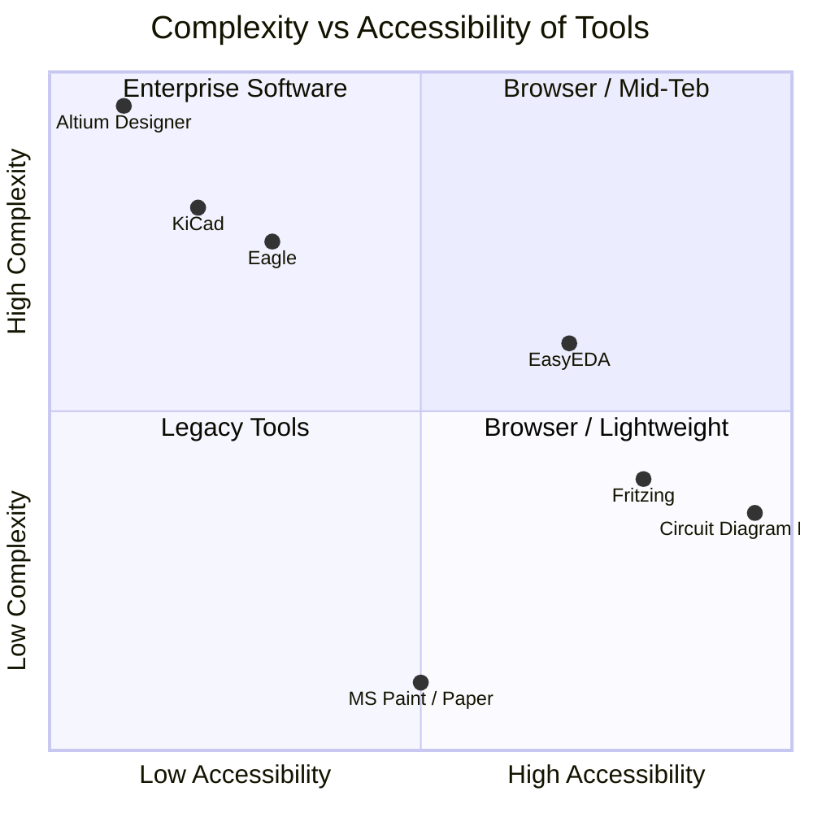
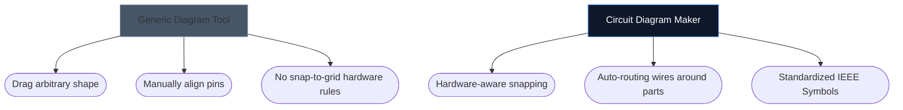

Wybór odpowiedniego narzędzia do rysowania schematów elektroniki często może decydować o szybkości iteracji nowego projektu sprzętowego. Podczas gdy zaawansowani projektanci PCB wymagają ciężkich środowisk stacjonarnych, hobbyści, studenci i twórcy często potrzebują czegoś zupełnie innego: dostępności i szybkości.

Poniżej analizujemy, jak nasze narzędzie wypada w porównaniu z głównymi alternatywami branżowymi.

## Macierz kategoryzacji narzędzi

Przed zagłębieniem się w poszczególne narzędzia ważne jest, aby zrozumieć, jakiego poziomu oprogramowania faktycznie wymaga Twój projekt. Używanie oprogramowania PCB dla przedsiębiorstw do szkicowania 4-elementowego układu diod LED jest przesadą.

## 1. Kreator schematów obwodów kontra Fritzing

Fritzing słynie z wypełniania luki pomiędzy prototypowaniem płytek stykowych a schematami. Jednak Fritzing wymaga instalacji i przez lata borykał się z aktualizacjami konserwacyjnymi.

| Funkcja | Kreator schematów obwodów | Fritzing |
| :--- | :--- | :--- |
| **Główny cel** | Standardowe układy schematów | Wizualizacje Breadboardu |
| **Instalacja** | Brak (w 100% oparty na przeglądarce) | Wymagana instalacja na komputerze |
| **Koszt** | 100% za darmo | Płatne (Donationware) |
| **Krzywa uczenia się** | Niezwykle niski | Umiarkowany |

> **Werdykt:** Jeśli szczególnie potrzebujesz wizualizacji przewodów fizyki zanurzonych w płytce stykowej, Fritzing jest lepszy. Jeśli potrzebujesz standardowych, uniwersalnych schematów elektronicznych *natychmiast*, użyj Kreatora schematów obwodów.

## 2. Kreator schematów obwodów kontra KiCad i Altium

KiCad to legendarny pakiet PCB typu open source, a Altium Designer to standard branżowy dla przedsiębiorstw. Są niezwykle potężni.

| Warstwa możliwości | Kreator schematów obwodów | KiCad / Altium |
| :--- | :--- | :--- |
| **Typ wyjścia** | Obrazy SVG/PNG | Pliki Gerber, BOM, Pick&Place |
| **Symulacja** | Wizualny / Uproszczony | Głęboka integracja SPICE |
| **Szybkość do pierwszego schematu** | < 10 sekund | 10–30 minut (konfiguracja/konfiguracja) |

> **Werdykt:** Użyj programu KiCad lub Altium, gdy wysyłasz warstwy miedzi do fabryki w Shenzhen. Użyj Kreatora schematów obwodów, jeśli załączasz schemat do zadania z fizyki, wpisu na blogu lub pytania na forum.

## 3. Kreator schematów obwodów vs. Draw.io / Lucidchart

Ogólne narzędzia do tworzenia diagramów, takie jak Draw.io, są niezwykle popularne w przypadku schematów blokowych. Brakuje im jednak semantycznego zrozumienia elektroniki.

Kiedy używasz dedykowanego narzędzia elektronicznego, edytor rozumie, że przewód nie może po prostu „zakończyć się” w sposób losowy bez złącza i z natury odwzorowuje standardowe właściwości (takie jak rezystancja w omach na rezystory).

## Które narzędzie jest dla Ciebie odpowiednie?

Najlepsze narzędzie to takie, które staje ci na drodze. Do szybkiego tworzenia pomysłów, zadań edukacyjnych i publikacji w Internecie, [Kreator diagramów obwodów](/editor/) oferuje niezrównane połączenie szybkości i nowoczesnej estetyki.