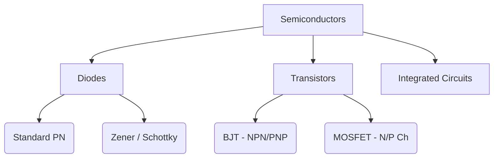

Symbole elektroniczne są uniwersalnym językiem inżynierii sprzętu. Tak jak nuty muzyczne dyktują wysokość i rytm, tak symbole obwodów przekazują funkcje elektryczne, właściwości i łączność na kartce papieru.

W tym obszernym przewodniku analizujemy wizualną morfologię najważniejszych elementów, które napotkasz na każdym schemacie.

## Globalne różnice w standardach: IEEE vs. IEC

Przed zagłębieniem się w konkretne symbole należy pamiętać, że symbole mogą wyglądać inaczej w zależności od miejsca narysowania schematu. Dwa dominujące standardy to **IEEE/ANSI** (głównie Ameryki) i **IEC** (Europa i międzynarodowe).

```mermaid
flowchart LR
    subgraph Regional Standards
    A((Schematic Origin))
    A -- US / Americas --> B[IEEE / ANSI]
    A -- Europe / Int'l --> C[IEC]
    end
    
    B -.-> D(Zigzag Resistors)
    C -.-> E(Rectangle Resistors)
    
    style B fill:#1e293b,stroke:#f59e0b
    style C fill:#1e293b,stroke:#3b82f6
```

W Kreatorze schematów obwodów wykorzystujemy przede wszystkim standard IEEE/ANSI, ponieważ pozostaje on bardzo popularny w ekosystemach cyfrowych i hobbystycznych, chociaż oba są poprawne technicznie.

## Komponenty pasywne

Elementy pasywne nie wymagają do działania zewnętrznego źródła zasilania i nie mogą wzmacniać sygnału.

| Składnik | Standardowy wygląd symbolu | Opis funkcjonalny |
| :--- | :--- | :--- |
| **Rezystor** | Zdefiniowany przez ostrą, postrzępioną linię zygzakowatą. Warianty zmienne posiadają strzałkę przebijającą linię. | Rozprasza energię w postaci ciepła, aby ograniczyć przepływ prądu elektrycznego. |
| **Kondensator** | Dwie równoległe linie oddzielone przerwą. Warianty spolaryzowane zakrzywiają jedną z linii, aby wskazać zacisk ujemny. | Magazynuje tymczasowo energię elektryczną w polu elektrycznym. |
| **Induktor** | Seria zaokrąglonych pętli lub półkoli przedstawiających zwoje drutu. | Przeciwstawia się zmianom w przepływie prądu poprzez magazynowanie energii w polu magnetycznym. |

## Komponenty aktywne (półprzewodniki)

Elementy aktywne wymagają źródła zasilania i mogą kontrolować przepływ prądu, często wzmacniając sygnały.

| Składnik | Wskaźniki wizualne | Podstawowe wykorzystanie |
| :--- | :--- | :--- |
| **Dioda** | Trójkąt skierowany w stronę płaskiej linii. Linia wskazuje katodę (ujemną). | Zawór jednokierunkowy do prądu. |
| **LED** | Standardowy symbol diody z dwiema małymi strzałkami skierowanymi na zewnątrz, oznaczającymi emisję światła. | Wskaźniki wizualne i optoelektronika. |
| **Tranzystor BJT** | Linia pionowa otoczona trzema połączeniami: podstawą, kolektorem i emiterem ze strzałką wskazującą NPN lub PNP. | Przełączniki i wzmacniacze sterowane prądem. |
| **MOSFET** | Zawiera oddzielne linie graniczne podkreślające izolowaną bramkę i wewnętrzne diody podłoża. | Przełączanie sterowane napięciem dla dużej mocy. |

## Urządzenia mechaniczne i wyjściowe

Części te wchodzą w interakcję ze światem fizycznym, wykorzystując wkład człowieka lub generując fizyczny wynik.

| Składnik | Schematyczny skrót | Aplikacja |
| :--- | :--- | :--- |
| **Przełącznik (SPST)** | Linia przerywana, która może obrócić się w dół, aby zakończyć obwód. | Podstawowe sterowanie mocą ON/OFF. |
| **Przekaźnik** | Zwykle przedstawiany jako cewka indukcyjna (cewka wewnętrzna) połączona z izolowanymi stykami przełączającymi. | Przełączanie obciążeń wysokiego napięcia za pomocą mikrokontrolerów niskiego napięcia. |
| **Silnik** | Okrąg zawierający literę „M”, często z wyznaczonymi zaciskami dodatnimi i ujemnymi. | Przetwarzanie prądu elektrycznego na kinetykę obrotową. |

> **Wskazówka projektowa:** W przypadku używania mechanicznych przełączników lub przekaźników należy zawsze dołączać *diodę zwrotną* do obciążeń indukcyjnych, aby chronić elementy półprzewodnikowe przed skokami napięcia!

Zrozumienie tych symboli jest pierwszym krokiem w kierunku płynności obwodów. Sprawdź nasz [edytor online](/editor/), aby błyskawicznie przeciągać, upuszczać i eksperymentować z tymi kształtami.