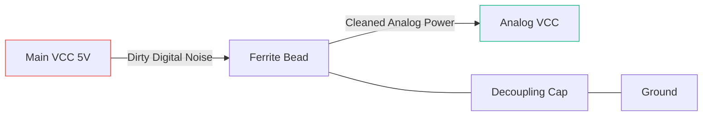

Szybka elektronika cyfrowa wytwarza dużo szumu elektromagnetycznego. Bez środków łagodzących, te zakłócenia o wysokiej częstotliwości przedostają się do wrażliwych linii analogowych lub promieniują na zewnątrz, powodując spektakularne niepowodzenie testów emisji FCC.

Podstawową bronią przeciwko tym zakłóceniom jest **koralik ferrytowy**. Zrozumienie jego schematycznego symbolu i rozmieszczenia decyduje o tym, czy obwód działa czysto, czy tonie we własnym hałasie.

## 1. Wizualizacja symbolu koralika ferrytowego

Koralik ferrytowy działa z natury jak silnie stratna cewka indukcyjna. Z tego powodu jego schematyczny symbol jest ściśle powiązany ze standardowym symbolem cewki indukcyjnej, ale dostosowany tak, aby podkreślić jego specyficzną rolę.

```mermaid
graph LR
    A[Inductor Basis] --> B(Standard Inductor Symbol)
    A --> C(Rectangle Over Wire)
    B -.-> D(Addition of a dashed line or solid bar)
    D --> E[IEEE Ferrite Symbol]
    C --> F[IEC Ferrite Symbol]
    
    style E fill:#0f172a,stroke:#3b82f6
    style F fill:#0f172a,stroke:#10b981
```

| Cecha | Standard IEEE/ANSI | Norma IEC | Notatki |
| :--- | :--- | :--- | :--- |
| **Kształt** | Seria półkoli z prętem/pudełkiem | Solidna prostokątna bryła | Funkcjonalnie identyczny wynik |
| **Przedrostek oznaczenia** | `FB` | `FB` lub `L` | Zdecydowanie zaleca się używanie `FB`, aby zapobiec pomyłkom z cewkami mocy
| **Jednostka miary** | Omy (Ω) przy określonej MHz | Omy (Ω) przy określonej MHz | W przeciwieństwie do cewek mierzonych w Henriach (H) |

> **Kluczowe rozróżnienie:** Nigdy nie oceniaj koralików ferrytowych według indukcyjności. Koraliki ferrytowe są określone na podstawie ich **impedancji (w omach) przy określonej częstotliwości** (zwykle 100 MHz).

## 2. Podstawowa mechanika operacyjna

Po co używać koralika ferrytowego zamiast standardowej cewki indukcyjnej?

* **Indukcja** magazynuje energię i zwraca ją do obwodu. Jest wysoce reaktywny i oszczędza energię.
* **Koralik ferrytowy** jest aktywnie zaprojektowany jako *stratny*. Przy wysokich częstotliwościach zachowuje się jak rezystor, przekształcając niechciany szum o wysokiej częstotliwości bezpośrednio w ciepło.

| Zakres częstotliwości | Zachowanie kulki ferrytowej | Wynik na obwodzie |
| :--- | :--- | :--- |
| **Niska częstotliwość / DC** | Poniżej 1 MHz | Działa jak zwykły przewód (~0 Ω). Zasilanie DC przepływa swobodnie. |
| **Częstotliwość rezonansowa** | Wysoce reaktywny | Krótko przechowuje energię. |
| **Wysoka częstotliwość** | Ponad 50 MHz+ | Działa jak rezystor o dużej wartości. Blokuje i rozprasza szum RF w postaci ciepła. |

## 3. Najlepsze praktyki dotyczące rozmieszczania schematów

Prawidłowe wykorzystanie symbolu FB wymaga strategicznego rozmieszczenia. Losowe uderzanie koralikami ferrytowymi w schemat może w rzeczywistości pogorszyć dzwonienie i rezonans.

### Odsprzęgające zasilacze (filtry Pi)

Absolutnie najczęstszym zastosowaniem symbolu „FB” jest izolowanie brudnej mocy cyfrowej od czystej mocy analogowej.

W powyższej konfiguracji (część filtra Pi) koralik ferrytowy blokuje przedostawanie się stanów nieustalonych o wysokiej częstotliwości do linii AVCC, podczas gdy kondensator odprowadza wszelkie pozostałe tętnienia do masy.

### Tłumienie zakłóceń elektromagnetycznych linii danych

Podczas prowadzenia długich kabli do transmisji danych USB lub ścieżek HDMI, symbole „FB” są często umieszczane szeregowo w pobliżu złącza. Dzięki temu długi, fizycznie odsłonięty przewód nie będzie działał jak antena i nie będzie emitował szumu procesora po całym pomieszczeniu.

Aby dodać koralik ferrytowy do następnego schematu, otwórz **[Edytor schematów obwodów](/editor/)**, wyszukaj „Ferryt” i określ swoją impedancję!