Zbudowanie falownika, czyli zamiana akumulatora samochodowego 12 V na prąd przemienny o napięciu 220 V, który może zasilać urządzenia gospodarstwa domowego, to rytuał przejścia dla inżynierów elektroników.

Przed podniesieniem lutownicy należy uzyskać doskonałe zrozumienie leżącego u jej podstaw schematu. Obwody wysokiego napięcia są bezlitosne, a źle narysowany schemat gwarantuje spalenie tranzystorów MOSFET lub poważne porażenie prądem. W tym przewodniku omówiono architekturę podstawowego falownika prostokątnego.

> **Ostrzeżenie dotyczące bezpieczeństwa:** Zasilanie 220 V AC jest śmiertelne. Ten artykuł jest eksploracją schematycznej logiki i projektu teoretycznego, a nie planem produkcyjnym. Nigdy nie buduj obwodów wysokiego napięcia bez zaawansowanego szkolenia elektrycznego.

## Architektura trzech filarów

Niezależnie od tego, jak skomplikowany jest nowoczesny falownik, schemat można zawsze wizualnie i logicznie podzielić na trzy odrębne bloki funkcjonalne.

```mermaid
flowchart LR
    DC_SRC[(12V DC Battery)] --> OSC[1. Oscillator Block]
    OSC -- Low Power Square Wave --> AMP[2. Power Switch Block]
    AMP -- High Current 12V Wave --> TX[3. Step-Up Transformer]
    TX -- Magnetic Induction --> AC_OUT((220V AC Output))
    
    style OSC fill:#0f172a,stroke:#3b82f6
    style AMP fill:#0f172a,stroke:#f59e0b
    style TX fill:#0f172a,stroke:#ef4444
```

### Etap 1: Oscylator (mózg)

Prąd stały (DC) z akumulatora płynie w linii prostej. Transformatory nie mogą przyspieszyć linii prostej; wymagają zmiennego pola magnetycznego. Dlatego musimy przekształcić prąd stały w sztuczną falę prądu przemiennego (zwykle 50 Hz lub 60 Hz w zależności od regionu geograficznego).

| Używany komponent | Schematyczna rola | Dlaczego jest wybrany |
| :--- | :--- | :--- |
| **CD4047 IC / Timer 555** | Astabilny multiwibrator | Generuje wyjątkowo stabilną falę prostokątną poprzez obliczenie stałej czasowej RC. |
| **Sieć rezystorów i kondensatorów** | Kalibratory rozrządu | Wartości (np. „R=100kΩ”, „C=0,1μF”) jednoznacznie określają dokładną częstotliwość 50 Hz. |

### Etap 2: Przełączniki zasilania (mięsień)

Układ logiczny wytwarza nieskazitelną falę o częstotliwości 50 Hz, ale przy wyjątkowo niskich granicach prądu (często poniżej 20 mA). Jeśli wprowadzisz to do transformatora, nie wygeneruje on wystarczającego strumienia magnetycznego, aby zasilić żarówkę.

Pomiędzy oscylatorem a cewkami transformatora umieszczamy tranzystory dużej mocy.

1. Słaby sygnał oscylatora uderza w **bramkę** masywnego tranzystora MOSFET z kanałem N (takiego jak IRF3205).
2. MOSFET działa jak elektroniczny przekaźnik o dużej wytrzymałości.
3. Wściekle przełącza ogromne natężenie prądu z akumulatora 12 V bezpośrednio przez cewki transformatora 50 razy na sekundę.

### Etap 3: Transformator podwyższający

W tym miejscu schematu widzimy ogromne ilości prądu 12 V pulsującego tam i z powrotem. Ostatni etap wymaga poprowadzenia tego przez cewki pierwotne transformatora.

| Funkcja | Szczegóły schematu | Implikacje w świecie rzeczywistym |
| :--- | :--- | :--- |
| **Cewka pierwotna (po lewej)** | Konfiguracja z gwintem centralnym (`12V - 0 - 12V`) | Umożliwia przełączanie push-pull w obie strony z dwóch naprzemiennych tranzystorów MOSFET. |
| **Linie podstawowe** | Dwie ciągłe linie narysowane pionowo | Reprezentuje rdzeń żelazno-ferrytowy niezbędny do wysokowydajnej indukcji magnetycznej. |
| **Cewka wtórna (prawa)** | Znacząco zwiększone przełożenie uzwojenia | Fizyka zamienia pulsujący strumień magnetyczny o napięciu 12 V w śmiercionośną, lotną falę o napięciu 220 V. |

## Uwagi dotyczące rysunku

Korzystając z **[Edytora schematów obwodów](/editor/)** do tworzenia tego projektu, pamiętaj o najlepszych praktykach dotyczących układu:

* Narysuj grube linie przenoszące prąd akumulatora 12 V grubsze niż linie oscylatora małej mocy.
* Uziemij piny źródła MOSFET wyraźnie i niepowtarzalnie; nie kieruj ich z powrotem w pobliże wrażliwej masy oscylatora, aby zapobiec sprzężeniu szumów.
* Nakreśl graficznie wyjścia 220 V! Zamiast pozostawiać gołe przewody zakończone w pustce, należy umieścić etykiety ostrzegawcze i porty wyjściowe (jak symbol gniazda).