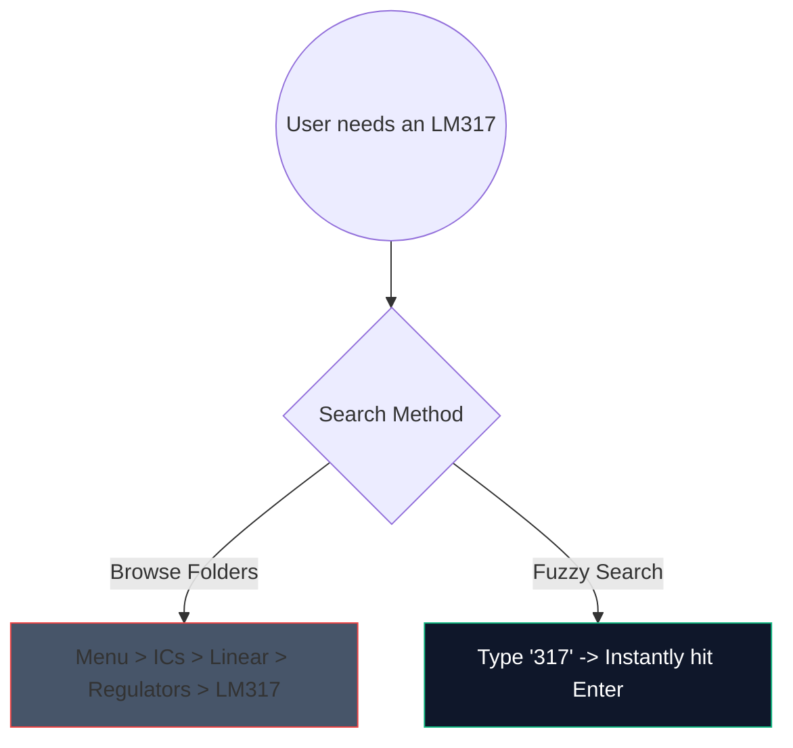

Skończyły się czasy pobierania ciężkiego, 2-gigabajtowego oprogramowania komputerowego w celu szkicowania prostego obwodu wzmacniacza. Oprogramowanie CAD (Computer Aided Design) oparte na przeglądarce jest już dostępne i jest fenomenalnie szybkie.

Oto dokładny sposób wykorzystania nowoczesnych narzędzi internetowych do generowania schematów o jakości produkcyjnej w czasie krótszym niż 5 minut.

## Dlaczego projektowanie obwodów oparte na przeglądarce?

Jeśli jesteś nauczycielem, studentem lub hobbystą piszącym dokumentację, szybkość i dostępność przewyższają surowe funkcje.

```mermaid
flowchart LR
    subgraph Traditional Workflow
    DL[Download/Install] --> CONF[Configure Libraries] --> DRAW1[Draw]
    end
    
    subgraph Web Workflow
    URL[Go to URL] --> DRAW2[Draw immediately]
    end
    
    style URL fill:#0f172a,stroke:#3b82f6
    style DRAW2 fill:#1e293b,stroke:#10b981
```

| Metryczne | Aplikacja komputerowa | Kreator schematów obwodów |
| :--- | :--- | :--- |
| **Przestrzeń magazynowa** | 1 GB - 5 GB+ | 0 MB (w chmurze) |
| **Zgodność systemu operacyjnego** | Często tylko dla systemu Windows lub porty z błędami | Uniwersalnie kompatybilny z Internetem |
| **Czas uruchomienia** | 15–30 sekund | < 1 sekunda |
| **Przenośność** | Ograniczeni do jednej maszyny | Dostępne wszędzie |

## Podstawowe triki zwiększające szybkość pracy

Podczas korzystania z edytora internetowego użycie skrótów klawiaturowych zmienia doświadczenie z „klikania” w stan nieprzerwanego przepływu.

Oto skróty o najwyższym ROI, które warto zapamiętać w naszym edytorze:

| Akcja | Polecenie skrótu | Korzyści z przepływu pracy |
| :--- | :--- | :--- |
| **Prowadzenie przewodów** | `W` | Natychmiast przełącza kursor w tryb połączenia, umożliwiając szybkie routing sieciowy bez konieczności przechodzenia do paska narzędzi. |
| **Obrót komponentu** | `R` (trzymając część) | Ukierunkowanie rezystorów lub tranzystorów przed ich umieszczeniem pozwala zaoszczędzić ogromną ilość czasu na późniejsze czyszczenie. |
| **Powiel zaznaczenie** | `Ctrl + D` lub `Alt-Przeciągnij` | Nie wyciągaj 8 diod LED z menu; umieść jeden, skonfiguruj go i natychmiast zduplikuj 7 razy. |
| **Płótno panoramiczne** | `Spacja + przeciągnij` | Utrzymuje spójny poziom powiększenia podczas poruszania się po ogromnych, złożonych układach. |

## Korzystanie z wyszukiwania komponentów

Wizualne przeszukiwanie ogromnych menu rozwijanych jest żmudne. Zintegrowaliśmy solidny mechanizm wyszukiwania rozmytego.

Po prostu naciśnij pasek wyszukiwania i wpisz „NPN”, zamiast klikać „Półprzewodniki -> Tranzystory -> BJT”. Narzędzie natychmiast wybiera dopasowanie o najwyższym prawdopodobieństwie.

## Eksportowanie do użytku profesjonalnego

Utworzenie diagramu to tylko połowa sukcesu; wstrzyknięcie go do swojej pracy dyplomowej lub bloga technicznego to druga połowa.

Jeśli to możliwe, zawsze eksportuj swoje wzory obwodów jako **SVG (Scalable Vector Graphics)**, a nie PNG lub JPG. Plik SVG przechowuje matematycznie zdefiniowane linie, a nie piksele, co oznacza, że ​​możesz skalować schemat do rozmiaru billboardu, dzięki czemu zawsze pozostanie on ostry jak szpilka bez rozmycia rasteryzacji.

Gotowy do przetestowania swojej prędkości? **[Uruchom aplikację](/editor/)** i spróbuj utworzyć obwód migającej diody LED z zegarem 555!