Otwieranie złożonego schematu po raz pierwszy przypomina patrzenie na obcy język. Dziesiątki przecinających się linii, tajemniczych skrótów i postrzępionych symboli łączą się w ścianę wizualnego szumu.

Jednak doświadczeni inżynierowie nie czytają schematów, wpatrując się w całą stronę. Izolują, tropią i podbijają. Oto metodologia krok po kroku rozszyfrowania dowolnego schematu obwodu.

## Krok 1: Odizoluj podstawową infrastrukturę zasilania

Zanim zrozumiesz, co *robi* obwód, musisz zrozumieć *jak oddycha*.

Każdy schemat ma punkty wejścia energii elektrycznej. Twoim pierwszym zadaniem jest zlokalizowanie wszystkich głównych szyn napięciowych i uziemień.

```mermaid
flowchart TD
    A[Start: Scan Edges] --> B{Look for Power Symbols}
    B -- Found Battery/Jack --> C[Trace the initial VCC and GND lines]
    B -- Found Net Labels --> D[Locate generic +5V, +3.3V pads]
    C --> E[Are there Voltage Regulators?]
    D --> E
    E -- Yes --> F[Mentally divide circuit into Voltage Zones]
    E -- No --> G[Circuit runs on single voltage]
    
    style A fill:#0f172a,stroke:#3b82f6
    style F fill:#1e293b,stroke:#f59e0b
```



| Symbol/Tekst | Znaczenie | Wymaganie działania |
| :--- | :--- | :--- |
| `VCC` / `VDD` | Dodatnie napięcie zasilania dla układów scalonych. | Prześledź to, aby upewnić się, że każdy układ scalony otrzymuje zasilanie. |
| `GND` / `VSS` | Wspólne odniesienie do podstawy. | Załóżmy, że wszystkie te symbole fizycznie łączą się ze sobą. |
| `LDO` / `zł` | Układ regulujący napięcie w dół. | Zwróć uwagę, które komponenty są podłączone za nowym, niższym napięciem. |

## Krok 2: Zdemaskuj „mózgi” (IC)

Kiedy już będziesz wiedział, gdzie płynie prąd, poszukaj na stronie największych prostokątów. Układy scalone (IC) dyktują podstawową funkcję schematu.

Jeśli natkniesz się na układ scalony oznaczony „U1” z tajemniczym numerem części, takim jak „NE555” lub „ATmega328P”, natychmiast przestań czytać schemat. Otwórz nową kartę i pobierz **arkusz danych**.

Nie musisz rozumieć wewnętrznej fizyki półprzewodników; po prostu spójrz na „Schemat pinów” w arkuszu danych. Jeśli pin 4 to „RESET”, a pin 8 to „VCC”, natychmiast zmapuj tę logikę z powrotem na rysunek.

## Krok 3: Śledź wejścia i wyjścia

Obwody są funkcjonalnymi maszynami. Otrzymują dane wejściowe ze środowiska, przetwarzają je i generują wynik.

```mermaid
quadrantChart
    title Input/Output Hardware Identification
    x-axis Analog/Physical --> Digital/Data
    y-axis Input Devices --> Output Devices
    quadrant-1 Digital Receivers (e.g. WiFi)
    quadrant-2 Digital Displays (e.g. OLEDs)
    quadrant-3 Physical Actuators (e.g. Motors)
    quadrant-4 Physical Sensors (e.g. Thermistors)
    "Push Button": [0.1, 0.4]
    "Photoresistor": [0.2, 0.2]
    "UART RX": [0.8, 0.4]
    "UART TX": [0.8, 0.6]
    "Speaker": [0.3, 0.8]
    "LED": [0.4, 0.7]
```

Śledź przewody na zewnątrz od centralnych układów scalonych. Jeśli pin układu scalonego łączy się z diodą LED, jest to sygnał wizualny. Jeśli pin łączy się z przełącznikiem SPST, który jest uziemiony, jest to działanie człowieka.

## Krok 4: Sprawdź skrzyżowania i skrzyżowania

Najczęstszy błąd w czytaniu dla początkujących polega na niezrozumieniu krzyżujących się przewodów.

* **Kropka tworzy węzeł:** Jeśli dwie przecinające się linie mają na przecięciu stałą kropkę, są one fizycznie ze sobą lutowane/połączone. Prąd może przepływać pomiędzy nimi.
* **Brak kropki tworzy most:** Jeśli dwie linie tworzą zwykły krzyż (+), *nie* się stykają. Przypominają dwie autostrady, które przecinają się na wiadukcie.

## Krok 5: Rozpoznaj obwody pomocnicze (tajna broń)

Inżynierowie rzadko projektują obwody całkowicie od zera. Sklejają ze sobą standardowe modułowe obwody. Gdy nauczysz się rozpoznawać te wizualne „słowa”, przestaniesz czytać pojedyncze „litery”.

| Wzór wizualny | Standardowy obwód podrzędny | Funkcja |
| :--- | :--- | :--- |
| Przejście kondensatora z „VCC” na „GND” tuż obok układu scalonego. | **Kondensator odsprzęgający** | Pochłania hałas. Zignoruj ​​to, analizując przepływ logiczny. |
| Rezystor z pinu cyfrowego owijający do `+5V`. | **Rezystor podciągający** | Zapobiega pływającym szpilkom; zapewnia stabilny stan domyślny WYSOKI. |
| Dwa rezystory umieszczone szeregowo pomiędzy napięciem a masą, zaczepione pośrodku. | **Dzielnik napięcia** | Spada napięcie proporcjonalnie, aby można je było bezpiecznie odczytać przez pin czujnika. |

Wprowadź tę teorię w praktykę. Otwórz **[Edytor schematów obwodów](/editor/)**, załaduj szablon i samodzielnie zaplanuj moc, mózg, wejścia i wyjścia!