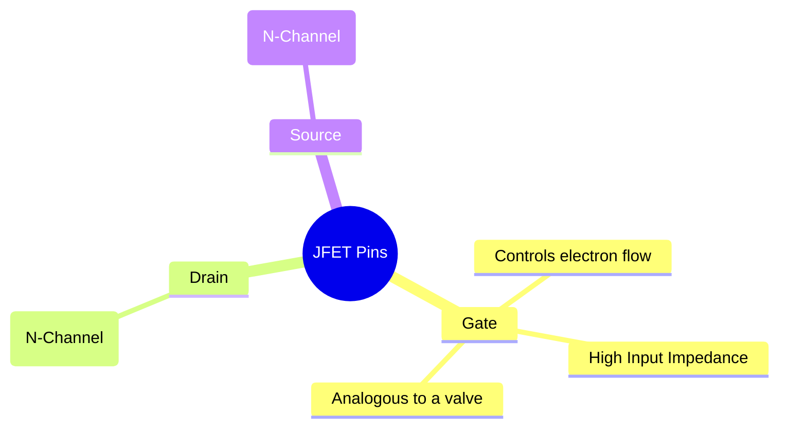

Przed masowym rozpowszechnieniem tranzystorów MOSFET, **JFET** (tranzystor polowy złączowy) był królem wzmocnienia o wysokiej impedancji wejściowej. Chociaż nie są one tak często używane we współczesnej logice cyfrowej, pozostają niezbędnymi artefaktami w przedwzmacniaczach audio o wysokiej jakości, czułym oprzyrządowaniu i obwodach RF.

Zrozumienie symbolu schematu JFET jest niezbędne dla każdego, kto zagłębia się w projektowanie dyskretnych obwodów analogowych.

## 1. Anatomia symbolu JFET

W przeciwieństwie do tranzystorów bipolarnych (BJT), które są urządzeniami sterowanymi prądem, JFET jest urządzeniem **sterowanym napięciem**. Symbol schematyczny próbuje wizualnie przedstawić fizyczną konstrukcję wewnętrznego kanału półprzewodnikowego.

Symbol składa się z prostej pionowej linii przedstawiającej kanał, z dwiema poziomymi liniami zaczepionymi do niego (Dren i Źródło). Bramkę tworzy trzecia prostopadła linia, uzupełniona strzałką wskazującą polaryzację półprzewodnika.

### JFET z kanałem N i kanałem P

Podobnie jak BJT mają NPN i PNP, JFET występują w dwóch różnych wersjach.

| Charakterystyka | Kanał N JFET | Kanał P JFET |
| :--- | :--- | :--- |
| **Symbol Strzałki** | Wskazuje **IN** w stronę linii kanału | Punkty **OUT** od kanału |
| **Przewoźnicy większościowi** | Elektrony | Dziury |
| **Vgs dla uszczypnięcia** | Napięcie ujemne (np. -5 V) | Napięcie dodatnie (np. +5 V) |
| **Typowa operacja**| Normalnie WŁ. -> Zastosuj układ napięcia ujemnego, aby WYŁĄCZYĆ | Normalnie WŁ. -> Zastosuj układ napięcia dodatniego, aby WYŁĄCZYĆ |

> **Sztuczka z pamięcią:** „Wskazywanie IN” oznacza **N**-kanał. Spójrz na strzałkę na Bramie. Jeśli wskazuje do wewnątrz linii, masz do czynienia z tranzystorem JFET z kanałem N (jak popularny 2N5457).

## 2. Operacja: Tryb wyczerpania

Jedną z najbardziej charakterystycznych cech JFET jest to, że jest to urządzenie **w trybie wyczerpania**. Ma to ogromny wpływ na sposób projektowania schematów wokół nich.

* **Mosfety (tryb ulepszeń):** Są normalnie wyłączone. Aby włączyć bramę, należy podać napięcie.
* **JFET (tryb wyczerpania):** Są normalnie włączone. Przy napięciu 0 V na bramce maksymalny prąd przepływa od drenażu do źródła. Musisz zastosować napięcie *odwrotnego polaryzacji* (ujemne dla kanału N), aby rozszerzyć obszar zubożenia i dosłownie „zablokować” przepływ elektronów, wyłączając urządzenie.

```mermaid
flowchart LR
    VGS[V_GS = 0V] --> I1[Maximum Drain Current flows]
    VGS2[V_GS = -2V] --> I2[Current is restricted]
    VGS3[V_GS = -5V] --> I3[Pinch-Off reached. Circuit is OFF]
    
    style VGS fill:#1e293b,stroke:#f59e0b
    style VGS3 fill:#1e293b,stroke:#ef4444
```

## 3. Typowe zastosowania schematów

Ponieważ bramka tranzystora JFET jest podczas pracy spolaryzowana odwrotnie, przepływa do niej zasadniczo prąd zerowy. Daje to astronomicznie wysoką impedancję wejściową (często mierzoną w setkach megaomów).

| Aplikacja obwodu | Dlaczego wybiera się JFET | Schematyczne wskazówki |
| :--- | :--- | :--- |
| **Przedwzmacniacze audio** | Niezwykle niski poziom szumów i ogromna impedancja wejściowa zapobiegają obciążaniu wrażliwych przetworników gitary elektrycznej. | Często postrzegany jako etap buforowy Source Follower. |
| **Przełączniki analogowe** | Ponieważ są sterowane wyłącznie napięciem, bez prądu bramki, wprowadzają do ścieżki sygnału stany przejściowe przełączania zera. | Umieszczone szeregowo z sygnałem analogowym przechodzącym przez kanał dren-źródło. |
| **Stałe źródła prądu** | JFET zachowuje się natywnie jak odbiornik prądu stałego, gdy bramka jest podłączona bezpośrednio do źródła. | Terminal bramki podłączony bezpośrednio do terminala źródłowego. |

Podczas tworzenia diagramów tych wyspecjalizowanych obwodów analogowych kluczowa jest precyzja. Upewnij się, że orientacja strzałki bramy jest prawidłowa, aby zapobiec awariom produkcyjnym. Skorzystaj z wybranej biblioteki dyskretnych półprzewodników w **[Kreator diagramów obwodów](/editor/)**, aby dokładnie umieścić standardowe symbole JFET kanału N i kanału P na następnym płótnie.