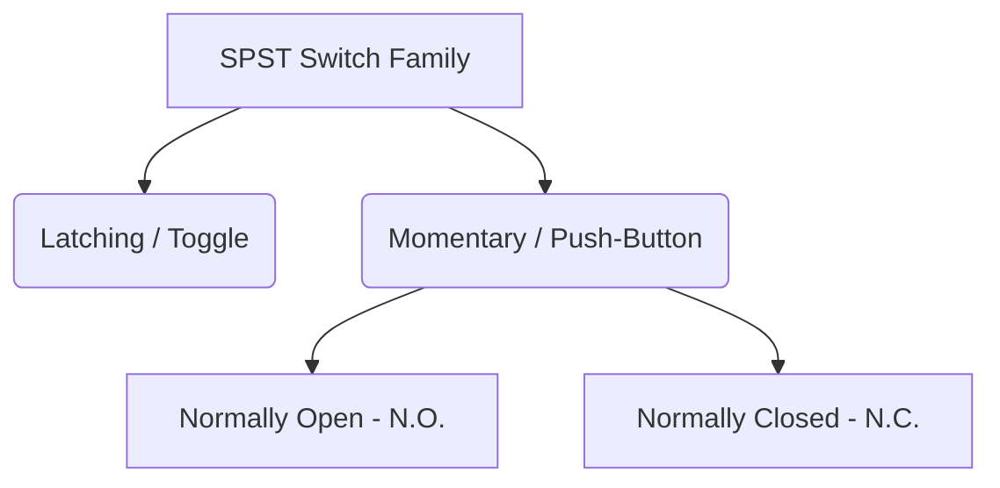

Sercem każdego interfejsu używanego przez ludzi do kontrolowania energii elektrycznej jest przełącznik mechaniczny. Najprostszym i najbardziej wszechobecnym wcieleniem tego komponentu jest **SPST**, czyli przełącznik jednobiegunowy.

Niezależnie od tego, czy projektujesz wyłącznik sieciowy wysokiego napięcia, czy po prostu planujesz przycisk na płytce prototypowej Arduino, symbol SPST jest logicznym punktem wyjścia.

## 1. Co właściwie oznacza SPST

Inżynierowie klasyfikują przełączniki na podstawie dwóch zmiennych: **Polacy** i **Wyrzuty**.

* **Biegun (P):** Liczba niezależnych obwodów elektrycznych, które przełącznik może jednocześnie kontrolować. 
* **Rzut (T):** Liczba stanów zamkniętych (pozycji WŁĄCZENIA) każdego bieguna.

Dlatego SPST jest *jednobiegunowym* (steruje jednym obwodem) i *pojedynczym rzutem* (ma tylko jedną zamkniętą, przewodzącą pozycję).

```mermaid
flowchart LR
    A[Human Input] --> B((SPST Mechanism))
    B -- Open / Default --> C[Infinite Resistance / OFF]
    B -- Closed / Actuated --> D[Zero Resistance / ON]
    
    style B fill:#0f172a,stroke:#f59e0b
```

## 2. Odczytywanie symbolu schematycznego SPST

Standardowy symbol IEEE dla przełącznika SPST jest bardzo intuicyjny — dosłownie wygląda tak, jak robi.

| Element wizualny | Znaczenie w prawdziwym świecie |
| :--- | :--- |
| **Dwa otwarte koła** | Stacjonarne elektryczne pola kontaktowe, w których kończą się przewody. |
| **Ukośna linia przerywana** | Mechaniczne ramię przewodzące, fizycznie oddzielone od drugiej podkładki, aby wskazać domyślny stan „otwarty”. |
| **Desygnator („S” lub „SW”)** | Standardowe znaczniki referencyjne. np. „SW1”. |

> **Założenie stanu normalnego:** O ile nie określono inaczej, przełączniki mechaniczne są rysowane w **nieuruchomionym stanie spoczynku**. W przypadku standardowego włącznika światła SPST oznacza to, że na schemacie jest on ustawiony jako WYŁĄCZONY.

## 3. Odmiany SPST: Przyciski

Przełącznik dwustabilny pozostaje tam, gdzie go umieścisz (zatrzask). Przycisk działa tylko wtedy, gdy znajduje się na nim palec (chwilowo). Oznaczenie SPST dotyczy obu, ale symbole zmieniają się nieznacznie, aby rozróżnić tryby interakcji międzyludzkich.

| Typ przełącznika | Zmiana schematu | Przykład ze świata rzeczywistego |
| :--- | :--- | :--- |
| **Przycisk (N.O.)** | Zamiast wygiętego ramienia płaski mostek unosi się *nad* dwoma polami stykowymi. Pchnięcie w dół wypełnia lukę. | Klawisze klawiatury, przyciski zasilania komputera, przyciski dzwonka do drzwi. |
| **Przycisk (NC)** | Płaski mostek spoczywa *pod* lub dotyka podkładek, domyślnie utrzymując obwód WŁĄCZONY. Naciśnięcie powoduje zerwanie połączeń. | Przyciski zatrzymania awaryjnego (E-Stop) w ciężkich maszynach. |

## 4. Ostrzeżenia dotyczące implementacji sprzętu

Po włączeniu przełącznika SPST do cyfrowego obwodu logicznego (takiego jak pin GPIO Raspberry Pi) naiwny projekt schematu doprowadzi do katastrofalnie nieprzewidywalnego zachowania oprogramowania.

### Problem z „pływającym kołkiem”.

Jeśli podłączysz jedną stronę przełącznika SPST do napięcia 5 V, a drugą stronę bezpośrednio do styku mikrokontrolera, co się stanie, gdy przełącznik będzie otwarty? Pin nie wskazuje 0 V — jest odłączony i „pływa”, zachowując się jak antena wychwytująca otaczający elektromagnetyzm.

**Poprawka: rezystory obniżające**

Zawsze dołączaj rezystor (zwykle 10 kΩ) podłączony pomiędzy pinem cyfrowym a masą.

1. **Wyłącz:** Pin odczytuje bezpiecznie 0 V przez rezystor.
2. **Włącz:** Zasilanie 5 V przewyższa rezystor, wyzwalając bezpieczny stan WYSOKI.

Bezpiecznie dodawaj odmiany SPST do swoich projektów za pomocą **[Edytora schematów obwodów](/editor/)**. Rozwiń lewą bibliotekę „Przełączniki”, aby znaleźć N.O. i wdrożenia NC!