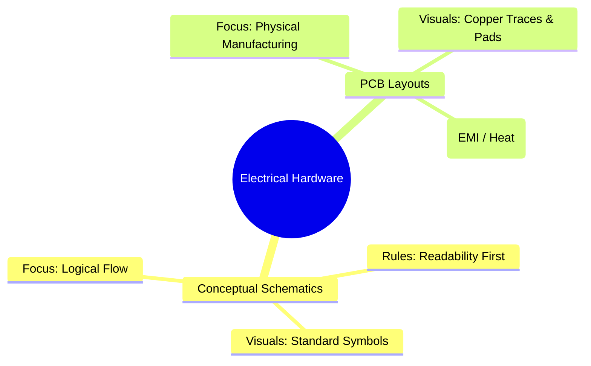
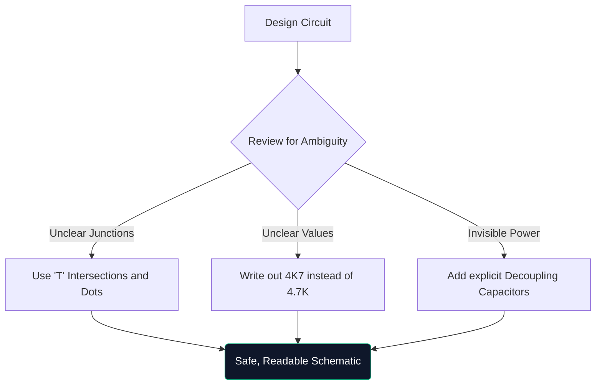

Witamy w ostatecznym kursie mistrzowskim na temat schematów obwodów. Niezależnie od tego, czy w weekend łączysz prototypy Arduino, czy studiujesz elektrotechnikę, zrozumienie schematycznej architektury nie podlega negocjacjom.

Ten przewodnik wykracza poza podstawy i ocenia, w jaki sposób współczesne diagramy są konstruowane, weryfikowane i wytwarzane.

## Schematy teoretyczne a układy PCB

Bardzo częstym powodem nieporozumień jest różnica między schematem a układem płytki drukowanej (PCB). Są to zupełnie różne reprezentacje tej samej prawdy elektrycznej.

| Cecha | Schemat ideowy | Układ PCB |
| :--- | :--- | :--- |
| **Cel** | Aby zrozumieć *jak* logicznie działa obwód | Aby dyktować *gdzie* miedź fizycznie trafia |
| **Reprezentacja komponentu** | Symbole abstrakcyjne (trójkąty, zygzaki) | Fizyczne podkładki 1:1 (np. SOIC-8, 0805) |
| **Połączenia** | Idealne linie geometryczne | Ścieżki miedziane pod kątem 45 stopni |
| **Środowisko** | Czysty, biały papier w tle | Wielowarstwowa dosłowna przestrzeń 3D |

## Anatomia zaawansowanego schematu

Kiedy obwody rozrastają się powyżej 100 elementów, zmieniają się paradygmaty wizualne. Nie da się po prostu wszystkiego połączyć ciągnionymi przewodami.

1. **Tabele tytułowe**: Profesjonalne schematy zawsze zawierają blok w prawym dolnym rogu, oznaczający nazwę firmy, inżyniera, numer wersji i datę.
2. **Etykiety i porty sieciowe**: Przewody nie łączą podsystemów; nazwane etykiety tak. Jeśli dwa przewody są oznaczone jako „CLK_OUT”, są one połączone elektrycznie, nawet jeśli znajdują się na różnych stronach.
3. **Bloki hierarchiczne**: Ogromne projekty (takie jak płyta główna komputera) wykorzystują hierarchię. Pojedynczy prostokątny blok oznaczony jako „Interfejs pamięci” zawiera w sobie całkowicie oddzielną stronę schematu.

## Zasada „rysowania w obronie”

Podobnie jak w przypadku jazdy defensywnej, rysowanie defensywne zakłada, że ​​osoba czytająca schemat źle go zrozumie, chyba że wyraźnie jej poinstruujesz.

> **Po co pisać „4K7”?** Na drukowanych lub kserowanych schematach mała kropka dziesiętna („.”) łatwo znika z powodu artefaktów. Zapisanie „4,7K” wiąże się z ryzykiem, że ktoś odczyta go jako „47K”, co mogłoby usmażyć komponent. Zapisanie „4K7” powoduje, że mnożnik działa jak przecinek dziesiętny, praktycznie eliminując błędne odczyty.

## Przejście na cyfrowe narzędzia CAD

Rysowanie na papierze milimetrowym doskonale nadaje się do burzy mózgów, ale jest praktycznie bezużyteczne w produkcji. Kiedy przenosisz swoje projekty do narzędzia takiego jak [Kreator diagramów obwodów](/editor/), zyskujesz kilka supermocy:

* **Netlisty**: Cyfrowe narzędzia matematyczne dowodzą powiązań.
* **Możliwość ponownego wykorzystania**: Kopiowanie i wklejanie złożonych zasilaczy regulowanych z poprzednich projektów oszczędza godziny.
* **Jakość wektorowa**: Eksportowanie w formacie SVG gwarantuje idealnie wyraźne linie niezależnie od stopnia powiększenia.

Skok od teorii do rzeczywistości zaczyna się od dobrze narysowanej linii. Rozpocznij swoją podróż już dziś!