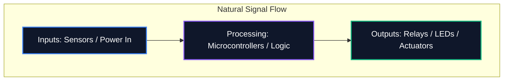

Esteja você compartilhando um diagrama em um fórum ou enviando-o para fabricação profissional de PCB, a legibilidade do seu esquema é tão importante quanto sua correção lógica. Um esquema confuso leva a erros de roteamento, componentes mal compreendidos e perda de tempo.

Este guia descreve as principais práticas recomendadas usadas por engenheiros eletrônicos profissionais para criar diagramas de circuitos limpos, fáceis de manter e altamente legíveis.

## 1. Fluxo do esquema: da esquerda para a direita, de cima para baixo

Um esquema é um documento técnico e, como qualquer documento, deve ser lido com naturalidade. No projeto eletrônico, a convenção padrão determina que as entradas fluam da esquerda e as saídas saiam da direita.

Da mesma forma, tensões mais altas devem ser explicitamente colocadas na parte superior do esquema e tensões mais baixas ou terra na parte inferior.



## 2. Símbolos de poder e solo

Nunca puxe fios longos e enrolados conectando cada pino de aterramento. Cria uma teia de aranha impossível de ler. Em vez disso, use símbolos locais de energia e terra no componente.

| Má prática | Melhores Práticas | Por que é importante |
| :--- | :--- | :--- |
| Amarrando todos os aterramentos com um único fio contínuo | Utilizando símbolos `GND` locais em cada componente | Reduz a desordem visual; define explicitamente caminhos de retorno sem rastreamento complexo |
| Colocação de linhas VCC cruzando traços de sinal | Usando símbolos locais `VCC` / `+5V` apontando para cima | Evita que as linhas de sinal sejam visualmente confundidas com o fornecimento de energia |
| Rotulagem de diferentes motivos com o mesmo símbolo | Diferenciando aterramento analógico (AGND) e aterramento digital (DGND) | Crítico para evitar loops de terra e propagação de ruído em projetos de sinais mistos |

## 3. Pontos de junção vs. cruzamentos

Um dos erros mais perigosos no projeto esquemático é a ambigüidade no cruzamento dos fios.

```mermaid
graph TD
    A[Is it a connection?]
    A --> B{Is there a junction dot?}
    B -- Yes --> C[Wires are electrically connected (Node)]
    B -- No --> D[Wires are crossing without connecting]
    
    style A fill:#1e293b,stroke:#f59e0b
    style C fill:#1e293b,stroke:#10b981
    style D fill:#1e293b,stroke:#ef4444
```

> **Dica profissional:** Nunca use cruzamentos de "4 vias" (uma cruz em forma de '+'). Se quatro fios precisarem se encontrar, desloque-os em duas junções 'T' de 3 vias. Isto elimina completamente a ambiguidade; se o ponto de junção desaparecer durante a impressão ou dimensionamento, a forma de 'T' ainda implica inequivocamente uma conexão, enquanto uma cruz nua não.

## 4. Agrupamento de componentes lógicos

Ao lidar com grandes esquemas contendo microcontroladores com mais de 64 pinos, tentar atrair fisicamente cada fio para o componente é um exercício de futilidade. Em vez disso, ferramentas profissionais utilizam **Net Labels**.

Agrupe blocos funcionais do seu circuito em zonas visuais. Por exemplo, coloque a fonte de alimentação em um canto, o MCU no centro e os drivers do motor em outro. Conecte-os puramente usando Net Labels descritivos (por exemplo, `SPI_MOSI`, `UART_TX`, `MOTOR_PWM`).

## 5. Designadores e valores de referência

Um símbolo de resistor nu não diz nada ao espectador. Cada componente deve ter um designador de referência exclusivo e um valor explícito.

| Categoria de componente | Prefixo padrão | Exemplo |
| :--- | :--- | :--- |
| **Resistores** | `R` | `R1 (10kΩ)` |
| **Capacitores** | `C` | `C4 (100nF)` |
| **Circuitos Integrados** | `U` ou `IC` | `U2 (LM358)` |
| **Diodos/LEDs** | `D` | `D1 (1N4148)` |
| **Transistores/MOSFETs** | `Q` | `Q1 (2N2222)` |
| **Indutores** | `L` | `L1 (4,7μH)` |
| **Conectores/Cabeçalhos** | `J` ou `P` | `J1 (tomada de alimentação)` |

A adesão a essas convenções garante que seu esquema será compreendido instantaneamente por qualquer engenheiro, em qualquer lugar do mundo. Comece a aplicar essas regras hoje mesmo no [Editor de Diagrama de Circuito](/editor/).