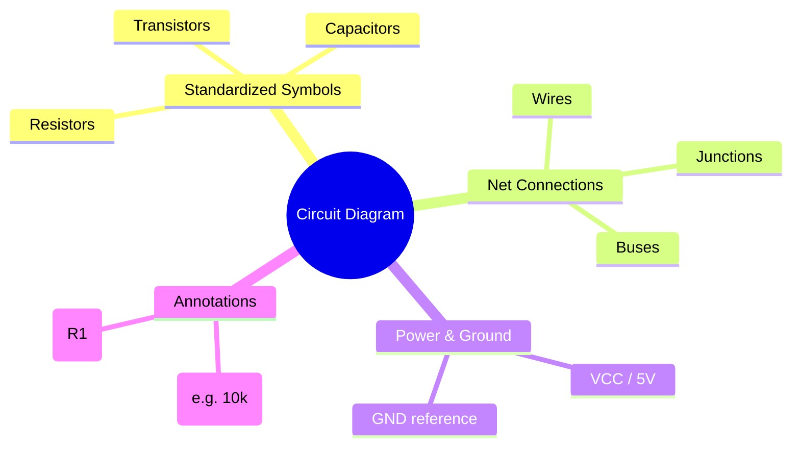
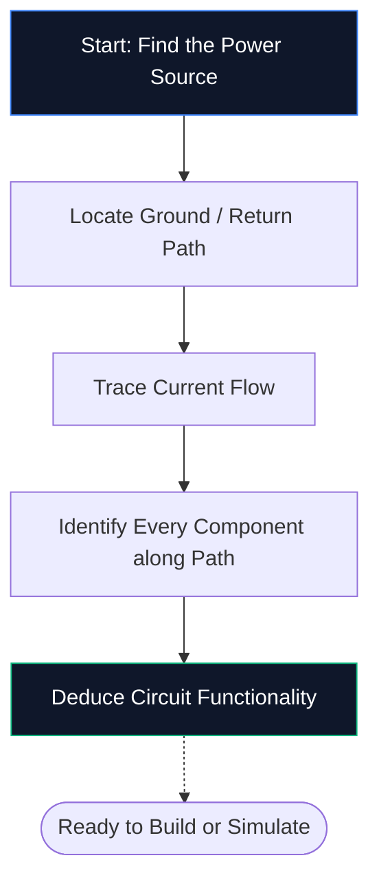

Se você nunca abriu um editor de esquemáticos antes, este é o único guia que você precisa. Examinaremos os fundamentos — o que é um diagrama de circuito, como decodificar os símbolos e como desenhar seu primeiro esquema dentro do **Circuit Diagram Maker** — tudo sem instalar um único software.

## O que exatamente é um diagrama de circuito?

Um diagrama de circuito é um mapa da eletricidade. Assim como um mapa do metrô mostra como as estações se conectam sem representar os túneis em escala, um diagrama de circuito mostra como os componentes eletrônicos se conectam sem se preocupar com o tamanho físico ou o posicionamento das placas.

Em vez de desenhos realistas, os esquemas usam **símbolos padronizados**. Um resistor aparece como uma linha em zigue-zague, um capacitor como duas placas paralelas e um diodo como um triângulo encontrando uma barra. Esta abreviatura universal mantém os diagramas limpos, imprimíveis e legíveis em todos os países e idiomas.

> **Por que as abstrações são importantes:** Um resistor físico é um pequeno cilindro com faixas coloridas, mas em um esquema de 50 componentes esse detalhe criaria um caos visual. Os símbolos comprimem a imagem para que seu cérebro possa se concentrar em *como as coisas se conectam* em vez de em *sua aparência*.

## Os 10 símbolos obrigatórios para todo iniciante

Antes de poder ler – ou desenhar – um único esquema, você precisa reconhecer os principais blocos de construção. Memorize a tabela abaixo e você será capaz de decodificar a maioria dos circuitos amadores imediatamente.

| Forma do símbolo | Componente | Função Primária | Designador |
| :--- | :--- | :--- | :--- |
| **Linha em ziguezague** | Resistor | Limita o fluxo de corrente | `R` |
| **Duas linhas paralelas** | Capacitor | Armazena carga, filtra ruído | `C` |
| **Série de loops** | Indutor | Armazena energia em um campo magnético | `L` |
| **Triângulo + barra** | Diodo | Permite corrente em uma direção | `D` |
| **Triângulo + barra + setas** | LED | Emite luz quando polarizado diretamente | `D` / `LED` |
| **Linhas paralelas longas/curtas** | Bateria | Fornece tensão DC | `BT` |
| **Três linhas empilhadas** | Terreno | Ponto de referência em 0 V | `GND` |
| **Forma triangular** | Amplificador operacional | Amplifica a diferença de tensão | `U` / `IC` |
| **Retângulo com alfinetes** | Circuito Integrado | Executa funções complexas | `U` / `IC` |
| **Linhas retas** | Fios | Transportar corrente entre componentes | *(Nenhum)* |

## Como ler um esquema em cinco etapas

Ler um diagrama de circuito segue sempre o mesmo processo mental. Pratique essas cinco etapas em qualquer esquema e o padrão se tornará uma segunda natureza.

1. **Encontre a fonte de alimentação** — Procure o símbolo da bateria ou etiquetas como VCC, 5 V ou 3,3 V. É aqui que a energia elétrica entra no circuito.
2. **Localize o aterramento** — Encontre o símbolo de aterramento de três linhas ou uma etiqueta GND. Todo circuito deve ter um caminho de retorno.
3. **Rastreie o fluxo de corrente** — Siga os fios do terminal positivo, através de cada componente, e de volta ao terra. A corrente convencional flui de positivo para negativo.
4. **Identifique cada componente** — Combine cada símbolo com a tabela acima e leia a etiqueta ao lado para obter os valores exatos (por exemplo, 10 kΩ significa 10.000 ohms).
5. **Entenda o propósito** — Pergunte a si mesmo o que o circuito faz. Um LED mais um resistor é uma luz indicadora simples. Um amplificador operacional com resistores de feedback é um amplificador de sinal.

## Seu primeiro esquema: o circuito de LED

Todo iniciante em eletrônica começa aqui – um LED alimentado por um resistor limitador de corrente. Abra o [editor do Criador de Diagramas de Circuito](/editor/) e siga em frente.

**Pipeline de arquitetura de circuito:**

```mermaid
graph LR
    PWR(Battery 9V) -- Positive Wire --> R1(Resistor 330Ω)
    R1 -- Controlled Current --> D1((Red LED))
    D1 -- Return Path --> GND(Ground)
    
    style PWR fill:#1e293b,stroke:#f59e0b
    style R1 fill:#1e293b,stroke:#3b82f6
    style D1 fill:#1e293b,stroke:#ef4444
    style GND fill:#1e293b,stroke:#64748b
```

**Instruções passo a passo:**

1. Arraste um símbolo de **Bateria** da barra lateral para a tela.
2. Coloque um **Resistor** à direita da bateria.
3. Coloque um **LED** à direita do resistor.
4. Pressione **W** para ativar o modo Wire.
5. Clique no terminal positivo da bateria e, em seguida, clique no pino esquerdo do resistor para desenhar um fio.
6. Conecte o pino direito do resistor ao ânodo do LED.
7. Conecte o cátodo do LED de volta ao terminal negativo da bateria.
8. Clique duas vezes no resistor e digite **330 Ω**.
9. Clique em **Exportar → SVG** para salvar um arquivo com qualidade de publicação.

## Cinco erros comuns (e como evitá-los)

| Erro | O que dá errado | Correção rápida |
| :--- | :--- | :--- |
| **Caminho de solo ausente** | O circuito parece aberto; a corrente não pode fluir | Sempre conecte um caminho de retorno ao terra |
| **Passagens de fios sem pontos** | Dois fios que se cruzam parecem conectados quando não estão | Adicione um ponto de junção somente onde os fios realmente se unem |
| **Sem valores de componentes** | Os revisores não podem verificar seu design | Rotule cada resistor, capacitor e IC |
| **Fiação bagunçada** | Fios diagonais ou sobrepostos reduzem a legibilidade | Use roteamento Manhattan (somente horizontal e vertical) |
| **Sem designadores de referência** | Lista de peças torna-se impossível de criar | Rotule cada parte R1, C1, U1, D1 e assim por diante |

## Para onde ir em seguida

Quando estiver confortável em desenhar esquemas básicos, explore estes recursos para subir de nível:

* **[Explicação dos símbolos do diagrama de circuito](/blog/circuit-diagram-symbols-explained/)** — aprofunde-se em cada categoria de símbolo
* **[Como fazer um diagrama de circuito online](/blog/how-to-make-circuit-diagram-online/)** — técnicas avançadas e dicas de fluxo de trabalho
* **[Biblioteca de Componentes](/components/)** — navegue por todos os mais de 40 símbolos disponíveis no Circuit Diagram Maker