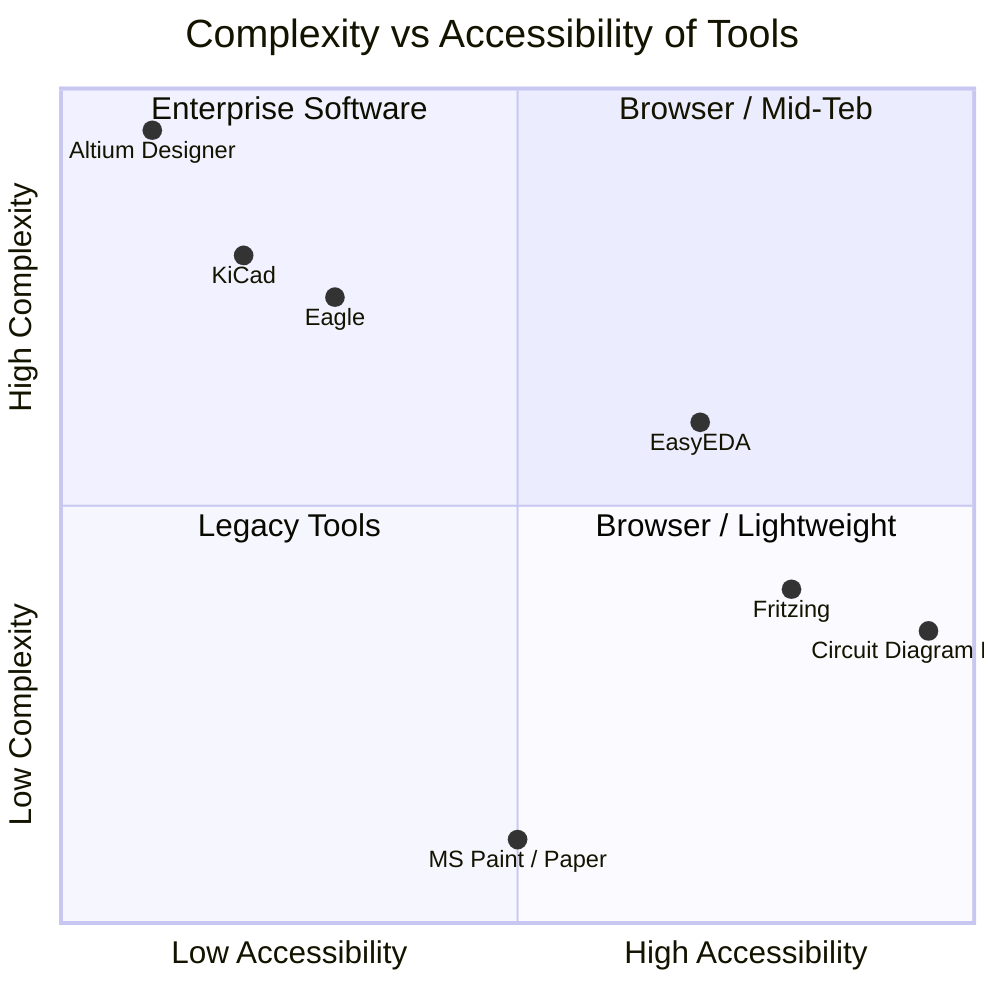
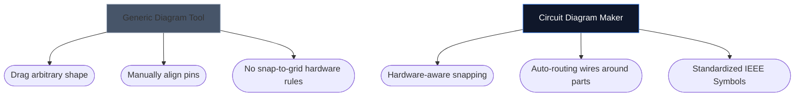

Escolher a ferramenta certa para desenhar seus esquemas eletrônicos muitas vezes pode determinar a rapidez com que você pode iterar em um novo projeto de hardware. Embora os designers avançados de PCB exijam ambientes de desktop pesados, amadores, estudantes e fabricantes geralmente precisam de algo totalmente diferente: acessibilidade e velocidade.

A seguir, analisamos como nossa ferramenta se compara às principais alternativas do setor.

## Matriz de categorização de ferramentas

Antes de mergulhar nas ferramentas individuais, é crucial entender qual nível de software seu projeto realmente exige. Usar software PCB empresarial para esboçar um layout de LED de 4 componentes é um exagero.

## 1. Criador de diagrama de circuito vs. Fritzing

Fritzing é famoso por preencher a lacuna entre a prototipagem e os esquemas da placa de ensaio. No entanto, o Fritzing requer instalação e tem lutado com atualizações de manutenção ao longo dos anos.

| Recurso | Criador de diagrama de circuito | Fritz |
| :--- | :--- | :--- |
| **Foco principal** | Layouts esquemáticos padrão | Visualizações de breadboard |
| **Instalação** | Nenhum (100% baseado em navegador) | Instalação na área de trabalho necessária |
| **Custo** | 100% grátis | Pago (Donationware) |
| **Curva de aprendizagem** | Extremamente Baixo | Moderado |

> **O Veredicto:** Se você precisa especificamente visualizar fios físicos mergulhando em uma placa de ensaio, Fritzing é superior. Se você precisar de esquemas eletrônicos padrão e universais *instantaneamente*, use o Circuit Diagram Maker.

## 2. Criador de diagrama de circuito vs. KiCad e Altium

KiCad é um lendário conjunto de PCB de código aberto e Altium Designer é o padrão da indústria empresarial. Eles são imensamente poderosos.

| Camada de capacidade | Criador de diagrama de circuito | KiCad/Altium |
| :--- | :--- | :--- |
| **Tipo de saída** | Imagens SVG/PNG | Arquivos Gerber, BOM, Pick&Place |
| **Simulação** | Visual / Simplista | Integração profunda com SPICE |
| **Velocidade para o primeiro esquema** | <10 segundos | 10–30 minutos (instalação/configuração) |

> **O veredicto:** Use KiCad ou Altium ao enviar camadas de cobre para uma fábrica em Shenzhen. Use o Criador de Diagramas de Circuito ao anexar um esquema a uma tarefa de física, postagem de blog ou pergunta de fórum.

## 3. Criador de diagrama de circuito vs. draw.io / Lucidchart

Ferramentas genéricas de diagramação como draw.io são incrivelmente populares para fluxogramas. No entanto, eles carecem de compreensão semântica da eletrônica.

Quando você usa uma ferramenta eletrônica dedicada, o editor entende que um fio não pode simplesmente “terminar” aleatoriamente sem uma junção e mapeia inerentemente propriedades padrão (como Ohms para resistores).

## Qual ferramenta é ideal para você?

A melhor ferramenta é aquela que sai do seu caminho. Para ideias rápidas, tarefas educacionais e publicações na web, o [Circuit Diagram Maker](/editor/) oferece uma combinação imbatível de velocidade e estética moderna.