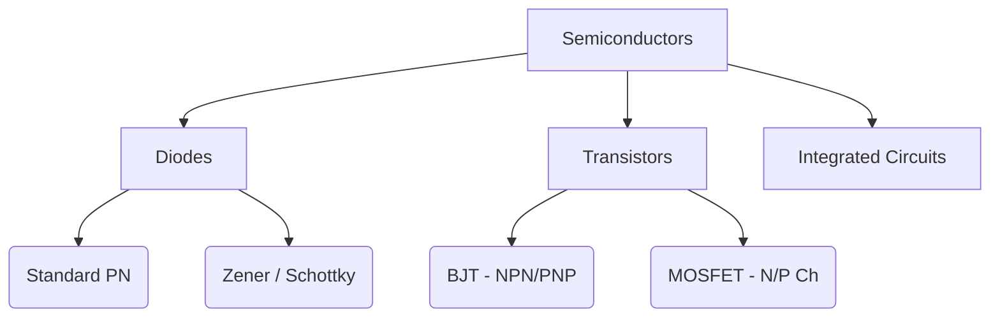

Os símbolos eletrônicos são a linguagem universal da engenharia de hardware. Assim como as notas musicais ditam a altura e o ritmo, os símbolos dos circuitos transmitem funções elétricas, propriedades e conectividade em um pedaço de papel.

Neste guia completo, dissecamos a morfologia visual dos elementos mais importantes que você encontrará em qualquer esquema.

## Diferenças de padrões globais: IEEE vs.

Antes de mergulhar em símbolos específicos, é crucial reconhecer que os símbolos podem parecer diferentes dependendo de onde o esquema foi desenhado. Os dois padrões dominantes são **IEEE/ANSI** (principalmente Américas) e **IEC** (Europa e internacionais).

```mermaid
flowchart LR
    subgraph Regional Standards
    A((Schematic Origin))
    A -- US / Americas --> B[IEEE / ANSI]
    A -- Europe / Int'l --> C[IEC]
    end
    
    B -.-> D(Zigzag Resistors)
    C -.-> E(Rectangle Resistors)
    
    style B fill:#1e293b,stroke:#f59e0b
    style C fill:#1e293b,stroke:#3b82f6
```

No Circuit Diagram Maker, utilizamos principalmente o padrão IEEE/ANSI, pois ele continua altamente popular em ecossistemas digitais e amadores, embora ambos sejam tecnicamente corretos.

## Componentes Passivos

Os componentes passivos não requerem uma fonte de alimentação externa para funcionar e não podem amplificar um sinal.

| Componente | Aparência do símbolo padrão | Descrição Funcional |
| :--- | :--- | :--- |
| **Resistência** | Definido por uma linha em zigue-zague nítida e irregular. As variantes variáveis ​​apresentam uma seta perfurando a linha. | Dissipa energia na forma de calor para restringir o fluxo de corrente elétrica. |
| **Capacitor** | Duas linhas paralelas separadas por uma lacuna. As variantes polarizadas curvam uma das linhas para indicar o terminal negativo. | Armazena energia elétrica temporariamente em um campo elétrico. |
| **Indutor** | Uma série de voltas arredondadas ou semicírculos representando bobinas de fio. | Opõe-se às mudanças no fluxo de corrente armazenando energia em um campo magnético. |

## Componentes ativos (semicondutores)

Os componentes ativos requerem uma fonte de energia e podem controlar o fluxo de eletricidade, muitas vezes amplificando os sinais.

| Componente | Indicadores Visuais | Uso principal |
| :--- | :--- | :--- |
| **Diodo** | Um triângulo apontando para uma linha plana. A linha indica o cátodo (negativo). | Uma válvula unidirecional para eletricidade. |
| **LED** | Um símbolo de diodo padrão com duas pequenas setas apontando para fora, significando emissão de luz. | Indicadores visuais e optoeletrônica. |
| **Transistor BJT** | Uma linha vertical flanqueada por três conexões: base, coletor e emissor com uma seta indicando NPN ou PNP. | Chaves e amplificadores controlados por corrente. |
| **MOSFET** | Apresenta linhas de limite separadas destacando a porta isolada e os diodos de substrato interno. | Comutação controlada por tensão para alta potência. |

## Dispositivos Mecânicos e de Saída

Essas partes interagem com o mundo físico, recebendo informações humanas ou gerando resultados físicos.

| Componente | Taquigrafia esquemática | Aplicação |
| :--- | :--- | :--- |
| **Alternar (SPST)** | Uma linha quebrada que pode girar para baixo para completar o circuito. | Controle básico de energia ON/OFF. |
| **Relé** | Geralmente representado como um indutor (bobina interna) acoplado a contatos de comutação isolados. | Comutação de cargas de alta tensão através de microcontroladores de baixa tensão. |
| **Motor** | Um círculo contendo um 'M', geralmente com terminais positivos e negativos designados. | Conversão de corrente elétrica em cinética rotacional. |

> **Dica de design:** Sempre que usar interruptores ou relés mecânicos, inclua sempre um *diodo flyback* entre cargas indutivas para proteger seus componentes semicondutores contra picos de tensão!

Compreender esses símbolos é o primeiro passo para a fluência do circuito. Confira nosso [editor on-line](/editor/) para arrastar, soltar e experimentar essas formas instantaneamente.