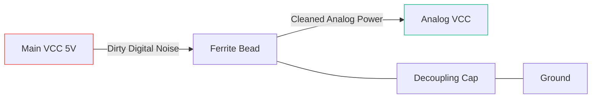

A eletrônica digital de alta velocidade cria muito ruído eletromagnético. Sem mitigação, essa interferência de alta frequência penetra em linhas analógicas sensíveis ou irradia para fora, fazendo com que seu dispositivo falhe espetacularmente nos testes de emissões da FCC.

A principal arma contra essa interferência é a **esfera de ferrite**. A compreensão de seu símbolo esquemático e posicionamento determina se o seu circuito funciona de maneira limpa ou se afoga em seu próprio ruído.

## 1. Visualizando o símbolo do grânulo de ferrite

Um cordão de ferrite opera inerentemente como um indutor com muitas perdas. Por causa disso, seu símbolo esquemático está intimamente relacionado ao símbolo do indutor padrão, mas adaptado para enfatizar sua função específica.

```mermaid
graph LR
    A[Inductor Basis] --> B(Standard Inductor Symbol)
    A --> C(Rectangle Over Wire)
    B -.-> D(Addition of a dashed line or solid bar)
    D --> E[IEEE Ferrite Symbol]
    C --> F[IEC Ferrite Symbol]
    
    style E fill:#0f172a,stroke:#3b82f6
    style F fill:#0f172a,stroke:#10b981
```

| Característica | Padrão IEEE/ANSI | Padrão IEC | Notas |
| :--- | :--- | :--- | :--- |
| **Forma** | Série de semicírculos com barra/caixa | Um bloco retangular sólido | Funcionalmente idêntico em resultado |
| **Prefixo Designador** | `FB` | `FB` ou `L` | Usar `FB` é altamente recomendado para evitar confusão com indutores de potência |
| **Unidade de medição** | Ohms (Ω) em MHz específicos | Ohms (Ω) em MHz específicos | Ao contrário dos indutores medidos em Henries (H) |

> **Distinção crucial:** Nunca avalie um cordão de ferrite por indutância. Os grânulos de ferrite são especificados por sua **impedância (em Ohms) em uma frequência específica** (normalmente 100 MHz).

## 2. Mecânica Operacional Central

Por que usar um cordão de ferrite em vez de um indutor padrão?

* Um **indutor** armazena energia e a devolve ao circuito. É altamente reativo e preserva energia.
* Um **esfera de ferrite** é ativamente projetado para apresentar *perdas*. Em altas frequências, ele se comporta como um resistor, convertendo ruídos indesejados de alta frequência diretamente em calor.

| Faixa de frequência | Comportamento do grânulo de ferrite | Resultado no Circuito |
| :--- | :--- | :--- |
| **Baixa frequência / CC** | Abaixo de 1 MHz | Atua como um fio simples (~0 Ω). A energia DC passa livremente. |
| **Frequência Ressonante** | Altamente Reativo | Armazena energia brevemente. |
| **Alta frequência** | Mais de 50 MHz+ | Atua como um resistor de alto valor. Bloqueia e dissipa o ruído de RF na forma de calor. |

## 3. Melhores práticas para posicionamento esquemático

A utilização adequada do símbolo FB requer posicionamento estratégico. Colocar esferas de ferrite aleatoriamente em um esquema pode piorar o toque e a ressonância.

### Desacoplando fontes de alimentação (filtros Pi)

O uso mais comum para um símbolo `FB` é isolar a energia digital suja da energia analógica limpa.

Na configuração acima (parte de um filtro Pi), o cordão de ferrite bloqueia a entrada de transientes de alta frequência na linha AVCC, enquanto o capacitor desvia qualquer ondulação restante para o solo.

### Supressão de EMI de linha de dados

Ao rotear cabos de dados USB longos ou trilhas HDMI, os símbolos `FB` geralmente são colocados em série perto do conector. Isso garante que o fio longo e fisicamente exposto não atue como uma antena e irradie ruído da CPU pela sala.

Para adicionar um cordão de ferrite ao seu próximo esquema, abra o **[Editor de Diagrama de Circuito](/editor/)**, procure por "Ferrite" e especifique sua classificação de impedância!