Construir um inversor de energia – converter uma bateria de carro de 12 V em corrente alternada de 220 V capaz de alimentar eletrodomésticos – é um rito de passagem para engenheiros eletrônicos.

Antes de levantar um ferro de soldar, você deve obter uma compreensão perfeita do esquema subjacente. Os circuitos de alta tensão são implacáveis, e um diagrama mal desenhado garante MOSFETs queimados ou choque elétrico grave. Este guia detalha a arquitetura de um inversor fundamental de onda quadrada.

> **Aviso de segurança:** A alimentação de 220 Vca é letal. Este artigo é uma exploração da lógica esquemática e do projeto teórico, não um projeto de fabricação. Nunca construa circuitos de alta tensão sem treinamento elétrico avançado.

## A Arquitetura dos Três Pilares

Não importa quão complexo seja um inversor moderno, o esquema sempre pode ser dividido visual e logicamente em três blocos funcionais distintos.

```mermaid
flowchart LR
    DC_SRC[(12V DC Battery)] --> OSC[1. Oscillator Block]
    OSC -- Low Power Square Wave --> AMP[2. Power Switch Block]
    AMP -- High Current 12V Wave --> TX[3. Step-Up Transformer]
    TX -- Magnetic Induction --> AC_OUT((220V AC Output))
    
    style OSC fill:#0f172a,stroke:#3b82f6
    style AMP fill:#0f172a,stroke:#f59e0b
    style TX fill:#0f172a,stroke:#ef4444
```

### Estágio 1: O Oscilador (O Cérebro)

A corrente contínua (CC) de uma bateria flui em linha reta. Os transformadores não podem avançar em linha reta; eles exigem campos magnéticos flutuantes. Portanto, devemos converter a CC em uma onda CA artificial (normalmente 50 Hz ou 60 Hz dependendo da região geográfica).

| Componente usado | Função esquemática | Por que foi escolhido |
| :--- | :--- | :--- |
| **Temporizador CD4047 IC/555** | Multivibrador Astável | Produz uma onda quadrada notavelmente estável através do cálculo de uma constante de tempo RC. |
| **Rede de resistores e capacitores** | Calibradores de tempo | Valores (por exemplo, `R=100kΩ`, `C=0,1μF`) determinam exclusivamente a frequência precisa de 50Hz. |

### Estágio 2: Os interruptores de energia (o músculo)

O chip lógico produz uma onda pura de 50 Hz, mas em limites de corrente excepcionalmente baixos (geralmente abaixo de 20 mA). Se você alimentasse isso em um transformador, não geraria fluxo magnético suficiente para acender uma lâmpada.

Colocamos transistores de alta potência entre o oscilador e as bobinas do transformador.

1. O sinal fraco do oscilador atinge o **Gate** de um enorme MOSFET de canal N (como o IRF3205).
2. O MOSFET atua como um relé eletrônico de serviço pesado.
3. Ele alterna furiosamente a enorme amperagem da bateria de 12V diretamente através das bobinas do transformador 50 vezes por segundo.

### Estágio 3: O transformador elevador

Neste ponto do esquema, temos grandes quantidades de corrente de 12 V pulsando para frente e para trás. O estágio final requer o roteamento através das bobinas primárias de um transformador.

| Recurso | Detalhes esquemáticos | Implicação no mundo real |
| :--- | :--- | :--- |
| **Bobina Primária (Esquerda)** | Configuração com derivação central (`12V - 0 - 12V`) | Permite a comutação push-pull de dois MOSFETs alternados. |
| **Linhas principais** | Duas linhas sólidas desenhadas verticalmente | Representa o núcleo de ferro/ferrite necessário para indução magnética de alta eficiência. |
| **Bobina Secundária (Direita)** | Taxa de enrolamento massivamente aumentada | A física transforma o fluxo magnético pulsante de 12 V em uma onda letal e volátil de 220 V. |

## Considerações sobre desenho

Ao utilizar o **[Editor de Diagrama de Circuito](/editor/)** para elaborar esse design, lembre-se das práticas recomendadas de layout:

* Desenhe as linhas pesadas que transportam a corrente da bateria de 12V mais espessas do que as linhas do oscilador de baixa potência.
* Aterre os pinos da fonte MOSFET de forma explícita e exclusiva; não os direcione de volta perto do terra sensível do oscilador para evitar acoplamento de ruído.
*Delineie graficamente as saídas de 220V! Coloque etiquetas de advertência e portas de saída (como um símbolo de soquete) em vez de deixar fios desencapados terminando no vazio.