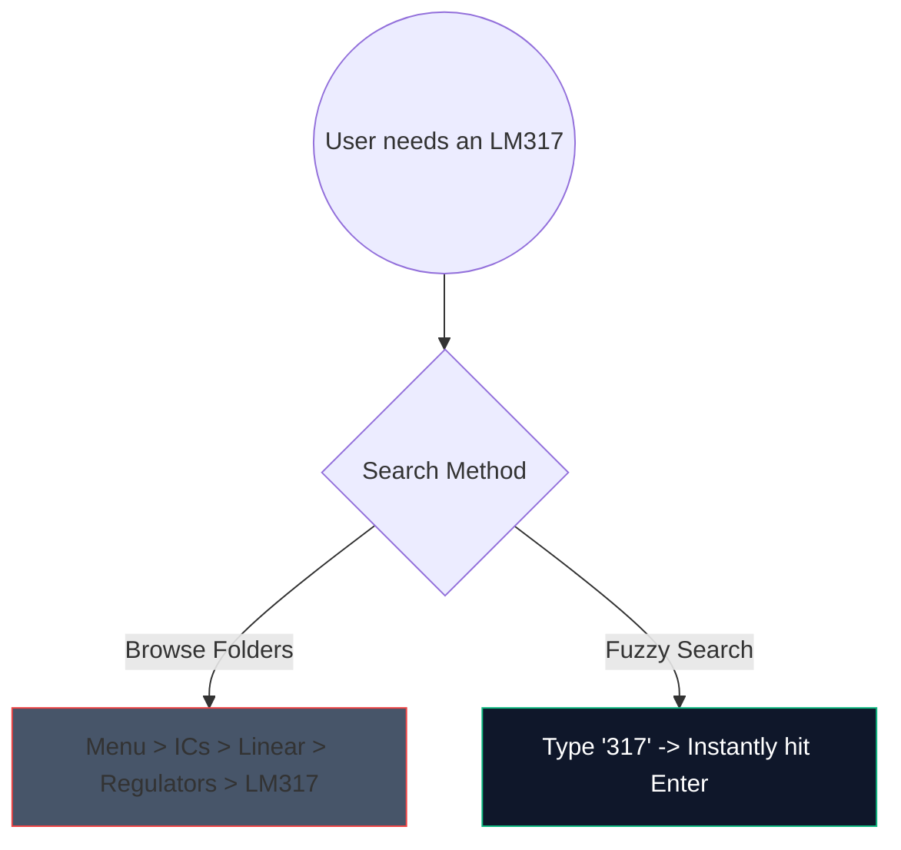

Os dias de download de software de desktop pesado de 2 gigabytes apenas para esboçar um circuito amplificador simples acabaram. O CAD (Computer-Aided Design) baseado em navegador está aqui e é fenomenalmente rápido.

Veja exatamente como você pode utilizar ferramentas modernas da web para gerar esquemas com qualidade de produção em menos de 5 minutos.

## Por que projetar circuitos baseados em navegador?

Se você é um educador, estudante ou amador que escreve documentação, a velocidade e a acessibilidade superam os recursos brutos.

```mermaid
flowchart LR
    subgraph Traditional Workflow
    DL[Download/Install] --> CONF[Configure Libraries] --> DRAW1[Draw]
    end
    
    subgraph Web Workflow
    URL[Go to URL] --> DRAW2[Draw immediately]
    end
    
    style URL fill:#0f172a,stroke:#3b82f6
    style DRAW2 fill:#1e293b,stroke:#10b981
```

| Métrica | Aplicativo de área de trabalho | Criador de diagrama de circuito |
| :--- | :--- | :--- |
| **Espaço de armazenamento** | 1GB - 5GB+ | 0 MB (baseado em nuvem) |
| **Compatibilidade de SO** | Freqüentemente, portas somente para Windows ou com bugs | Universalmente compatível com a Web |
| **Hora de inicialização** | 15–30 segundos | <1 segundo |
| **Portabilidade** | Confinado a uma máquina | Acessível em qualquer lugar |

## Hacks básicos de fluxo de trabalho para velocidade

Ao usar um editor web, o uso de atalhos de teclado transforma a experiência de “clicar” em um estado de fluxo ininterrupto.

Aqui estão os atalhos de maior ROI para memorizar em nosso editor:

| Ação | Comando de tecla de atalho | Benefício de fluxo de trabalho |
| :--- | :--- | :--- |
| **Roteamento de fios** | `W` | Muda instantaneamente o cursor para o modo de conexão, permitindo o roteamento rápido da rede sem passar para uma barra de ferramentas. |
| **Rotação de componentes** | `R` (enquanto segura parte) | Orientar resistores ou transistores antes de colocá-los economiza muito tempo de limpeza posterior. |
| **Seleção Duplicada** | `Ctrl + D` ou `Alt-Arrastar` | Não retire 8 LEDs do menu; coloque um, configure-o e duplique-o 7 vezes instantaneamente. |
| **Tela panorâmica** | `Barra de espaço + Arrastar` | Mantém o nível de zoom consistente ao navegar em layouts enormes e complexos. |

## Utilizando a pesquisa de componentes

Pesquisar visualmente em enormes menus suspensos é entediante. Integramos um mecanismo robusto de pesquisa difusa.

Basta clicar na barra de pesquisa e digitar `NPN` em vez de clicar em `Semicondutores -> Transistores -> BJT`. A ferramenta seleciona instantaneamente a correspondência de maior probabilidade.

## Exportando para uso profissional

Criar o diagrama é apenas metade da batalha; injetá-lo em sua tese ou blog técnico é a outra metade.

Sempre exporte seus padrões de circuito como **SVG (Scalable Vector Graphics)** sempre que possível, em vez de PNG ou JPG. Um SVG armazena linhas matematicamente definidas em vez de pixels, o que significa que você pode dimensionar seu esquema até o tamanho de um outdoor e ele permanecerá perpetuamente nítido, sem desfoque de rasterização.

Pronto para testar sua velocidade? **[Inicie o aplicativo](/editor/)** e tente criar um circuito de LED piscando com temporizador 555!