Abrir um esquema complexo pela primeira vez é como olhar para uma língua estranha. Dezenas de linhas que se cruzam, abreviações enigmáticas e símbolos irregulares se fundem em uma parede de ruído visual.

No entanto, engenheiros experientes não leem os esquemas olhando a página inteira. Eles isolam, rastreiam e conquistam. Aqui está a metodologia passo a passo para decifrar qualquer diagrama de circuito.

## Etapa 1: Isolar a infraestrutura principal de energia

Antes de entender o que um circuito *faz*, você deve entender *como ele respira*.

Cada esquema possui pontos de entrada para energia elétrica. Sua primeira tarefa é localizar todos os principais trilhos de tensão e referências de aterramento.

```mermaid
flowchart TD
    A[Start: Scan Edges] --> B{Look for Power Symbols}
    B -- Found Battery/Jack --> C[Trace the initial VCC and GND lines]
    B -- Found Net Labels --> D[Locate generic +5V, +3.3V pads]
    C --> E[Are there Voltage Regulators?]
    D --> E
    E -- Yes --> F[Mentally divide circuit into Voltage Zones]
    E -- No --> G[Circuit runs on single voltage]
    
    style A fill:#0f172a,stroke:#3b82f6
    style F fill:#1e293b,stroke:#f59e0b
```



| Símbolo/Texto | Significado | Requisito de ação |
| :--- | :--- | :--- |
| `VCC` / `VDD` | Tensão de alimentação positiva para CIs. | Rastreie isso para garantir que cada IC esteja recebendo energia. |
| `GND` / `VSS` | A referência de terreno comum. | Suponha que todos esses símbolos estejam fisicamente conectados. |
| `LDO` / `buck` | Um chip que regula a tensão para baixo. | Observe quais componentes estão a jusante utilizando a nova tensão mais baixa. |

## Passo 2: Desmistifique os “Cérebros” (ICs)

Depois de saber para onde a energia está fluindo, procure os retângulos maiores na página. Circuitos Integrados (ICs) ditam a função principal do esquema.

Se você encontrar um IC rotulado como `U1` com um número de peça enigmático como `NE555` ou `ATmega328P`, pare de ler o esquema imediatamente. Abra uma nova guia e extraia a **folha de dados**.

Você não precisa entender a física interna dos semicondutores; basta olhar o "Diagrama de pinagem" da folha de dados. Se o pino 4 for `RESET` e o pino 8 for `VCC`, mapeie imediatamente essa lógica de volta ao desenho.

## Etapa 3: Rastreie as entradas e saídas

Os circuitos são máquinas funcionais. Eles recebem informações ambientais, processam-nas e produzem um resultado.

```mermaid
quadrantChart
    title Input/Output Hardware Identification
    x-axis Analog/Physical --> Digital/Data
    y-axis Input Devices --> Output Devices
    quadrant-1 Digital Receivers (e.g. WiFi)
    quadrant-2 Digital Displays (e.g. OLEDs)
    quadrant-3 Physical Actuators (e.g. Motors)
    quadrant-4 Physical Sensors (e.g. Thermistors)
    "Push Button": [0.1, 0.4]
    "Photoresistor": [0.2, 0.2]
    "UART RX": [0.8, 0.4]
    "UART TX": [0.8, 0.6]
    "Speaker": [0.3, 0.8]
    "LED": [0.4, 0.7]
```

Rastreie os fios para fora dos ICs centrais. Se um pino IC se conectar a um LED, isso é uma saída visual. Se um pino se conectar a um switch SPST indo para o aterramento, isso é uma entrada humana.

## Etapa 4: Validar cruzamentos e cruzamentos

O erro de leitura mais comum para iniciantes envolve a má compreensão dos fios que se cruzam.

* **Um ponto produz um nó:** Se duas linhas que se cruzam apresentam um ponto sólido em seu cruzamento, elas estão fisicamente soldadas/conectadas entre si. A corrente pode fluir entre eles.
* **Nenhum ponto produz uma ponte:** Se duas linhas formam uma cruz simples (+), elas *não* se tocam. Eles são semelhantes a duas rodovias que passam uma sobre a outra em um viaduto.

## Etapa 5: Reconhecer subcircuitos (a arma secreta)

Os engenheiros raramente projetam circuitos inteiramente do zero. Eles unem subcircuitos modulares padrão. Depois de aprender a reconhecer essas “palavras” visuais, você para de ler “letras” individuais.

| Padrão Visual | Subcircuito padrão | Função |
| :--- | :--- | :--- |
| Capacitor cruzando de `VCC` para `GND` bem próximo a um IC. | **Capacitor de desacoplamento** | Absorve ruído. Ignore isso ao analisar o fluxo lógico. |
| Resistor de um pino digital envolvendo até `+5V`. | **Resistor de pull-up** | Impede pinos flutuantes; garante um estado padrão ALTO estável. |
| Dois resistores colocados em série entre a tensão e o terra, com derivação no meio. | **Divisor de tensão** | Reduz uma tensão proporcionalmente para ser lida com segurança por um pino do sensor. |

Coloque essa teoria em prática. Abra o **[Editor de Diagrama de Circuito](/editor/)**, carregue um modelo e mapeie a potência, o cérebro, as entradas e as saídas você mesmo!