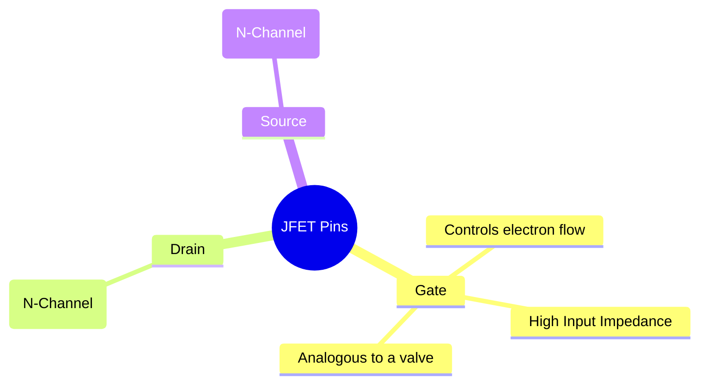

Antes da proliferação massiva de MOSFETs, o **JFET** (Junction Field-Effect Transistor) era o rei da amplificação de alta impedância de entrada. Embora não sejam usados ​​com tanta frequência na lógica digital moderna, eles continuam sendo artefatos indispensáveis ​​em pré-amplificadores de áudio de alta fidelidade, instrumentação sensível e circuitos de RF.

Compreender o símbolo esquemático JFET é essencial para qualquer pessoa que se aprofunde no projeto de circuitos analógicos discretos.

## 1. Anatomia do Símbolo JFET

Ao contrário dos transistores de junção bipolar (BJTs), que são dispositivos controlados por corrente, um JFET é um dispositivo **controlado por tensão**. O símbolo esquemático tenta representar visualmente a construção física de seu canal semicondutor interno.

O símbolo consiste em uma linha reta vertical representando o canal, com duas linhas horizontais conectadas a ele (o Dreno e a Fonte). Uma terceira linha perpendicular forma o Gate, completa com uma seta que determina a polaridade do semicondutor.

### JFETs de canal N vs. canal P

Assim como os BJTs possuem NPN e PNP, os JFETs vêm em dois sabores distintos.

| Característica | JFET Canal N | JFET de canal P |
| :--- | :--- | :--- |
| **Seta do símbolo** | Aponta **IN** em direção à linha do canal | Pontos **FORA** fora do canal |
| **Operadoras Majoritárias** | Elétrons | Buracos |
| **Vgs para Pinch-Off** | Tensão negativa (por exemplo, -5V) | Tensão positiva (por exemplo, +5V) |
| **Operação Típica**| Normalmente LIGADO -> Aplique matriz de tensão negativa para DESLIGAR | Normalmente LIGADO -> Aplique matriz de tensão positiva para DESLIGAR |

> **Truque de memória:** "Apontar para dentro" significa **N**-canal. Olhe para a seta no portão. Se apontar para dentro da linha, você está lidando com um JFET N-Channel (como o popular 2N5457).

## 2. Operação: O modo de esgotamento

Uma das características mais marcantes de um JFET é que ele é um dispositivo em **Modo de Esgotamento**. Isso afeta enormemente a forma como você projeta esquemas em torno deles.

* **MOSFETs (modo de aprimoramento):** normalmente estão desligados. Você deve aplicar uma tensão ao portão para ligá-los.
* **JFETs (modo de esgotamento):** normalmente estão ligados. Com 0 Volts no portão, a corrente máxima flui do Dreno para a Fonte. Você deve aplicar uma tensão de *polarização reversa* (negativa para o Canal N) para expandir a região de depleção e literalmente "cortar" o fluxo de elétrons, desligando o dispositivo.

```mermaid
flowchart LR
    VGS[V_GS = 0V] --> I1[Maximum Drain Current flows]
    VGS2[V_GS = -2V] --> I2[Current is restricted]
    VGS3[V_GS = -5V] --> I3[Pinch-Off reached. Circuit is OFF]
    
    style VGS fill:#1e293b,stroke:#f59e0b
    style VGS3 fill:#1e293b,stroke:#ef4444
```

## 3. Aplicações esquemáticas típicas

Como a porta de um JFET é polarizada reversamente durante a operação, essencialmente a corrente zero flui para ela. Isto produz uma impedância de entrada astronomicamente alta (frequentemente medida em centenas de Megaohms).

| Aplicação de Circuito | Por que os JFETs são escolhidos | Pistas esquemáticas |
| :--- | :--- | :--- |
| **Pré-amplificadores de áudio** | Ruído extremamente baixo e impedância de entrada maciça evitam o carregamento de captadores sensíveis de guitarra elétrica. | Frequentemente visto atuando como um estágio de buffer do Seguidor de Fonte. |
| **Interruptores Analógicos** | Por serem puramente controlados por tensão, sem corrente de porta, eles injetam transientes de comutação zero no caminho do sinal. | Colocado em série com um sinal analógico passando pelo canal fonte de drenagem. |
| **Fontes de corrente constante** | Um JFET se comporta nativamente como um coletor de corrente constante quando a porta está ligada diretamente à fonte. | Terminal Gate conectado diretamente ao terminal Fonte. |

Ao diagramar esses circuitos analógicos especializados, a precisão é fundamental. Certifique-se de que a orientação da seta do portão esteja correta para evitar falhas de fabricação. Use a biblioteca de semicondutores discretos selecionada no **[Circuit Diagram Maker](/editor/)** para posicionar símbolos JFET padrão de canal N e canal P com precisão em sua próxima tela.