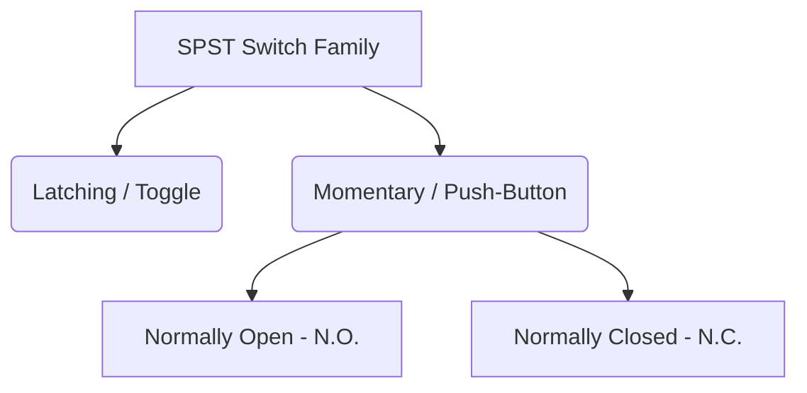

No centro de cada interface que os humanos usam para controlar a eletricidade está o interruptor mecânico. A encarnação mais simples e onipresente desse componente é o **SPST**, ou switch Single Pole Single Throw.

Esteja você projetando um disjuntor de rede elétrica de alta tensão ou simplesmente mapeando um botão em uma placa de ensaio Arduino, o símbolo SPST é o seu ponto de partida lógico.

## 1. O que SPST realmente significa

Os engenheiros classificam os switches usando duas variáveis: **Poles** e **Throws**.

* **Pólo (P):** O número de circuitos elétricos independentes que o switch pode controlar simultaneamente. 
* **Throw (T):** O número de estados fechados (posições ON) que cada polo possui.

Portanto, um SPST é um *Pólo Único* (controla um circuito) e *Lançamento Único* (tem apenas uma posição fechada e condutiva).

```mermaid
flowchart LR
    A[Human Input] --> B((SPST Mechanism))
    B -- Open / Default --> C[Infinite Resistance / OFF]
    B -- Closed / Actuated --> D[Zero Resistance / ON]
    
    style B fill:#0f172a,stroke:#f59e0b
```

## 2. Lendo o símbolo esquemático SPST

O símbolo padrão IEEE para um switch SPST é altamente intuitivo – literalmente se parece com o que faz.

| Elemento Visual | Significado no mundo real |
| :--- | :--- |
| **Dois Círculos Abertos** | As almofadas de contato elétrico estacionárias onde os fios terminam. |
| **Linha quebrada diagonal** | O braço condutor mecânico, fisicamente desarticulado do segundo bloco para indicar um estado padrão 'Aberto'. |
| **Designador (`S` ou `SW`)** | Tags de referência padrão. por exemplo, `SW1`. |

> **Suposição de estado normal:** A menos que especificado de outra forma, os interruptores mecânicos são acionados em seu **estado de repouso não acionado**. Para um interruptor de luz SPST padrão, isso significa que o esquema o representa como DESLIGADO.

## 3. Variações do SPST: Botões

Uma chave seletora permanece onde você a colocou (travamento). Um botão só atua enquanto seu dedo está sobre ele (momentaneamente). A designação SPST aplica-se a ambos, mas os símbolos mudam ligeiramente para distinguir os modos de interação humana.

| Tipo de interruptor | Alteração Esquemática | Exemplo do mundo real |
| :--- | :--- | :--- |
| **Botão (N.A.)** | Em vez de um braço angulado, uma ponte plana paira *acima* das duas almofadas de contato. Empurrar para baixo preenche a lacuna. | Teclas do teclado, botões de energia do computador, botões de campainha. |
| **Botão (N.C.)** | A ponte plana fica *embaixo* ou tocando os pads, mantendo o circuito LIGADO por padrão. Empurrar para baixo quebra as conexões. | Botões de parada de emergência (E-Stop) em máquinas pesadas. |

## 4. Avisos de implementação de hardware

Ao incorporar um switch SPST em um circuito lógico digital (como um pino Raspberry Pi GPIO), um design esquemático ingênuo levará a um comportamento de software desastrosamente imprevisível.

### O problema do "pino flutuante"

Se você conectar um lado de uma chave SPST a 5V e o outro lado diretamente a um pino do microcontrolador, o que acontece quando a chave está aberta? O pino não está lendo 0V – ele está desconectado e “flutuando”, agindo como uma antena captando o eletromagnetismo circundante.

**A correção: resistores pull-down**

Sempre inclua um resistor (normalmente 10kΩ) conectado entre o pino digital e o terra.

1. **Desligar:** O pino lê 0V com segurança através do resistor.
2. **LIGAR:** A fonte de 5 V sobrecarrega o resistor, acionando um estado ALTO seguro.

Incorpore variações do SPST em seus projetos com segurança por meio do **[Editor de Diagrama de Circuito](/editor/)**. Expanda a biblioteca esquerda de ‘Switches’ para encontrar N.O. e implementações N.C.!