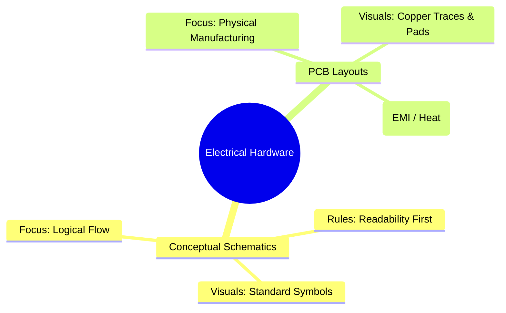
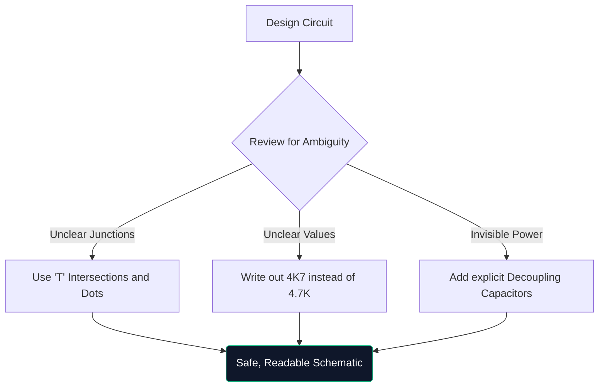

Bem-vindo à masterclass definitiva sobre diagramas de circuitos. Esteja você hackeando protótipos do Arduino em um fim de semana ou estudando engenharia elétrica, entender a arquitetura esquemática não é negociável.

Este guia vai além do básico, avaliando como os diagramas modernos são construídos, verificados e fabricados.

## Esquemas Teóricos vs. Layouts de PCB

Um ponto de confusão muito comum é a diferença entre um diagrama esquemático e um layout de placa de circuito impresso (PCB). São representações totalmente diferentes da mesma verdade elétrica.

| Característica | Diagrama esquemático | Layout de PCB |
| :--- | :--- | :--- |
| **Objetivo** | Para entender *como* o circuito funciona logicamente | Ditar *para onde* o cobre vai fisicamente |
| **Representação de Componentes** | Símbolos abstratos (triângulos, ziguezagues) | Almofadas físicas de pegada 1:1 (por exemplo, SOIC-8, 0805) |
| **Conexões** | Linhas geométricas perfeitas | Traços de cobre em ângulo de 45 graus |
| **Meio Ambiente** | Papel de fundo branco e limpo | Espaço 3D literal de múltiplas camadas |

## Anatomia de um esquema avançado

Quando os circuitos crescem além de 100 componentes, os paradigmas visuais mudam. Você não pode simplesmente conectar tudo com fios trefilados.

1. **Blocos de título**: os esquemas profissionais sempre apresentam um bloco no canto inferior direito indicando o nome da empresa, engenheiro de registro, número de revisão e data.
2. **Etiquetas de Rede e Portas**: Os fios não conectam subsistemas; rótulos nomeados fazem. Se dois fios estiverem rotulados como `CLK_OUT`, eles estão eletricamente conectados, mesmo que estejam em páginas diferentes.
3. **Blocos Hierárquicos**: Projetos massivos (como uma placa-mãe de computador) usam hierarquia. Um único bloco retangular denominado "Interface de memória" contém uma página esquemática totalmente separada dentro dele.

## A regra do "desenho defensivo"

Semelhante à direção defensiva, o desenho defensivo implica presumir que a pessoa que está lendo seu esquema o entenderá mal, a menos que você a oriente explicitamente.

> **Por que escrever `4K7`?** Em esquemas impressos ou fotocopiados, um pequeno ponto decimal (`.`) desaparece facilmente devido a artefatos. Escrever `4.7K` arrisca alguém lê-lo como `47K`, o que pode fritar um componente. Escrever `4K7` faz com que o multiplicador atue como ponto decimal, praticamente eliminando erros de leitura.

## Transição para ferramentas CAD digitais

Desenhar em papel milimetrado é excelente para brainstorming, mas praticamente inútil para produção. Ao migrar seus projetos para uma ferramenta como o [Circuit Diagram Maker](/editor/), você ganha vários superpoderes:

* **Netlists**: Ferramentas digitais que comprovam conexões matemáticas.
* **Reutilização**: copiar e colar fontes de alimentação reguladas complexas de projetos anteriores economiza horas.
* **Qualidade vetorial**: exportar como SVG garante linhas perfeitamente nítidas, independentemente de quanto você aumenta o zoom.

O salto da teoria para a realidade começa com uma linha bem traçada. Comece sua jornada hoje!