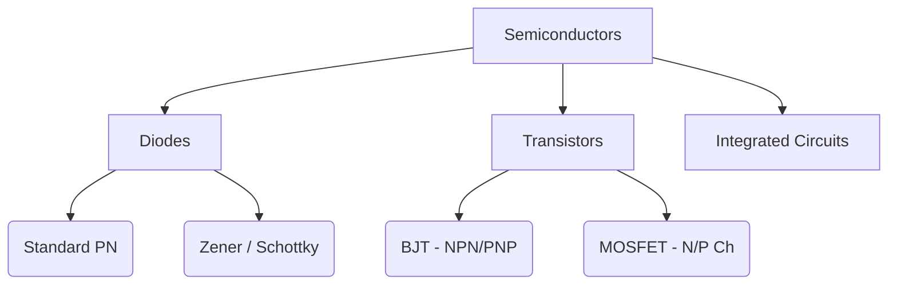

Электронные символы — универсальный язык аппаратной инженерии. Точно так же, как музыкальные ноты определяют высоту и ритм, символы цепей передают электрические функции, свойства и связи на листе бумаги.

В этом подробном руководстве мы анализируем визуальную морфологию наиболее важных элементов, которые вы встретите в любой схеме.

## Различия в глобальных стандартах: IEEE и IEC

Прежде чем углубляться в конкретные символы, важно понимать, что символы могут выглядеть по-разному в зависимости от того, где была нарисована схема. Двумя доминирующими стандартами являются **IEEE/ANSI** (в основном для Америки) и **IEC** (Европа и международные стандарты).

```mermaid
flowchart LR
    subgraph Regional Standards
    A((Schematic Origin))
    A -- US / Americas --> B[IEEE / ANSI]
    A -- Europe / Int'l --> C[IEC]
    end
    
    B -.-> D(Zigzag Resistors)
    C -.-> E(Rectangle Resistors)
    
    style B fill:#1e293b,stroke:#f59e0b
    style C fill:#1e293b,stroke:#3b82f6
```

В Circuit Diagram Maker мы в основном используем стандарт IEEE/ANSI, поскольку он остается очень популярным в цифровых экосистемах и экосистемах любителей, хотя оба они технически верны.

## Пассивные компоненты

Пассивные компоненты не требуют внешнего источника питания для работы и не могут усиливать сигнал.

| Компонент | Стандартный внешний вид символа | Функциональное описание |
| :--- | :--- | :--- |
| **Резистор** | Обозначается резкой зубчатой ​​зигзагообразной линией. В переменных вариантах имеется стрелка, пронзающая линию. | Рассеивает мощность в виде тепла, чтобы ограничить поток электрического тока. |
| **Конденсатор** | Две параллельные линии, разделенные промежутком. Поляризованные варианты искривляют одну из линий, обозначая отрицательный полюс. | Временно сохраняет электрическую энергию в электрическом поле. |
| **Индуктор** | Ряд закругленных петель или полукругов, представляющих мотки проволоки. | Противодействует изменениям тока, сохраняя энергию в магнитном поле. |

## Активные компоненты (полупроводники)

Активным компонентам требуется источник питания, и они могут контролировать поток электричества, часто усиливая сигналы.

| Компонент | Визуальные индикаторы | Основное использование |
| :--- | :--- | :--- |
| **Диод** | Треугольник, направленный к плоской линии. Линия обозначает катод (отрицательный). | Односторонний клапан для электричества. |
| **Светодиод** | Стандартный символ диода с двумя маленькими стрелками, направленными наружу, обозначающими излучение света. | Визуальные индикаторы и оптоэлектроника. |
| **БЮТ-транзистор** | Вертикальная линия, окруженная тремя соединениями: база, коллектор и эмиттер, со стрелкой, обозначающей NPN или PNP. | Переключатели и усилители с управлением по току. |
| **МОП-транзистор** | Имеет разделенные граничные линии, подчеркивающие изолированный затвор и диоды внутренней подложки. | Переключение, управляемое напряжением, для высокой мощности. |

## Механические устройства и устройства вывода

Эти части взаимодействуют с физическим миром, либо принимая человеческий вклад, либо генерируя физический результат.

| Компонент | Схематическое сокращение | Приложение |
| :--- | :--- | :--- |
| **Переключатель (SPST)** | Ломаная линия, которая может поворачиваться вниз, замыкая контур. | Базовое управление питанием ВКЛ/ВЫКЛ. |
| **Реле** | Обычно изображается как индуктор (внутренняя катушка), соединенный с изолированными контактами переключателя. | Коммутация высоковольтных нагрузок через низковольтные микроконтроллеры. |
| **Мотор** | Круг с буквой «М», часто с обозначенными положительными и отрицательными клеммами. | Преобразование электрического тока во вращательную кинетику. |

> **Совет по проектированию:** При использовании механических переключателей или реле всегда включайте *обратноходовой диод* между индуктивными нагрузками, чтобы защитить полупроводниковые компоненты от скачков напряжения!

Понимание этих символов — первый шаг к беглости схемы. Воспользуйтесь нашим [онлайн-редактором](/editor/), чтобы мгновенно перетаскивать и экспериментировать с этими фигурами.