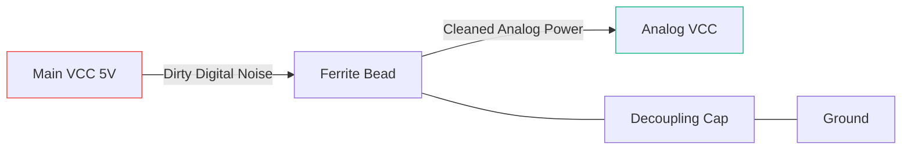

Высокоскоростная цифровая электроника создает много электромагнитных помех. Без смягчения эти высокочастотные помехи проникают в чувствительные аналоговые линии или излучаются наружу, в результате чего ваше устройство явно не проходит испытания на излучение FCC.

Основным оружием против этих помех является **ферритовая бусина**. Понимание символа схемы и ее размещения определяет, будет ли ваша схема работать чисто или тонет в собственном шуме.

## 1. Визуализация символа ферритового шарика

Ферритовый шарик по своей сути работает как дроссель с большими потерями. По этой причине его условное обозначение тесно связано со стандартным обозначением индуктора, но адаптировано с учетом его особой роли.

```mermaid
graph LR
    A[Inductor Basis] --> B(Standard Inductor Symbol)
    A --> C(Rectangle Over Wire)
    B -.-> D(Addition of a dashed line or solid bar)
    D --> E[IEEE Ferrite Symbol]
    C --> F[IEC Ferrite Symbol]
    
    style E fill:#0f172a,stroke:#3b82f6
    style F fill:#0f172a,stroke:#10b981
```

| черта | Стандарт IEEE/ANSI | Стандарт МЭК | Заметки |
| :--- | :--- | :--- | :--- |
| **Форма** | Серия полукругов со штангой/коробкой | Сплошной прямоугольный блок | Функционально идентичный по результату |
| **Префикс обозначения** | `ФБ` | `FB` или `L` | Настоятельно рекомендуется использовать `FB`, чтобы не путать с силовыми индукторами |
| **Единица измерения** | Ом (Ом) на определенных МГц | Ом (Ом) на определенных МГц | В отличие от индукторов, измеряемых в Генри (Гн) |

> **Важное отличие:** Никогда не оценивайте ферритовую бусину по индуктивности. Ферритовые бусины характеризуются их **импедансом (в Омах) на определенной частоте** (обычно 100 МГц).

## 2. Основная операционная механика

Зачем использовать ферритовую бусину вместо стандартной катушки индуктивности?

* **Индуктор** накапливает энергию и возвращает ее в цепь. Он обладает высокой реакционной способностью и сохраняет энергию.
* **Ферритовая бусина** разработана с учетом *потерь*. На высоких частотах он ведет себя как резистор, преобразуя нежелательный высокочастотный шум непосредственно в тепло.

| Частотный диапазон | Поведение ферритовых шариков | Результат на трассе |
| :--- | :--- | :--- |
| **Низкая частота/постоянный ток** | Менее 1 МГц | Действует как простой провод (~0 Ом). Мощность постоянного тока проходит свободно. |
| **Резонансная частота** | Высокореактивный | На короткое время сохраняет энергию. |
| **Высокая частота** | Более 50 МГц+ | Действует как резистор высокого номинала. Блокирует и рассеивает радиочастотный шум в виде тепла. |

## 3. Рекомендации по размещению схематических изображений

Правильное использование символа FB требует стратегического размещения. Случайное попадание ферритовых шариков на схему может фактически ухудшить звон и резонанс.

### Развязывающие источники питания (Пи-фильтры)

Наиболее распространенное использование символа «FB» — это изоляция «грязной» цифровой мощности от «чистой» аналоговой.

В приведенной выше конфигурации (часть пи-фильтра) ферритовый шарик блокирует попадание высокочастотных переходных процессов в линию AVCC, в то время как конденсатор шунтирует любую оставшуюся пульсацию на землю.

### Подавление электромагнитных помех в линии передачи данных

При прокладке длинных USB-кабелей передачи данных или трасс HDMI символы FB часто размещаются последовательно рядом с разъемом. Это гарантирует, что длинный, физически оголенный провод не будет действовать как антенна и не будет излучать шум процессора по комнате.

Чтобы добавить ферритовую бусину в следующую схему, откройте **[Редактор схем](/editor/)**, найдите «Феррит» и укажите свой номинал сопротивления!