Создание инвертора, преобразующего автомобильный аккумулятор напряжением 12 В в переменный ток напряжением 220 В, способный питать бытовую технику, — это обряд для инженеров-электронщиков.

Прежде чем поднять паяльник, необходимо добиться безупречного понимания лежащей в основе схемы. Высоковольтные схемы не прощают ошибок, а плохо нарисованная схема гарантирует сгорание МОП-транзисторов или серьезное поражение электрическим током. В этом руководстве рассматривается архитектура фундаментального инвертора прямоугольных импульсов.

> **Предупреждение по технике безопасности:** Напряжение переменного тока 220 В смертельно опасно. Эта статья представляет собой исследование схематической логики и теоретического проектирования, а не производственного проекта. Никогда не стройте высоковольтные цепи без углубленного электротехнического образования.

## Архитектура трех столпов

Независимо от того, насколько сложен современный инвертор, его схему всегда можно визуально и логически разделить на три отдельных функциональных блока.

```mermaid
flowchart LR
    DC_SRC[(12V DC Battery)] --> OSC[1. Oscillator Block]
    OSC -- Low Power Square Wave --> AMP[2. Power Switch Block]
    AMP -- High Current 12V Wave --> TX[3. Step-Up Transformer]
    TX -- Magnetic Induction --> AC_OUT((220V AC Output))
    
    style OSC fill:#0f172a,stroke:#3b82f6
    style AMP fill:#0f172a,stroke:#f59e0b
    style TX fill:#0f172a,stroke:#ef4444
```

### Этап 1: Осциллятор (Мозги)

Постоянный ток (DC) от батареи течет по прямой линии. Трансформаторы не могут повысить прямую линию; для них требуются переменные магнитные поля. Поэтому мы должны преобразовать постоянный ток в искусственную волну переменного тока (обычно 50 Гц или 60 Гц в зависимости от географического региона).

| Используемый компонент | Схематическая роль | Почему он выбран |
| :--- | :--- | :--- |
| **CD4047 IC / Таймер 555** | Нестабильный мультивибратор | Выдает чрезвычайно стабильный прямоугольный сигнал путем расчета постоянной времени RC. |
| **Сеть резисторов и конденсаторов** | Калибры времени | Значения (например, R=100 кОм, C=0,1 мкФ) однозначно определяют точную частоту 50 Гц. |

### Этап 2: Переключатели питания (мышцы)

Логический чип генерирует чистую волну частотой 50 Гц, но с исключительно низкими пределами тока (часто менее 20 мА). Если вы подадите его в трансформатор, он не будет генерировать достаточный магнитный поток для работы лампочки.

Между генератором и катушками трансформатора размещаем мощные транзисторы.

1. Слабый сигнал генератора попадает на **затвор** массивного N-канального МОП-транзистора (например, IRF3205).
2. МОП-транзистор действует как электронное реле для тяжелых условий эксплуатации.
3. Он яростно переключает огромную силу тока от батареи 12 В непосредственно через катушки трансформатора 50 раз в секунду.

### Этап 3: Повышающий трансформатор

На этом этапе схемы мы имеем огромное количество пульсирующего тока 12 В взад и вперед. На последнем этапе необходимо пропустить его через первичные катушки трансформатора.

| Особенность | Детали схемы | Реальные последствия |
| :--- | :--- | :--- |
| **Первичная катушка (слева)** | Конфигурация с центральным отводом (`12 В - 0 - 12 В`) | Обеспечивает двухтактное переключение двух попеременных МОП-транзисторов. |
| **Основные направления** | Две сплошные линии, нарисованные вертикально | Представляет собой железный/ферритовый сердечник, необходимый для высокоэффективной магнитной индукции. |
| **Вторичная катушка (справа)** | Значительно увеличенный коэффициент намотки | Физика преобразует пульсирующий магнитный поток напряжением 12 В в смертоносную, летучую волну напряжением 220 В. |

## Рекомендации по рисованию

При использовании **[Редактора принципиальных схем](/editor/)** для разработки этого проекта помните рекомендации по компоновке:

* Нарисуйте жирные линии, по которым проходит ток батареи 12 В, толще, чем линии генератора малой мощности.
* Заземлите контакты источника MOSFET явно и однозначно; не прокладывайте их обратно рядом с чувствительным заземлением генератора, чтобы предотвратить шумовую связь.
* Графически обозначьте выходы 220 В! Разместите предупреждающие надписи и выходные порты (например, символ розетки), а не оставляйте оголенные провода, заканчивающиеся в пустоте.