Открытие сложной схемы в первый раз похоже на изучение чужого языка. Десятки пересекающихся линий, загадочных аббревиатур и зубчатых символов сливаются в стену визуального шума.

Однако опытные инженеры не читают схемы, просматривая всю страницу. Они изолируют, отслеживают и побеждают. Вот пошаговая методика расшифровки любой принципиальной схемы.

## Шаг 1. Изолируйте основную энергетическую инфраструктуру

Прежде чем понять, что *делает* схема, вы должны понять *как она дышит*.

Каждая схема имеет точки входа для электрической энергии. Ваша первая задача — найти все основные шины напряжения и точки заземления.

```mermaid
flowchart TD
    A[Start: Scan Edges] --> B{Look for Power Symbols}
    B -- Found Battery/Jack --> C[Trace the initial VCC and GND lines]
    B -- Found Net Labels --> D[Locate generic +5V, +3.3V pads]
    C --> E[Are there Voltage Regulators?]
    D --> E
    E -- Yes --> F[Mentally divide circuit into Voltage Zones]
    E -- No --> G[Circuit runs on single voltage]
    
    style A fill:#0f172a,stroke:#3b82f6
    style F fill:#1e293b,stroke:#f59e0b
```



| Символ/Текст | Значение | Требование к действию |
| :--- | :--- | :--- |
| `VCC` / `VDD` | Положительное напряжение питания для микросхем. | Отследите это, чтобы убедиться, что каждая микросхема получает питание. |
| `GND` / `VSS` | Общая ссылка на землю. | Предположим, что все эти символы физически связаны друг с другом. |
| `ЛДО` / `бак` | Микросхема, регулирующая напряжение вниз. | Обратите внимание, какие компоненты ниже по потоку используют новое более низкое напряжение. |

## Шаг 2: Демистифицируйте «мозги» (ИС)

Как только вы узнаете, куда течет энергия, найдите на странице самые большие прямоугольники. Интегральные схемы (ИС) определяют основную функцию схемы.

Если вы встретите микросхему с маркировкой «U1» и загадочным номером детали, например «NE555» или «ATmega328P», немедленно прекратите чтение схемы. Откройте новую вкладку и извлеките **таблицу данных**.

Вам не нужно понимать внутреннюю физику полупроводников; просто посмотрите на «Схему распиновки» таблицы данных. Если контакт 4 — RESET, а контакт 8 — VCC, немедленно отобразите эту логику обратно на чертеж.

## Шаг 3: Отслеживайте входы и выходы

Схемы — это функциональные машины. Они получают данные из окружающей среды, обрабатывают их и выдают результат.

```mermaid
quadrantChart
    title Input/Output Hardware Identification
    x-axis Analog/Physical --> Digital/Data
    y-axis Input Devices --> Output Devices
    quadrant-1 Digital Receivers (e.g. WiFi)
    quadrant-2 Digital Displays (e.g. OLEDs)
    quadrant-3 Physical Actuators (e.g. Motors)
    quadrant-4 Physical Sensors (e.g. Thermistors)
    "Push Button": [0.1, 0.4]
    "Photoresistor": [0.2, 0.2]
    "UART RX": [0.8, 0.4]
    "UART TX": [0.8, 0.6]
    "Speaker": [0.3, 0.8]
    "LED": [0.4, 0.7]
```

Проследите провода наружу от центральных микросхем. Если вывод IC подключается к светодиоду, это визуальный выход. Если контакт подключен к переключателю SPST, идущему на землю, это вмешательство человека.

## Шаг 4: Проверка перекрестков и пересечений

Самая распространенная ошибка чтения среди новичков связана с непониманием проводов, которые пересекаются друг с другом.

* **Точка образует узел:** Если две пересекающиеся линии имеют на пересечении сплошную точку, они физически спаяны/соединены вместе. Между ними может течь ток.
* **Нет точки дает мост:** Если две линии образуют простой крест (+), они *не* соприкасаются. Они подобны двум шоссе, проходящим одна над другой по эстакаде.

## Шаг 5: Распознайте подсхемы (секретное оружие)

Инженеры редко проектируют схемы полностью с нуля. Они склеивают стандартные модульные подсхемы. Как только вы научитесь распознавать эти визуальные «слова», вы перестанете читать отдельные «буквы».

| Визуальный шаблон | Стандартная подсхема | Функция |
| :--- | :--- | :--- |
| Пересечение конденсатора от VCC к GND рядом с микросхемой. | **Развязывающий конденсатор** | Поглощает шум. Не обращайте на это внимания при анализе логического потока. |
| Резистор от цифрового вывода, накручивающий до +5В. | **Подтягивающий резистор** | Предотвращает плавание штифтов; обеспечивает стабильное состояние ВЫСОКОГО значения по умолчанию. |
| Два резистора, включенные последовательно между напряжением и землей, с отводом посередине. | **Делитель напряжения** | Падает напряжение пропорционально, чтобы его можно было безопасно считывать контактом датчика. |

Примените эту теорию на практике. Откройте **[Редактор принципиальных схем](/editor/)**, загрузите шаблон и наметьте для себя мощность, мозг, входы и выходы!